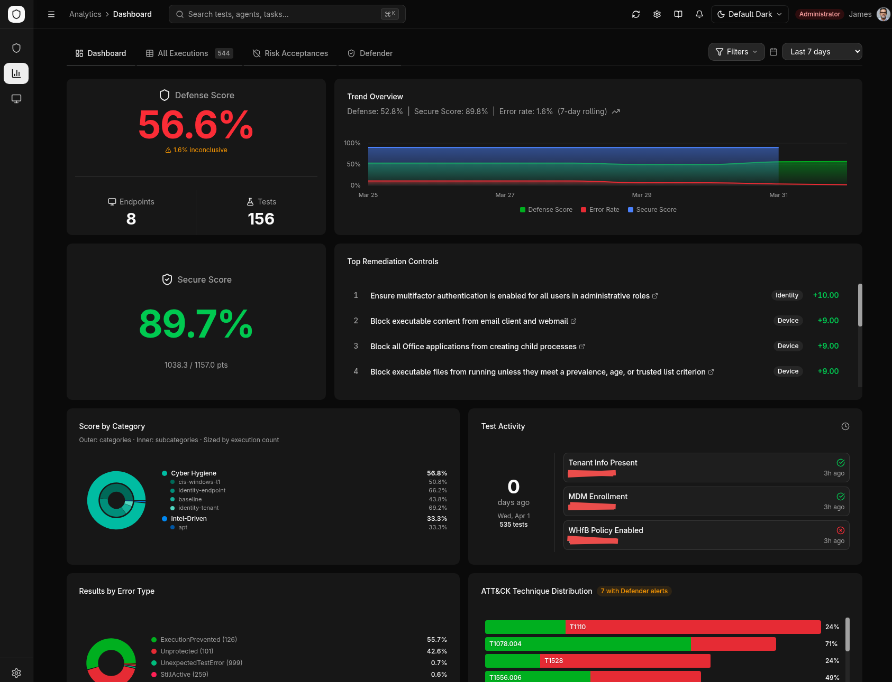
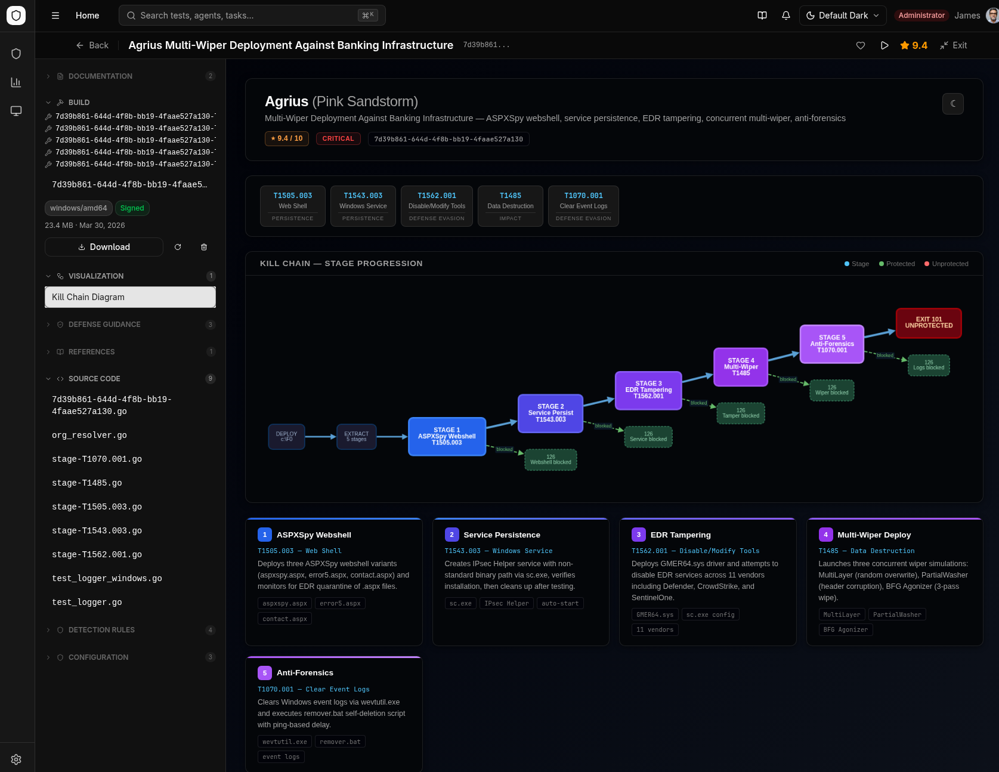
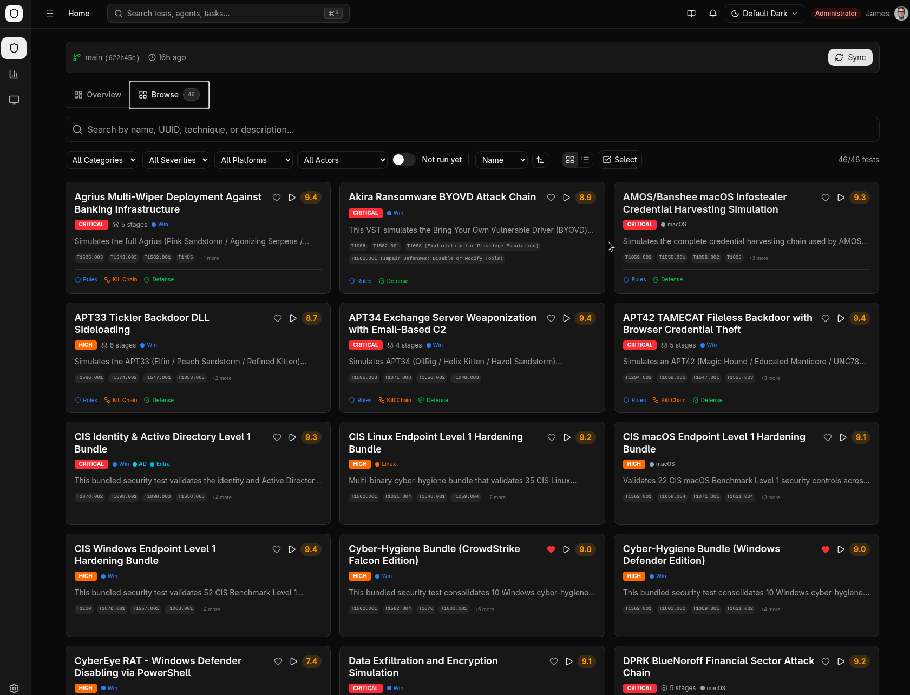
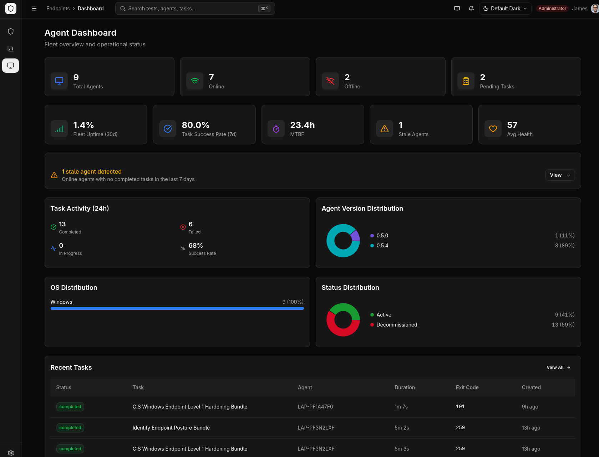
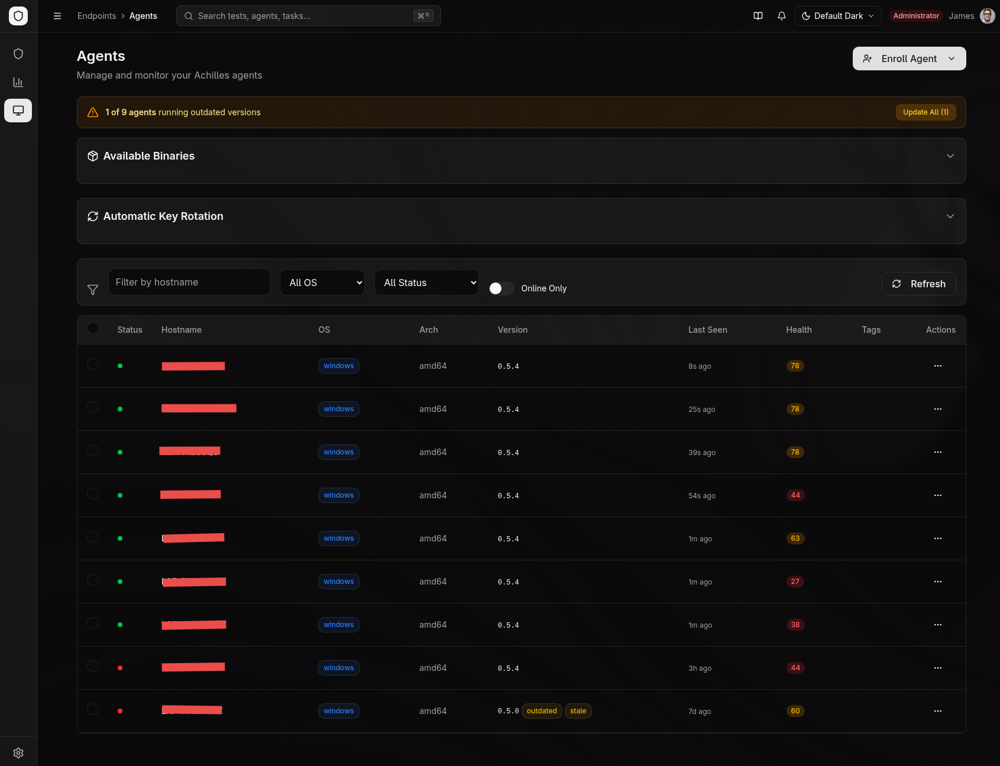
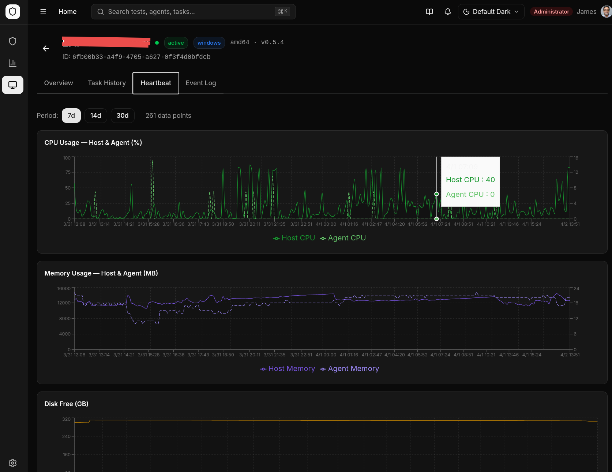
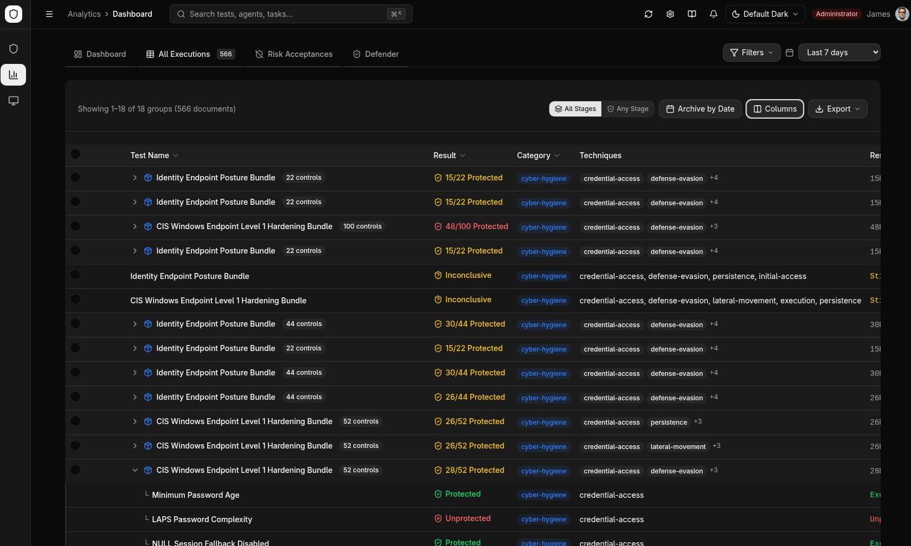
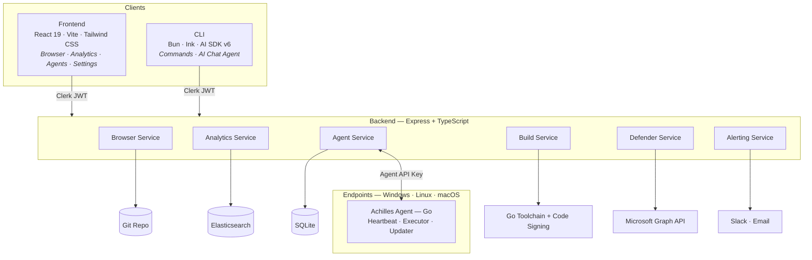

# ProjectAchilles

<div align="center">


[](https://github.com/projectachilles/ProjectAchilles/actions/workflows/ci.yml)
[](https://github.com/projectachilles/ProjectAchilles/actions/workflows/security-review.yml)
[](https://github.com/projectachilles/ProjectAchilles/actions/workflows/security-review.yml)
[](LICENSE)
[](https://www.typescriptlang.org/)
[](https://react.dev/)
[](https://go.dev/)
[](https://bun.sh/)

**Continuous Security Validation — From Threat Intelligence to Defense Readiness**

Stop hoping your defenses work. Start proving it.

[Quick Start](#quick-start) · [Features](#features) · [Architecture](#architecture) · [Documentation](#documentation) · [Roadmap](docs/ROADMAP.md) · [Contributing](#contributing)

</div>

<p align="center">
  
</p>

---

## Why ProjectAchilles

Most organizations invest heavily in security tools but struggle to answer a simple question: *are our defenses actually working?*

Threat intelligence reports pile up unread. Compliance checklists are checked once and forgotten. Security teams deploy EDR, SIEM, and endpoint hardening — then hope for the best. When a breach happens, the post-mortem reveals gaps that were always there but never measured.

**ProjectAchilles exists to close this loop.**

The platform turns threat intelligence into executable security tests, deploys them to your endpoints through a lightweight agent framework, and measures whether your defenses detect, prevent, or miss each technique. The result is not an opinion — it's a score backed by evidence, broken down by technique, host, and control, tracked over time.

You don't need a red team certification to use it. You don't need to write exploit code. You need to know what threats matter to your organization, and whether you're defended against them.

### What It Measures

- **Defense Readiness** — For each threat technique, did your endpoint defenses detect it, block it, or miss it entirely?
- **Controls Compliance** — Are your security configurations (endpoint hardening, identity policies, cloud settings) actually in place?
- **Security ROI** — Which investments are driving measurable protection, and where are the gaps that still need funding?

### Two Modes of Operation

| Mode | Purpose | Input | Output |
|------|---------|-------|--------|
| **Threat-Informed Validation** | Test defenses against real-world attack techniques | Threat intel mapped to MITRE ATT&CK | Per-technique defense score with detection/prevention evidence |
| **Controls Compliance** | Verify security baselines across your fleet | Standards-based control frameworks | Per-control compliance status with remediation guidance |

## Overview

ProjectAchilles is a continuous security validation platform with four core components:

1. **AI-Powered Test Development** — An agentic pipeline that transforms threat intelligence articles into complete, deployable security test packages — source code, detection rules, hardening scripts, and documentation — without manual test development.

2. **Execution Framework** — A lightweight Go agent deployed to endpoints (Windows, Linux, macOS) that executes security tests on demand or on schedule, reports results with cryptographic integrity, and self-updates without downtime.

3. **Analytics & Measurement** — An Elasticsearch-backed dashboard that quantifies defense readiness with scores, heatmaps, trend analysis, and MITRE ATT&CK coverage matrices — turning raw test results into actionable intelligence for security teams and leadership.

4. **CLI & AI Agent** — A Bun-powered command-line tool (`achilles`) with 17+ command modules for platform management and an AI conversational agent mode powered by Vercel AI SDK for natural-language fleet operations.

The platform is open-source, deploys in minutes via Docker Compose, and integrates with Microsoft Defender for cross-correlation between your internal validation results and your EDR's own security posture data.

## Quick Start

### Path A — Local Development

```bash
# Clone the repository
git clone https://github.com/projectachilles/ProjectAchilles.git
cd ProjectAchilles

# Start the full stack (installs deps, finds available ports)
./scripts/start.sh -k --daemon
```

Configure Clerk authentication (see [Configuration](#configuration)), then open http://localhost:5173.

### Path B — Docker Compose

```bash
# Clone and run the setup wizard
git clone https://github.com/projectachilles/ProjectAchilles.git
cd ProjectAchilles
./scripts/setup.sh

# Start services
docker compose up -d

# Optional: include local Elasticsearch with synthetic data
docker compose --profile elasticsearch up -d
```

### Path C — Windows (PowerShell)

```powershell
git clone https://github.com/your-org/ProjectAchilles.git
cd ProjectAchilles
.\scripts\Install-ProjectAchilles.ps1
```

The PowerShell script checks prerequisites, fixes line endings, configures `backend/.env` interactively, builds Docker images, and opens the dashboard. See [Windows Docker Installation](docs/deployment/WINDOWS_DOCKER_INSTALL.md) for the full manual guide.

### Deployment Targets

| Target | Backend | Database | Agent Builds | Guide |
|--------|---------|----------|-------------|-------|
| **Docker Compose** | `backend/` | SQLite (volume) | Yes | [docker-compose.yml](docker-compose.yml) |
| **Railway** | `backend/` | SQLite (volume) | Partial | [Railway Guide](docs/deployment/RAILWAY.md) |
| **Render** | `backend/` | SQLite (persistent disk) | Partial | [Render Guide](docs/deployment/RENDER.md) |
| **Fly.io** | `backend/` | SQLite (volume) | Yes | [Fly.io Guide](docs/deployment/FLY.md) |
| **Vercel** | `backend-serverless/` | Turso (libSQL) | No | [Vercel Guide](docs/deployment/VERCEL.md) |

## Features

### AI-Powered Test Development

Security tests are built by a multi-agent AI pipeline that converts threat intelligence into complete test packages. Each test includes ~19 artifacts generated autonomously.

**How it works:**

```
Threat Intelligence Article
    ↓ Phase 1: Analysis & Implementation
    Extracts TTPs → generates Go source → compiles & signs binary
    ↓ Phase 2: Parallel Artifact Generation
    Detection Rules (5 formats) │ Defense Guidance │ Documentation │ Kill Chain Diagrams
    ↓ Phase 3: Validation & Deployment
    Verifies all artifacts → syncs catalog → deploys to endpoints
```

**What each test package contains:**

| Artifact | Formats | Purpose |
|----------|---------|---------|
| Test binary | Go (Windows, Linux, macOS) | Executes the simulated technique on the endpoint |
| Detection rules | KQL, YARA, Sigma, Elastic EQL, LimaCharlie | Import directly into your SIEM/EDR |
| Hardening scripts | PowerShell, Bash (Linux + macOS) | Remediate gaps found by the test |
| Documentation | Markdown (README + info card) | MITRE mapping, severity, threat actor context |
| Kill chain diagram | Interactive HTML | Visualizes multi-stage attack flow |

<p align="center">
  
</p>

**Test categories:**

| Category | Description | Example |
|----------|-------------|---------|
| **Intel-Driven** | Real-world attack techniques from APT reports and ransomware analysis | Lazarus group TTPs, Emotet delivery chains |
| **MITRE Top 10** | Most common ransomware techniques from MITRE ATT&CK | Process injection, defense evasion, lateral movement |
| **Cyber-Hygiene** | Configuration validation for endpoint, identity, and cloud security | Defender settings, ASR rules, LSASS protection, MFA |

> The test development pipeline lives in a companion repository. Tests are synced to ProjectAchilles via Git for browsing, building, and execution.

### CLI (`achilles`)

A Bun-powered command-line interface for managing the entire platform from the terminal — or through an AI conversational agent.

**Two modes of operation:**

| Mode | Command | Description |
|------|---------|-------------|
| **Commands** | `achilles <command> [args]` | Direct platform management with rich terminal output |
| **AI Chat** | `achilles chat` | Conversational agent powered by AI SDK v6 with full tool access |

**What it covers:**

- **Agent fleet** — List, inspect, tag, and manage enrolled agents
- **Enrollment tokens** — Create, revoke, and audit tokens
- **Task management** — Create, assign, and monitor task execution
- **Scheduling** — CRUD for recurring schedules
- **Test browser** — Search, inspect, and build tests
- **Analytics** — Query defense scores, trends, and execution history
- **Defender** — Secure Score, alerts, controls, cross-correlation
- **Build system** — Trigger cross-compilation, manage certificates
- **Risk acceptance** — Accept/revoke risk on individual controls
- **User management** — List and inspect Clerk users

**Key features:**
- `--json` flag on every command for structured output (scripts, LLM consumption)
- Multi-profile server configuration (`achilles config profile`)
- Clerk device-flow authentication (`achilles login`)
- AI chat mode with Ink TUI (interactive) or readline fallback (piped)
- AI agent has tool access to all platform APIs with approval tiers (read/write/destructive)

### Test Browser

Browse the full test library with rich metadata and execute tests directly from the UI.

<p align="center">
  
</p>

- Filter by MITRE ATT&CK technique, platform, category, and severity
- View source code, detection rules, hardening scripts, and attack flow diagrams
- Build, sign, and download test binaries directly from test detail pages
- MITRE ATT&CK coverage matrix with visual technique heatmap
- Execution drawer — assign and run tests directly from the browse page
- Favorite tests, track recent views, view version history and Git modification dates

### Execution Framework

Deploy a lightweight Go agent to endpoints for remote test execution with full lifecycle management.

<p align="center">
  
</p>

- **Enrollment** — Token-based registration with configurable TTL and max uses
- **Heartbeat Monitoring** — Real-time online/offline status with CPU, memory, disk, and uptime metrics
- **Secure Execution** — Download, verify (SHA256 + Ed25519 signature), execute, and report results
- **Self-Updating** — Agents poll for new versions and auto-apply cryptographically signed updates
- **Cross-Platform** — Windows, Linux, and macOS (amd64 + arm64) with native service integration
- **Bundle Results** — Per-control results from compliance tests fan out to individual ES documents for granular tracking
- **Zero-Downtime Key Rotation** — API keys rotated automatically via heartbeat with dual-key grace period
- **Encrypted Config** — Agent credentials encrypted at rest with AES-256-GCM using machine-bound keys
- **Remote Uninstall** — Two-phase agent removal (stop service + cleanup) initiated from admin UI

<details>
<summary>More: Fleet management &amp; heartbeat monitoring</summary>
<br>
<p align="center">
  
</p>
<p align="center">
  
</p>
</details>

### Analytics & Measurement

Quantify your security posture with 30+ query endpoints powered by Elasticsearch.

<p align="center">
  
</p>

- **Defense Score** — Aggregate score with breakdowns by test, technique, category, hostname, and severity
- **Trend Analysis** — Rolling-window defense score and error rate trends over time
- **MITRE ATT&CK Heatmaps** — Host-test matrix showing protection status across your fleet
- **Coverage Treemaps** — Hierarchical category/subcategory coverage visualization
- **Execution Table** — Paginated results with advanced filtering (technique, hostname, threat actor, tags)
- **Risk Acceptance** — Accept risk on individual controls with audit tracking
- **Microsoft Defender Integration** — Sync Secure Score, alerts, and control profiles with cross-correlation analytics
- **Trend Alerting** — Threshold-based Slack and email notifications with in-app notification bell
- **Multi-Index Management** — Per-task index targeting for isolated result sets
- **Visual Themes** — Three selectable themes: Default (light/dark), Neobrutalism (hot pink accent, bold borders), Hacker Terminal (phosphor green/amber scanlines)

### Build System

Compile and sign test binaries on demand with Go cross-compilation.

- **Cross-Compilation** — Build for Linux/Windows/macOS × amd64/arm64 from any host OS
- **Code Signing** — Windows Authenticode (osslsigncode) and macOS ad-hoc signing (rcodesign)
- **Multi-Certificate Management** — Upload PFX/P12 or generate self-signed certs (up to 5)
- **Embed Dependencies** — Detects `//go:embed` directives and manages required files
- **Build Caching** — Previously built binaries cached for instant download

### Task Scheduling

Automate test execution across agent pools with flexible scheduling.

- **Schedule Types** — Once, daily, weekly (specific days), monthly (specific day)
- **Randomized Timing** — Optional randomization within office hours for realistic simulation
- **Per-Task ES Index** — Target specific Elasticsearch indices per task for result isolation
- **Priority Queue** — Higher-priority tasks assigned first

### Agent Communication Security

The agent-server communication channel has been hardened through an internal security audit covering 9 findings. All HIGH and MEDIUM findings are resolved. See [Agent Security Findings](docs/agent-security-findings.md) for full details.

| Protection | Description |
|------------|-------------|
| **TLS Enforcement** | `skip_tls_verify` blocked for non-localhost servers; explicit `--allow-insecure` override required |
| **API Key Rotation** | Zero-downtime rotation via heartbeat delivery with 5-minute dual-key grace period |
| **Replay Protection** | `X-Request-Timestamp` header with 5-minute skew window; payload-level timestamp validation |
| **Timing Oracle Prevention** | Constant-time bcrypt comparison on enrollment and auth (dummy hash on miss) |
| **Update Signatures** | Ed25519 detached signatures on agent binaries; verified before applying updates |
| **Rate Limiting** | Per-endpoint budgets: enrollment (5/15min), device (100/15min), download (10/15min), rotation (3/15min) |
| **Encrypted Credentials** | Agent API key encrypted at rest with AES-256-GCM; key derived from machine ID (non-portable) |
| **Least-Privilege Permissions** | Binary `0700` / Windows SYSTEM+Admins ACL; config `0600`; work dirs `0700` |

## Architecture



### Tech Stack

| Layer | Technology | Version |
|-------|------------|---------|
| Frontend | React | 19.2 |
| Build Tool | Vite | 8.0 |
| Styling | Tailwind CSS | 4.2 |
| State Management | Redux Toolkit | 2.11 |
| Routing | React Router | 7.13 |
| Authentication | Clerk | 5.x |
| Backend | Express | 4.18 |
| Language | TypeScript | 5.9 |
| CLI Runtime | Bun | 1.3 |
| CLI UI | Ink | 6.8 |
| AI SDK | Vercel AI SDK | 6.0 |
| Agent | Go | 1.24 |
| Analytics Store | Elasticsearch | 8.x |
| Agent Database | SQLite | 3.x |
| Code Signing | osslsigncode | — |
| Containerization | Docker Compose | — |

### Project Structure

```
ProjectAchilles/
├── frontend/                  # React 19 + TypeScript + Vite
│   └── src/
│       ├── components/        # Shared UI primitives
│       ├── pages/             # Module pages (browser, analytics, agents, settings)
│       ├── services/api/      # API client modules
│       ├── hooks/             # Custom hooks (useAuthenticatedApi, etc.)
│       └── store/             # Redux slices
├── backend/                   # Express + TypeScript (ES modules)
│   └── src/
│       ├── api/               # Route handlers (*.routes.ts)
│       ├── services/          # Business logic by module
│       ├── middleware/         # Auth, error handling, rate limiting
│       └── types/             # TypeScript definitions
├── cli/                       # Bun + TypeScript CLI with AI chat agent
│   └── src/
│       ├── commands/          # Command modules (agents, tasks, browser, analytics, ...)
│       ├── chat/              # AI chat agent (AI SDK v6, Ink TUI, tool definitions)
│       ├── api/               # API client for backend communication
│       ├── auth/              # Clerk device-flow token management
│       ├── config/            # Multi-profile configuration store
│       └── output/            # Formatters (table, JSON, colors)
├── agent/                     # Go agent source
│   ├── main.go                # CLI entry point (--enroll, --run, --install)
│   └── internal/              # Agent modules (poller, executor, updater, sysinfo)
├── scripts/                   # Shell scripts and PowerShell bootstrap
│   ├── start.sh               # Development startup script
│   ├── setup.sh               # Interactive setup wizard (Linux/macOS)
│   └── Install-ProjectAchilles.ps1 # Bootstrap script (Windows)
├── docs/                      # Documentation
│   ├── deployment/            # Deployment guides (Fly, Railway, Render, Vercel)
│   └── security/              # Security audit and remediation docs
├── docker-compose.yml         # Multi-service deployment
└── CLAUDE.md                  # AI assistant development guidance
```

## Configuration

### Authentication (Required)

All modules require [Clerk](https://clerk.com) authentication. Create a Clerk application and configure your keys:

```bash
# frontend/.env
VITE_CLERK_PUBLISHABLE_KEY=pk_test_...

# backend/.env
CLERK_PUBLISHABLE_KEY=pk_test_...
CLERK_SECRET_KEY=sk_test_...
```

### Environment Variables

#### Frontend

| Variable | Description | Default |
|----------|-------------|---------|
| `VITE_CLERK_PUBLISHABLE_KEY` | Clerk publishable key | — (required) |
| `VITE_BACKEND_PORT` | Backend port for Vite proxy | `3000` |
| `VITE_API_URL` | Full backend URL (production) | — |

#### Backend

| Variable | Description | Default |
|----------|-------------|---------|
| `CLERK_PUBLISHABLE_KEY` | Clerk publishable key | — (required) |
| `CLERK_SECRET_KEY` | Clerk secret key | — (required) |
| `PORT` | Server port | `3000` |
| `SESSION_SECRET` | Session signing key | — (required in prod) |
| `CORS_ORIGIN` | Allowed CORS origin | `http://localhost:5173` |
| `TESTS_REPO_URL` | Git URL for test library | — |
| `GITHUB_TOKEN` | PAT for private repos | — |
| `TESTS_SOURCE_PATH` | Local fallback path for tests | `./tests_source` |
| `AGENT_SERVER_URL` | External URL for agent communication | — |
| `ENCRYPTION_SECRET` | Encryption key for settings at rest | Machine-derived |

#### Elasticsearch (optional)

| Variable | Description |
|----------|-------------|
| `ELASTICSEARCH_CLOUD_ID` | Elastic Cloud deployment ID |
| `ELASTICSEARCH_API_KEY` | API key for authentication |
| `ELASTICSEARCH_NODE` | Direct node URL (e.g., `http://localhost:9200`) |
| `ELASTICSEARCH_INDEX_PATTERN` | Index pattern (default: `achilles-results-*`) |

#### Docker

| Variable | Description |
|----------|-------------|
| `NGROK_FRONTEND_DOMAIN` | ngrok domain for frontend tunnel |
| `NGROK_BACKEND_DOMAIN` | ngrok domain for backend/agent tunnel |

## Data Storage & Clean Reset

Runtime state (agents, tokens, settings, certificates, compiled binaries) is stored **outside the repository** — in the user's home directory. This is intentional: it protects your data from `git pull`, re-clones, or accidental deletion of the repo folder.

### Where state lives

| Platform | Data directory |
|----------|----------------|
| Linux / macOS (local) | `~/.projectachilles/` |
| Windows | `C:\Users\<user>\.projectachilles\` |
| Docker / Render / Fly.io | `/root/.projectachilles/` (inside container, backed by a volume) |
| Vercel (serverless) | Turso database + Vercel Blob store (no filesystem state) |

### What's inside

| Path | Contents |
|------|----------|
| `agents.db` | SQLite database: agents, enrollment tokens, tasks, schedules, agent_versions |
| `analytics.json` | Encrypted Elasticsearch credentials (AES-256-GCM) |
| `integrations.json` | Encrypted Defender, Slack, and email credentials |
| `tests.json` | Test library configuration |
| `certs/cert-*/` | Code-signing PFX certificates (max 5, active cert tracked in `active-cert.txt`) |
| `binaries/<os>-<arch>/` | Compiled Go agents ready to download |
| `builds/<test-uuid>/` | Per-test compiled binaries |
| `signing/` | Agent API key signing keypair |
| `custom-tests/` | User-authored tests outside the git-synced library |

Additionally, test results and Defender alerts are stored in **Elasticsearch** (`achilles-results-*`, `achilles-defender` indices) — that data lives in your ES cluster, not on the local filesystem.

> **Why this matters**: deleting or renaming `/ProjectAchilles` and doing a fresh `git clone` does **not** reset your installation. The backend will start up against the same `agents.db` and show the same agents, tokens, schedules, and settings.

### Clean reset (start from scratch)

Stop services and remove the data directory. The next startup will create an empty database.

**Linux / macOS (local install):**

```bash
./scripts/start.sh --stop
rm -rf ~/.projectachilles
# optional: also wipe Elasticsearch test results
curl -X DELETE "$ELASTICSEARCH_NODE/achilles-results-*"
```

**Windows (PowerShell):**

```powershell
.\scripts\start.sh --stop   # or stop backend/frontend processes manually
Remove-Item -Recurse -Force $HOME\.projectachilles
```

**Docker Compose:**

```bash
docker compose down --volumes   # removes the achilles-data volume
docker compose up -d
```

**Render / Fly.io:** delete and recreate the persistent disk/volume via the provider dashboard or CLI (`flyctl volumes destroy`, Render → Disk → Delete), then redeploy.

**Vercel (serverless):** drop the Turso database (`turso db destroy <name>` and recreate) and clear the Blob store (delete objects via `vercel blob` CLI or Dashboard).

### Selective reset (keep install, clear agents only)

If you want to keep your Clerk config, certificates, and ES credentials but remove all enrolled agents:

```bash
sqlite3 ~/.projectachilles/agents.db <<'SQL'
DELETE FROM tasks;
DELETE FROM schedules;
DELETE FROM agents;
DELETE FROM enrollment_tokens;
SQL
```

Restart the backend afterwards so it reopens the database cleanly.

## API Reference

> All endpoints require Clerk JWT authentication unless noted. Include `Authorization: Bearer <token>` header.

### Browser

| Method | Endpoint | Description |
|--------|----------|-------------|
| `GET` | `/api/browser/tests` | List all security tests |
| `GET` | `/api/browser/tests/:uuid` | Get test details with metadata |
| `GET` | `/api/browser/tests/:uuid/files` | List test files |
| `GET` | `/api/browser/tests/:uuid/files/:filename` | Get file contents |

### Analytics

| Method | Endpoint | Description |
|--------|----------|-------------|
| `GET` | `/api/analytics/defense-score` | Aggregate defense score |
| `GET` | `/api/analytics/defense-score/trend` | Score trend over time |
| `GET` | `/api/analytics/host-test-matrix` | Host × test heatmap data |
| `GET` | `/api/analytics/technique-distribution` | Technique coverage breakdown |
| `GET` | `/api/analytics/executions/paginated` | Paginated results with filters |
| `POST` | `/api/analytics/settings` | Configure Elasticsearch connection |

### Agent (Admin)

| Method | Endpoint | Description |
|--------|----------|-------------|
| `GET` | `/api/agent/admin/agents` | List agents with filters |
| `POST` | `/api/agent/admin/tokens` | Create enrollment token |
| `POST` | `/api/agent/admin/tasks` | Create task for agent(s) |
| `GET` | `/api/agent/admin/schedules` | List schedules |
| `POST` | `/api/agent/admin/schedules` | Create recurring schedule |

### Agent (Device)

| Method | Endpoint | Auth |
|--------|----------|------|
| `POST` | `/api/agent/enroll` | Enrollment token |
| `POST` | `/api/agent/heartbeat` | Agent key |
| `GET` | `/api/agent/tasks` | Agent key |
| `POST` | `/api/agent/tasks/:id/result` | Agent key |
| `GET` | `/api/agent/update` | Agent key |

> `POST /api/agent/tasks/:id/result` accepts an optional `bundle_results` field. When present, each control is indexed as an independent ES document for per-control analytics.

### Build & Settings

| Method | Endpoint | Description |
|--------|----------|-------------|
| `POST` | `/api/tests/builds/:uuid` | Trigger cross-compilation |
| `GET` | `/api/tests/builds/:uuid/download` | Download built binary |
| `GET` | `/api/tests/certificates` | List certificates |
| `POST` | `/api/tests/certificates/upload` | Upload PFX/P12 certificate |
| `POST` | `/api/tests/certificates/generate` | Generate self-signed certificate |

### Defender Integration

| Method | Endpoint | Description |
|--------|----------|-------------|
| `GET` | `/api/analytics/defender/secure-score` | Current Secure Score with category breakdown |
| `GET` | `/api/analytics/defender/secure-score/trend` | Secure Score trend over time |
| `GET` | `/api/analytics/defender/alerts` | Defender alerts with filtering |
| `GET` | `/api/analytics/defender/controls` | Control profiles with compliance status |
| `GET` | `/api/analytics/defender/cross-correlation` | Defense Score vs Secure Score correlation |
| `GET` | `/api/integrations/defender/config` | Defender configuration status |
| `POST` | `/api/integrations/defender/config` | Save Defender credentials |
| `POST` | `/api/integrations/defender/sync` | Trigger manual data sync |

### Alerting

| Method | Endpoint | Description |
|--------|----------|-------------|
| `GET` | `/api/integrations/alerts/config` | Get alert threshold configuration |
| `POST` | `/api/integrations/alerts/config` | Save alert thresholds and notification channels |

## Documentation

### Getting Started
- [Quick Start Deployment](docs/deployment/QUICK_START_DEPLOYMENT.md) — 50-minute production deployment
- [Windows Docker Installation](docs/deployment/WINDOWS_DOCKER_INSTALL.md) — Complete guide for Windows with Docker Desktop
- [Docker Compose guide](docker-compose.yml) — Local deployment with optional Elasticsearch

### Deployment
- [Docker Compose guide](docker-compose.yml) — Local deployment with optional Elasticsearch
- [Quick Start Deployment](docs/deployment/QUICK_START_DEPLOYMENT.md) — 50-minute production deployment
- [Railway Deployment](docs/deployment/RAILWAY.md) — Railway with private networking
- [Render Deployment](docs/deployment/RENDER.md) — Render with persistent disk and Blueprint
- [Fly.io Deployment](docs/deployment/FLY.md) — Fly.io with custom domains and volumes
- [Vercel Deployment](docs/deployment/VERCEL.md) — Serverless with Turso and Vercel Blob
- [Windows Docker Installation](docs/deployment/WINDOWS_DOCKER_INSTALL.md) — Complete guide for Windows with Docker Desktop
- [Production Deployment Guide](docs/deployment/PRODUCTION_DEPLOYMENT.md) — Comprehensive Railway deployment
- [Deployment Checklist](docs/deployment/DEPLOYMENT_CHECKLIST.md) — Interactive pre-flight checklist

### Development
- [CLAUDE.md](CLAUDE.md) — AI-assisted development guidance
- [Contributing Guide](.github/CONTRIBUTING.md) — Contribution guidelines and code standards
- [Changelog](docs/CHANGELOG.md) — Version history

### Security & Community
- [Security Policy](.github/SECURITY.md) — Vulnerability reporting and security model
- [Security Audit Report](docs/security/SECURITY-AUDIT.md) — Comprehensive audit: 47 findings
- [Agent Security Findings](docs/agent-security-findings.md) — Internal audit: 9 findings, 8 fixed
- [Code of Conduct](.github/CODE_OF_CONDUCT.md) — Community guidelines
- [Roadmap](docs/ROADMAP.md) — Planned features and direction

## Contributing

We welcome contributions across all modules — frontend, backend, CLI (Bun), agent (Go), and documentation. See [CONTRIBUTING.md](.github/CONTRIBUTING.md) for guidelines on setup, coding standards, and the PR process.

## Security

For security vulnerabilities, please report via [GitHub Security Advisories](https://github.com/projectachilles/ProjectAchilles/security/advisories) or review our [Security Policy](.github/SECURITY.md).

## Acknowledgments

- [MITRE ATT&CK](https://attack.mitre.org) framework by MITRE Corporation — technique taxonomy and coverage mapping
- [Elasticsearch](https://www.elastic.co/elasticsearch) — analytics and result storage engine
- [Clerk](https://clerk.com) — authentication and user management
- [Semgrep](https://semgrep.dev) — static analysis in CI
- [Trail of Bits](https://trailofbits.com) — security analysis plugins for Claude Code
- [Claude Code](https://claude.ai/code) by Anthropic — AI-assisted development and release automation
- [LimaCharlie](https://limacharlie.io) — cloud SecOps platform that inspired the original endpoint management module
- Purple team methodology inspired by [DORA](https://www.digital-operational-resilience-act.com/) and [TIBER-EU](https://www.ecb.europa.eu/paym/cyber-resilience/tiber-eu/html/index.en.html) frameworks

Special thanks to:
- [@topher-lo](https://github.com/topher-lo) (Chris Lo) — ideas and inspiration
- [@crpol](https://github.com/crpol) (Cesar Rosa) — continuous support and great ideas
- [@msum83](https://github.com/msum83) (Michal Sumega) — continuous support and great ideas
- [@kmazara89](https://github.com/kmazara89) (Kendra Mazara) — testing and quality
- [@javierdiplan04](https://github.com/javierdiplan04) (Javier Diplan) — testing and quality
- [@Yamilithia](https://github.com/Yamilithia) (Yamilet Cruz) — testing and quality
- [@Albert2707](https://github.com/Albert2707) (Albert Agramonte) — testing and quality
- [@MarcosxDeveloper](https://github.com/MarcosxDeveloper) (Marcos Gonzalez) — testing and quality

## License

This project is licensed under the Apache License 2.0 — see the [LICENSE](LICENSE) file for details.

---

<div align="center">

**Stop hoping your defenses work. Start proving it.**

</div>
