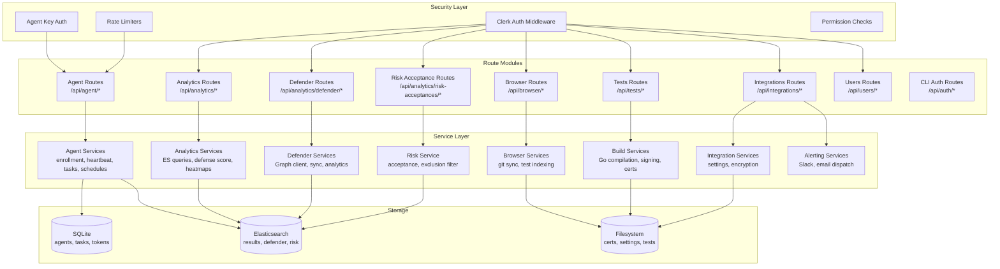

# Overview & Authentication

All endpoints are served from the backend at `/api/*`.

## Authentication

### Web Endpoints (Clerk JWT)

Most endpoints require a Clerk JWT in the Authorization header:

```bash
curl -H 'Authorization: Bearer <clerk-jwt>' https://backend.example.com/api/browser/tests
```

### API Keys (Programmatic Access)

For external applications that need long-lived programmatic access to the API, generate an API key in **Settings → API Keys** (admin only). Keys are `pa_`-prefixed bearer tokens:

```bash
curl -H 'Authorization: Bearer pa_<token>' https://backend.example.com/api/analytics/executions
```

Two scopes are available:

- **`read`** — every `*:read` permission (analytics, agents, tasks, schedules, test library, integrations status). Cannot mutate any resource.
- **`read-write`** — the `operator` permission set (create builds, tasks, schedules; no destructive actions, no user or cert management).

Keys are hashed at rest (SHA-256); the full plaintext is shown **once** at creation and is never retrievable again. Revoke a key from the Settings tab at any time — revocation is immediate.

API keys cannot manage other API keys; the management endpoints require `settings:users:manage` which only the `admin` role grants.

:::tip End-to-end usage walkthrough
For curl recipes, alerting integrations (CI gates, SIEM forwarders), and explanations of the gotchas you'll hit when scripting against the API, read the [Programmatic Access guide](./programmatic-access.md).
:::

### Agent Device Endpoints

Agent endpoints use an API key issued during enrollment:

```bash
curl -H 'X-Agent-Key: <api-key>' -H 'X-Agent-ID: <agent-id>' https://backend.example.com/api/agent/heartbeat
```

## Response Format

### Success
```json
{ "success": true, "data": { ... } }
```

### Error
```json
{ "success": false, "error": "Error message" }
```

## Rate Limits

| Endpoint Group | Limit |
|---------------|-------|
| Enrollment | 5 / 15 min per IP |
| Device (heartbeat, tasks) | 100 / 15 min per agent |
| Binary download | 10 / 15 min per IP |
| Key rotation | 3 / 15 min per IP |
| Auth | 20 / 15 min per IP |

## Route Groups

| Prefix | Auth | Purpose |
|--------|------|---------|
| `/api/browser/*` | Clerk | Test browser |
| `/api/analytics/*` | Clerk | Elasticsearch analytics |
| `/api/analytics/defender/*` | Clerk | Defender analytics |
| `/api/agent/admin/*` | Clerk | Agent management |
| `/api/agent/*` | Agent key | Device endpoints |
| `/api/tests/*` | Clerk | Build system, certificates |
| `/api/integrations/*` | Clerk | Defender, alerting config |
| `/api/analytics/risk-acceptances/*` | Clerk | Risk acceptance management |
| `/api/users/*` | Clerk | User management, invitations |
| `/api/api-keys/*` | Clerk (admin) | API key management — create, list, revoke |
| `/api/auth/*` | None/Clerk | CLI device flow auth |

## Route Architecture

The API is organized into domain-specific route modules, each backed by dedicated services:



## Cross-Module Integration Patterns

The route modules are not isolated — several critical workflows span multiple modules:

### Test Execution Pipeline

```
Browser Routes → Tests Routes → Agent Routes → Analytics Routes → Alerting
```

1. **Browse**: User discovers tests via Browser Routes
2. **Build**: Tests Routes compile and sign the binary
3. **Dispatch**: Agent admin routes create tasks for target agents
4. **Execute**: Agent device routes receive tasks and report results
5. **Analyze**: Analytics Routes query Elasticsearch for defense metrics
6. **Alert**: If thresholds are breached, Integration Routes trigger notifications

### Agent Lifecycle

```
Enrollment → Heartbeat → Task Polling → Result Ingestion → Key Rotation
```

All managed through Agent Routes with different auth strategies per sub-route:
- **Public**: Enrollment and binary downloads (rate-limited, no auth)
- **Agent-authenticated**: Heartbeat, task fetch, result submission (API key)
- **Admin**: Fleet management, task creation, scheduling (Clerk JWT)

### Configuration Flow

```
Integration Routes → Defender Routes → Analytics Routes
```

Defender credentials saved via Integration Routes enable the Defender sync service, which populates data queried by Defender Analytics Routes.

## Security Architecture

### Authentication Tiers

| Tier | Mechanism | Endpoints | Key Generator |
|------|-----------|-----------|---------------|
| **Public** | Rate limiting only | Agent downloads, enrollment | IP address |
| **Agent device** | `X-Agent-Key` + `X-Agent-ID` headers | Heartbeat, tasks, results | `<ip>:<agent-id>` composite |
| **API key** | `Authorization: Bearer pa_<token>` | Programmatic access (scope-gated) | IP address |
| **Clerk JWT** | `Authorization: Bearer <jwt>` | All admin endpoints | User ID |
| **Cron secret** | `CRON_SECRET` header (Vercel only) | Scheduled jobs | N/A |

### Input Validation

All routes validate inputs before passing to services:
- **UUID format checks** prevent path traversal in ID parameters
- **Platform validation** (`os` must be `windows`, `linux`, or `darwin`)
- **Payload size limits** protect against oversized uploads
- **Type coercion** via `extractFilterParams()` normalizes query string types

## Response Format Details

### Standard Success

```json
{
  "success": true,
  "data": { ... }
}
```

### Paginated Lists

```json
{
  "success": true,
  "data": [ ... ],
  "total": 142,
  "page": 1,
  "pageSize": 50
}
```

### Error Responses

```json
{
  "success": false,
  "error": "Human-readable error message"
}
```

HTTP status codes follow standard conventions: `400` for validation errors, `401` for authentication failures, `403` for authorization failures, `404` for missing resources, `429` for rate limits, and `500` for server errors.

:::tip Error Handling Pattern
All async route handlers are wrapped with `asyncHandler()`, which catches rejected promises and forwards them to the global error middleware. Throw `AppError` with an HTTP status code for structured error responses:
```typescript
throw new AppError('Resource not found', 404);
```
:::
