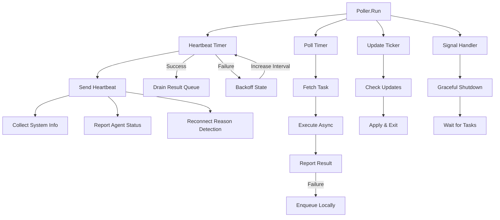
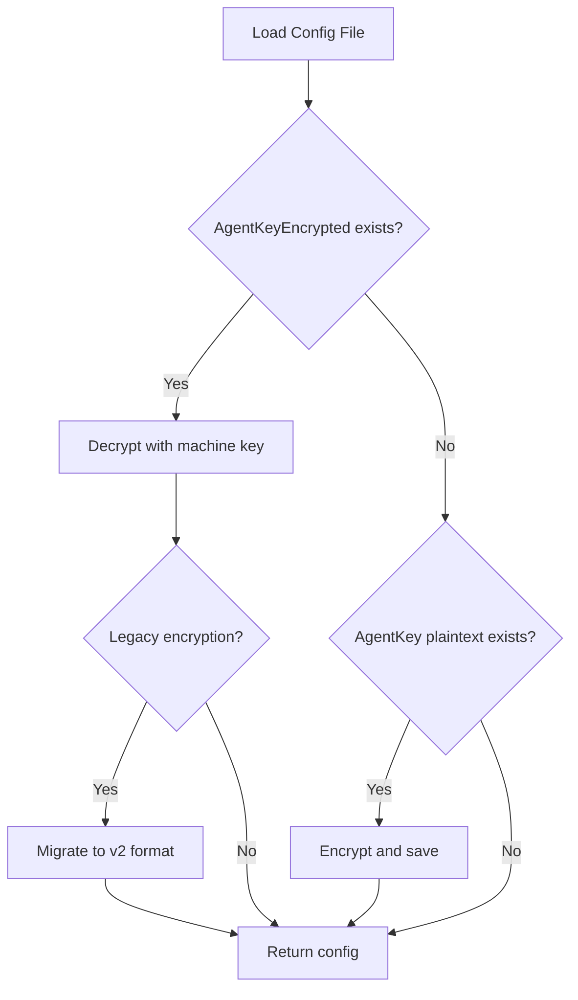

# Architecture

## Overview

The agent is a single Go binary (`achilles-agent`) that runs as a system service. It follows the standard Go project layout with `internal/` for private packages.

## Component Architecture

The following diagram shows how the major agent subsystems relate at runtime:



The **Poller** is the central event loop. It drives three independent cycles (heartbeat, task polling, update checking) and listens for OS signals to coordinate graceful shutdown.

## CLI Entry Points

```bash
achilles-agent --enroll --server <url> --token <token>  # Register with backend
achilles-agent --install                                 # Install as system service
achilles-agent --run                                     # Start polling loop
achilles-agent --status                                  # Show diagnostics
achilles-agent --uninstall                               # Remove service
```

:::tip
Pass `--install` together with `--enroll` to register and install as a service in a single step:
```bash
achilles-agent --enroll TOKEN --server https://server.com --install
```
:::

## Internal Packages

| Package | Purpose |
|---------|---------|
| `config` | Configuration file management |
| `enrollment` | Token-based registration flow |
| `executor` | Test binary download, verify, execute |
| `httpclient` | HTTP client with auth headers and TLS |
| `poller` | Heartbeat and task polling loop |
| `queue` | File-backed result queue for resilient reporting |
| `reporter` | Result reporting to backend |
| `service` | OS service management |
| `store` | Encrypted credential storage (AES-256-GCM) |
| `sysinfo` | Platform-specific system information |
| `updater` | Self-update mechanism |

## Runtime Services

### Enrollment (`internal/enrollment`)

Handles one-time agent registration. Collects system information (hostname, OS, architecture), posts to `/api/agent/enroll` with the enrollment token, and saves the returned configuration (agent ID, API key, polling intervals). Enforces HTTPS and includes redirect downgrade protection to prevent HTTPS-to-HTTP attacks.

### Poller (`internal/poller`)

The main runtime event loop. Manages three concurrent cycles:

- **Heartbeat timer** -- sends system metrics (CPU, memory, disk, uptime) to the backend at the configured heartbeat interval. Uses `time.Timer` (not `time.Ticker`) for adaptive interval control — intervals increase during extended server outages via backoff state and snap back to normal on first successful heartbeat. After each successful heartbeat, the local result queue is drained.
- **Poll timer** -- fetches pending tasks and dispatches them for async execution. Also uses `time.Timer` with adaptive intervals that follow the same backoff progression as heartbeat.
- **Update ticker** -- checks the server for new agent versions and applies them atomically.

**Concurrency model:** single-threaded main loop with an atomic busy flag ensuring only one task executes at a time. Tasks run in goroutines. Graceful shutdown waits up to 30 seconds for in-flight tasks before exiting.

### Executor (`internal/executor`)

Downloads, verifies, and runs security test binaries or shell commands.


Key safety measures:
- Binary integrity verification (SHA256 hash + file size)
- Isolated temporary directories under the configured work directory
- Process timeout enforcement with configurable limits
- Job Objects on Windows for reliable process tree termination
- Output capture capped at 1 MB to prevent memory exhaustion
- Custom environment variable injection for cloud credentials

### HTTP Client (`internal/httpclient`)

Provides authenticated communication with the backend. Every request includes:

```
Authorization: Bearer <agent_key>
X-Agent-ID: <agent_id>
X-Agent-Version: <version>
X-Request-Timestamp: <RFC3339>
```

Features exponential backoff retry on 429/5xx responses (1s, 2s, 4s intervals), custom CA certificate support, and HTTPS downgrade protection. Default request timeout is 30 seconds.

### Reporter (`internal/reporter`)

Delivers task execution results to the server with reliability guarantees. Retries up to 3 times with exponential backoff (2s, 4s, 8s). If all retries are exhausted, the task is marked as failed. Reports all results regardless of exit code -- the exit code **is** the result.

### Store (`internal/store`)

Persistent agent state stored as JSON in `state.json` within the work directory:

```go
type State struct {
    AgentID                 string     `json:"agent_id"`
    LastTaskID              string     `json:"last_task_id,omitempty"`
    LastHeartbeat           *time.Time `json:"last_heartbeat,omitempty"`
    LastSuccessfulHeartbeat *time.Time `json:"last_successful_heartbeat,omitempty"`
    Version                 string     `json:"version"`
}
```

Thread-safe read/write with mutex protection. Atomic updates via callback functions. Directories created with secure permissions (`0700`).

### System Info (`internal/sysinfo`)

Cross-platform system metrics collection for heartbeat payloads:

| Metric | Linux | macOS | Windows |
|--------|-------|-------|---------|
| CPU usage | `/proc/stat` | `sysctl` | `GetSystemTimes` |
| Memory | `syscall.Sysinfo` | `vm_stat` | `GlobalMemoryStatusEx` |
| Uptime | `syscall.Sysinfo` | `sysctl` | Win32 API |
| Disk free | Standard `syscall` | Standard `syscall` | Standard `syscall` |

### Status (`internal/status`)

Diagnostics and health reporting via `--status`. Displays agent identification, service state (running/stopped, PID), network connectivity (reachability, latency, last heartbeat), configuration details, and security status (key encryption, certificate validation).

## Configuration System

### Config Struct

All agent settings are held in a single struct:

```go
type Config struct {
    ServerURL         string        // Server endpoint
    PollInterval      time.Duration // Task polling frequency
    HeartbeatInterval time.Duration // Status reporting frequency
    AgentID           string        // Unique agent identifier
    AgentKey          string        // Authentication credential (in-memory only)
    AgentKeyEncrypted string        // Encrypted credential (on-disk)
    OrgID             string        // Organization identifier
    WorkDir           string        // Task execution directory
    LogFile           string        // Log output path
    MaxExecutionTime  time.Duration // Task timeout limit
    MaxBinarySize     int64         // Binary download size limit
    UpdateInterval    time.Duration // Self-update check frequency
    CACert            string        // Custom CA certificate
    SkipTLSVerify     bool          // Disable TLS verification (restricted)
    UpdatePublicKey   string        // Public key for update verification
}
```

:::warning
`AgentKey` is never written to disk. The on-disk representation is always `AgentKeyEncrypted`. If a plaintext `AgentKey` is found during `Load()`, it is automatically encrypted and the plaintext is removed.
:::

### Credential Protection (PBKDF2)

Agent API keys are encrypted at rest using machine-bound keys derived through PBKDF2:



**Current (v2) format:**
- PBKDF2-SHA256 with 210,000 iterations (OWASP 2023 recommendation)
- AES-256-GCM authenticated encryption
- Random salt per encryption operation
- On-disk format: `v2:` + base64(salt + nonce + ciphertext + tag)

**Legacy (v1) format:**
- Single-pass HMAC-SHA256 derivation with fixed context string
- Supported for backward compatibility; automatically migrated to v2 on load

### Machine ID Sources

The encryption key is derived from a stable, platform-specific machine identifier:

| Platform | Source |
|----------|--------|
| Linux | `/etc/machine-id` (systemd standard) |
| macOS | `IOPlatformUUID` from IORegistry |
| Windows | `MachineGuid` from Windows registry |

:::info
Machine ID binding means an encrypted config file is not portable between hosts. Re-enrollment is required if the agent binary is moved to a different machine.
:::

## Security Model

### Transport Security
- HTTPS is **required** for all remote server communication; `ValidateServerURL()` rejects plaintext HTTP to non-localhost addresses.
- `SkipTLSVerify` is restricted to localhost connections or when an explicit override is set via `ValidateTLSConfig()`.
- Custom CA certificates can be provided for environments with internal PKI.
- The HTTP client includes HTTPS downgrade protection to prevent redirect-based attacks.

### File Permissions
- **Unix (Linux/macOS):** config files `0600` (owner read/write), binaries `0700` (owner execute)
- **Windows:** `icacls` restricts access to SYSTEM and Administrators; inherited permissions are removed

### Process Isolation
- Each task executes in an isolated temporary directory
- Windows uses Job Objects for reliable process tree termination
- Output capture is capped at 1 MB
- Configurable execution timeout (`MaxExecutionTime`)

### Binary Integrity
- Downloaded test binaries are verified against SHA256 hash + expected file size before execution
- Agent updates are verified with Ed25519 cryptographic signatures over the SHA256 hash

## Resilience Features

### Adaptive Backoff

The heartbeat and poll timers use adaptive intervals that increase during extended server outages (60s → 5min → 15min → 30min cap). On first successful heartbeat, intervals snap back to normal. This reduces wasted network requests while maintaining fast recovery.

### Local Result Queue

When result reporting fails after all retries, the result is persisted as a JSON file in `{WorkDir}/queue/`. The queue drains automatically after each successful heartbeat. Maximum 100 files, FIFO order, restricted permissions (0600).

### Disconnect Reason Detection

When a heartbeat fails, the agent records a real-time **disconnect context**:
- HTTP error classification (DNS failure, connection refused, timeout, TLS error, etc.)
- Network adapter state check (per-platform: sysfs on Linux, GetAdaptersAddresses on Windows, ifconfig on macOS)
- System metrics snapshot (disk free, memory, CPU at time of failure)

On reconnection, the agent derives a specific reason from this context and sends a `reconnect_context` object:
- If the process restarted: checks for version change (update), OS uptime (reboot), or resource pressure (OOM/disk)
- If the process was running: uses the network adapter state and HTTP error type

The backend enriches `went_offline` events with last-known heartbeat metrics (`probable_cause`) and merges agent context + backend inference into the final `came_online` event details.

Possible reasons: `service_restart`, `machine_reboot`, `update_restart`, `network_adapter_disabled`, `server_unreachable`, `dns_failure`, `network_unreachable`, `connection_timeout`, `tls_error`, `disk_pressure_crash`, `memory_pressure_crash`, `network_recovery`.

## Execution Model

1. Agent starts and loads encrypted config
2. Enters polling loop (60s interval +/- 5s jitter)
3. Each poll: send heartbeat, check for tasks, check for updates
4. If task assigned: download binary -> verify -> execute -> report
5. If update available: download -> verify signature -> atomic replace -> restart
