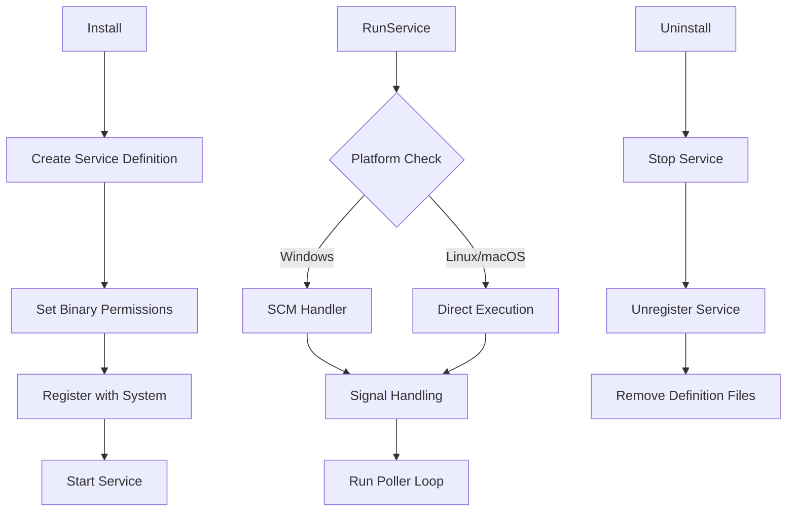

# Platform-Specific Code

## Build Tags

Platform-specific code uses Go build tags:

```go
//go:build darwin
// +build darwin

package service
```

### Files by Platform

| File Pattern | Platforms |
|-------------|----------|
| `*_darwin.go` | macOS (amd64, arm64) |
| `*_linux.go` | Linux (amd64) |
| `*_windows.go` | Windows (amd64) |

### Platform Differences

| Feature | Windows | Linux | macOS |
|---------|---------|-------|-------|
| Service manager | SCM (`sc.exe`) | systemd | launchd (plist) |
| System info | WMI/native | `/proc`, `/etc` | sysctl, vm_stat |
| Binary update | temp file + rename | atomic rename | atomic rename |
| Code signing | Authenticode | None | Ad-hoc (rcodesign) |
| File permissions | ACLs via `icacls` | Unix permissions | Unix permissions |

## CGO

CGO is **disabled** for all builds to produce static, cross-platform binaries:

```makefile
CGO_ENABLED=0 GOOS=linux GOARCH=amd64 go build ./...
```

## Service Management

The agent installs as a native system service on each platform. The core interface is the same across all three:

```go
func Install(configPath string) error
func Uninstall() error
func ServiceStatus() Status
func RunService(cfg *config.Config, st *store.Store, version string) error
```

The `Status` struct provides consistent state information:

```go
type Status struct {
    Installed bool  // Service is registered with system
    Running   bool  // Service is currently active
    PID       int   // Process ID (0 if unknown/stopped)
}
```

### Service Lifecycle



### Windows -- Service Control Manager

Windows uses the native SCM via `sc.exe` and the `golang.org/x/sys/windows/svc` package for the service handler.

Key behaviors:
- Creates a Windows service registered with the SCM
- Implements the full SCM lifecycle (start, stop, interrogate)
- Configures automatic restart on failure with exponential backoff
- Uses Task Scheduler as a fallback restart mechanism after updates
- Hardens the binary with `icacls` (SYSTEM + Administrators only, inherited permissions removed)

```bash
# What Install() does under the hood
sc.exe create achilles-agent binPath= "C:\path\to\achilles-agent.exe --run" start= auto
sc.exe failure achilles-agent reset= 86400 actions= restart/5000/restart/10000/restart/30000
icacls "C:\path\to\achilles-agent.exe" /inheritance:r /grant:r "SYSTEM:(F)" "Administrators:(F)"
```

:::info
On Windows, `RunService()` enters the SCM handler loop. The SCM sends control signals (stop, shutdown, interrogate) which the handler translates into context cancellation for the poller.
:::

### Linux -- systemd

Linux uses systemd unit files placed in `/etc/systemd/system/`.

Key behaviors:
- Creates a unit file with `Restart=always` and `RestartSec=5`
- Declares `After=network-online.target` to wait for network availability
- Manages lifecycle via `systemctl enable`, `systemctl start`, etc.
- Restricts binary permissions to root-only (`0700`)

```ini
# Generated unit file: /etc/systemd/system/achilles-agent.service
[Unit]
Description=Achilles Security Agent
After=network-online.target
Wants=network-online.target

[Service]
Type=simple
ExecStart=/usr/local/bin/achilles-agent --run
Restart=always
RestartSec=5

[Install]
WantedBy=multi-user.target
```

### macOS -- launchd

macOS uses launchd plist files placed in `/Library/LaunchDaemons/`.

Key behaviors:
- Creates a plist with `KeepAlive=true` for automatic restart
- Configures `RunAtLoad=true` for startup on boot
- Logs stdout/stderr to `/var/log/achilles-agent.log` and `/var/log/achilles-agent.err`
- Uses `launchctl load`/`unload` for service management

```xml
<!-- /Library/LaunchDaemons/com.achilles.agent.plist -->
<?xml version="1.0" encoding="UTF-8"?>
<!DOCTYPE plist PUBLIC "-//Apple//DTD PLIST 1.0//EN"
  "http://www.apple.com/DTDs/PropertyList-1.0.dtd">
<plist version="1.0">
<dict>
    <key>Label</key>
    <string>com.achilles.agent</string>
    <key>ProgramArguments</key>
    <array>
        <string>/usr/local/bin/achilles-agent</string>
        <string>--run</string>
    </array>
    <key>RunAtLoad</key>
    <true/>
    <key>KeepAlive</key>
    <true/>
    <key>StandardOutPath</key>
    <string>/var/log/achilles-agent.log</string>
    <key>StandardErrorPath</key>
    <string>/var/log/achilles-agent.err</string>
</dict>
</plist>
```

:::tip
On Linux and macOS, `RunService()` executes the poller loop directly in the foreground process. The service manager (systemd/launchd) handles restart-on-crash externally.
:::

## Auto-Update Flow

The agent checks for updates at a configurable interval. When a new version is available, it downloads, verifies, and replaces the running binary atomically.

### Cryptographic Verification

Updates are secured with a two-layer verification scheme:

1. **SHA256 hash** -- the downloaded binary's hash must match the server-provided hash.
2. **Ed25519 signature** -- the server signs the SHA256 hash with a private key. The agent verifies the signature using its configured public key.

```go
func verifySignature(hashBytes []byte, signatureHex string, publicKeyBase64 string) error
```

- Public keys are base64-encoded, signatures are hex-encoded
- The public key is set via the `update_public_key` config field during enrollment
- If no public key is configured, signature verification is skipped (not recommended for production)

:::warning
Without a configured `update_public_key`, the agent will accept any update that passes the SHA256 hash check. Always configure the public key in production deployments.
:::

### Update Process

```go
func CheckAndUpdate(ctx context.Context, client *httpclient.Client,
                   currentVersion string, cfg *config.Config) (bool, error)
```

Steps:

1. **Version check** -- query the server for the latest version metadata (version string, download URL, SHA256 hash, signature).
2. **Download** -- fetch the new binary to a temporary file.
3. **Hash verification** -- compute SHA256 of the downloaded file and compare against the server-provided hash.
4. **Signature verification** -- verify the Ed25519 signature over the SHA256 hash bytes.
5. **Platform-specific replacement** -- replace the running binary (see below).
6. **Restart** -- return `(true, nil)` to signal the poller to exit. The service manager restarts the process, which loads the new binary.

### Platform-Specific Binary Replacement

| Platform | Strategy | Reason |
|----------|----------|--------|
| Windows | Write to temp file, rename over original | Running `.exe` files are locked by the OS |
| Linux | Direct atomic rename | POSIX allows overwriting running executables |
| macOS | Direct atomic rename + ad-hoc code signing | POSIX rename works; ad-hoc signing satisfies macOS Launch Constraints |

:::info
On macOS, the updated binary is re-signed with an ad-hoc signature using `rcodesign sign --code-signature-flags adhoc`. This is required because macOS Launch Constraints reject unsigned binaries loaded from `/Library/LaunchDaemons/`.
:::

## Uninstall Process

### Two-Phase Uninstall

The uninstaller uses a two-phase approach to ensure the backend is properly notified before the agent removes itself:

**Phase 1: Report to backend**
- Send an "uninstall initiated" result to the server while the agent's authentication credentials are still valid.
- This allows the backend to mark the agent as uninstalled and stop expecting heartbeats.

**Phase 2: System cleanup**
- Stop and unregister the system service.
- Optionally delete agent files based on the cleanup parameter.

```go
func Execute(ctx context.Context, client *httpclient.Client,
            task executor.Task, cfg *config.Config) error
```

### Cleanup Modes

The uninstall task payload controls the cleanup level:

| Mode | Trigger | Behavior |
|------|---------|----------|
| **Soft delete** | `task.Payload.Command != "cleanup"` | Stop service, preserve files on disk |
| **Full cleanup** | `task.Payload.Command == "cleanup"` | Stop service, remove all files and directories |

### Platform-Specific Cleanup

**Windows:**
The running binary is locked by the OS and cannot be deleted by itself. The agent spawns a **detached `cmd.exe` process** that:
1. Waits for the agent process to exit
2. Removes the service via `sc delete`
3. Deletes the binary, work directory, and config files

```bash
# Simplified cleanup script spawned by the agent
ping -n 3 127.0.0.1 > nul
sc delete achilles-agent
del /f /q "C:\path\to\achilles-agent.exe"
rmdir /s /q "C:\path\to\workdir"
```

:::warning
On Windows, the detached cleanup process runs outside the agent's control. If the machine is shut down before cleanup completes, leftover files may remain. The backend should verify cleanup via the agent's absence from heartbeat checks.
:::

**Linux:**
- Direct file removal (POSIX allows deleting running executables)
- Removes the systemd unit file from `/etc/systemd/system/`
- Runs `systemctl daemon-reload` to refresh systemd
- Cleans up work directory and log files

**macOS:**
- Direct file removal (same POSIX behavior as Linux)
- Removes the launchd plist from `/Library/LaunchDaemons/`
- Runs `launchctl unload` before plist deletion
- Cleans up `/var/log/achilles-agent.{log,err}` and work directory

## Privilege Requirements

The `--install` and `--uninstall` CLI commands check for elevated privileges before attempting any operations:

| Platform | Check | Error Message |
|----------|-------|---------------|
| Linux/macOS | `os.Geteuid() == 0` | "install/uninstall requires administrator/root privileges" |
| Windows | `windows.GetCurrentProcessToken().IsElevated()` | "install/uninstall requires administrator/root privileges" |

Non-privileged users receive an explicit error instead of silent OS-level failures. The check is in `internal/service/elevate_unix.go` and `internal/service/elevate_windows.go`.

## Privilege Hardening

All platforms apply permission hardening during installation and after updates:

| Platform | Binary Permissions | Config Permissions |
|----------|-------------------|-------------------|
| Windows | SYSTEM + Administrators full control via `icacls`, inherited permissions removed | SYSTEM + Administrators read/write via `icacls` |
| Linux | `0700` (root execute only) | `0600` (root read/write only) |
| macOS | `0700` (root execute only) | `0600` (root read/write only) |
