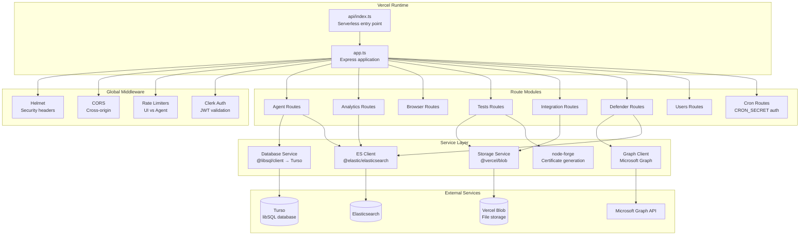

# Backend Serverless

## Overview

`backend-serverless/` is a separate codebase (not a build target of `backend/`) adapted for Vercel's serverless runtime.

## Key Differences

| Component | `backend/` | `backend-serverless/` |
|-----------|-----------|----------------------|
| Database | better-sqlite3 (sync) | @libsql/client (async, Turso) |
| DB helper | `getDatabase()` → sync `Database` | `getDb()` → async `DbHelper` |
| Storage | `fs` (filesystem) | `@vercel/blob` |
| Signing | Filesystem keypair | `SIGNING_PRIVATE_KEY_B64` env vars |
| Entry point | `server.ts` (Express listen) | `app.ts` (export) + `api/index.ts` |
| Scheduling | `setInterval` | Vercel Crons → `cron.routes.ts` |
| Test library | Runtime git sync | Build-time clone |
| Build system | Go cross-compilation | Stubbed (returns 503) |
| Cert generation | OpenSSL CLI | `node-forge` (pure JS) |

:::warning Independent Codebases
Changes to `backend/` do **not** propagate to `backend-serverless/`. If modifying shared logic (types, API contracts, ES mappings), update both codebases.
:::

## Architecture

The serverless backend is a layered Express.js application exported as a Vercel serverless function. Unlike the standard backend which calls `app.listen()`, the serverless variant exports the Express app and lets Vercel handle HTTP serving.



## Core Component Differences

### Database (`@libsql/client`)

The standard backend uses `better-sqlite3` with synchronous calls. The serverless backend uses `@libsql/client` which is fully async and connects to Turso's hosted libSQL service.

```typescript
// Standard backend (sync)
const db = getDatabase();
const row = db.prepare('SELECT * FROM agents WHERE id = ?').get(id);

// Serverless backend (async)
const db = getDb();
const row = await db.get('SELECT * FROM agents WHERE id = ?', [id]);
```

The `DbHelper` wrapper normalizes the libSQL client's API to match common patterns, but every database call requires `await`.

### Storage (`@vercel/blob`)

All file operations (certificates, settings, binaries) use Vercel Blob instead of the local filesystem:

| Operation | Standard Backend | Serverless Backend |
|-----------|-----------------|-------------------|
| Read file | `fs.readFileSync(path)` | `await fetch(blobUrl)` |
| Write file | `fs.writeFileSync(path, data)` | `await put(path, data, { access: 'public' })` |
| Delete file | `fs.unlinkSync(path)` | `await del(blobUrl)` |
| List files | `fs.readdirSync(dir)` | `await list({ prefix })` |

### Certificate Generation (`node-forge`)

The standard backend shells out to OpenSSL for certificate operations. The serverless backend uses `node-forge` (pure JavaScript) since native binaries are unavailable:

:::warning Performance Note
RSA-4096 key generation in pure JS takes 2-8 seconds. This is fine for Vercel Pro (60s timeout) but tight for Vercel Hobby (10s timeout). Certificate generation is a rare operation so this is acceptable in practice.
:::

### Scheduling (Vercel Cron)

Background tasks that run via `setInterval` in the standard backend are replaced with Vercel Cron routes:

| Task | Standard Backend | Serverless Backend |
|------|-----------------|-------------------|
| Schedule processing | `setInterval` (60s) | `GET /api/cron/schedules` |
| Key rotation | `setInterval` (1h) | `GET /api/cron/auto-rotation` |
| Defender sync | `setInterval` (5min/6h) | `GET /api/cron/defender-sync` |

Cron routes are protected by the `CRON_SECRET` header that Vercel sets automatically.

### Test Library (Build-time Clone)

The standard backend syncs the test library from Git at runtime. The serverless backend clones it once during the Vercel build step (`vercel-build` script) and bundles it into the deployment:

```json
{
  "scripts": {
    "vercel-build": "rm -rf data/f0_library && git clone <repo> data/f0_library && npm run build"
  }
}
```

The `includeFiles` setting in `vercel.json` ensures the cloned data directory is included in the deployment bundle.

### Stubbed Features

Features that require native toolchains or long-running processes return HTTP 503:

| Feature | Reason | Response |
|---------|--------|----------|
| Go cross-compilation | No Go toolchain in serverless | `503 "Not available on serverless"` |
| Git sync (runtime) | No persistent filesystem | `503 "Tests are updated at deploy time"` |

## Security Model

The serverless backend implements the same four-tier auth model as the standard backend:

1. **Public endpoints** — Agent downloads, enrollment (rate-limited)
2. **Agent device endpoints** — `X-Agent-Key` + `X-Agent-ID` authentication
3. **Admin endpoints** — Clerk JWT with permission checks
4. **Cron endpoints** — `CRON_SECRET` header validation

### Environment Variables

Required environment variables for the serverless deployment:

| Variable | Purpose |
|----------|---------|
| `CLERK_SECRET_KEY` | Clerk JWT validation |
| `CLERK_PUBLISHABLE_KEY` | Clerk frontend key |
| `TURSO_DATABASE_URL` | Turso connection string |
| `TURSO_AUTH_TOKEN` | Turso authentication |
| `BLOB_READ_WRITE_TOKEN` | Vercel Blob access |
| `ENCRYPTION_SECRET` | AES-256-GCM key for settings |
| `SIGNING_PRIVATE_KEY_B64` | Ed25519 private key (base64) |
| `SIGNING_PUBLIC_KEY_B64` | Ed25519 public key (base64) |

## Serverless Optimizations

### Cold Start Mitigation
- Lazy initialization of Elasticsearch client and test indexer
- Minimal top-level imports
- Service singletons created on first use, not at module load

### Stateless Design
- No in-memory caching across requests (each invocation is independent)
- Database connections created per request via Turso's HTTP protocol
- File operations go through Vercel Blob (no local state)

### Resource Constraints
- Request body size limits appropriate for serverless functions
- Timeout-aware operations (long-running tasks chunked or deferred to cron)
- Memory-efficient file processing (streaming where possible)

## Testing

```bash
cd backend-serverless && npm test   # 626 tests across 25 files (~11s)
```

Tests use the same patterns as the standard backend but mock `@libsql/client` instead of `better-sqlite3` and `@vercel/blob` instead of `fs`.
