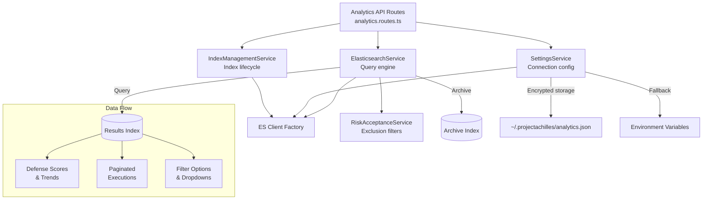
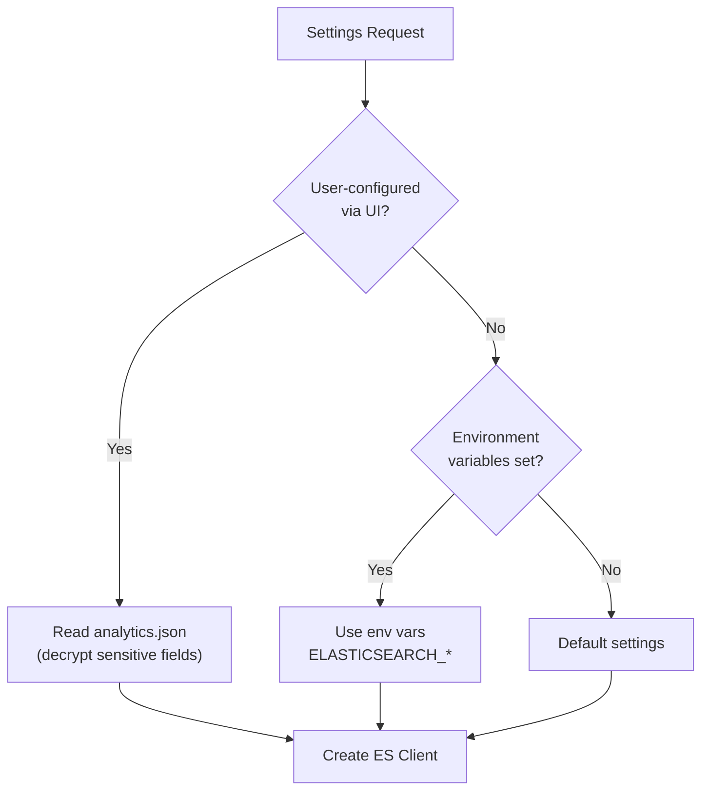
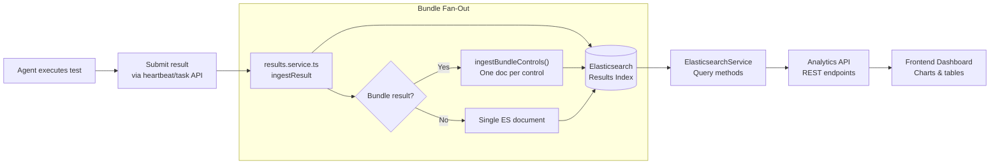

# Analytics Service

The Analytics module provides Elasticsearch-based analytics for security test execution data. It calculates defense scores, tracks trends over time, manages data lifecycle, and supports comprehensive filtering across all test dimensions.

**Key source files:** `backend/src/services/analytics/`

## Architecture

## Core Services

### ElasticsearchService

The primary analytics engine. All query methods accept a common filter set and return structured results for the frontend dashboard.

#### Defense Score Analytics

The defense score measures how effectively endpoint defenses detect and block security tests: `(protected_executions / conclusive_executions) * 100`.

| Method | Purpose |
|--------|---------|
| `getDefenseScore()` | Overall protection effectiveness for a time range |
| `getDefenseScoreTrend()` | Time-series defense score with rolling window smoothing |
| `getDefenseScoreByTest()` | Breakdown by individual test |
| `getDefenseScoreByTechnique()` | Breakdown by MITRE ATT&CK technique |
| `getDefenseScoreByOrg()` | Breakdown by organization |
| `getDefenseScoreBySeverity()` | Breakdown by test severity level |
| `getDefenseScoreByCategory()` | Breakdown by test category |
| `getDefenseScoreByHostname()` | Breakdown by endpoint hostname |

#### Test Execution Analysis

| Method | Purpose |
|--------|---------|
| `getPaginatedExecutions()` | Paginated test results with full filter support |
| `getGroupedPaginatedExecutions()` | Groups by bundle or standalone test for the Executions table |
| `getRecentExecutions()` | Latest test activity for the dashboard overview |

#### Error Rate and Coverage

| Method | Purpose |
|--------|---------|
| `getErrorRate()` | Proportion of inconclusive test outcomes |
| `getErrorRateTrendRolling()` | Error rate trends over time |
| `getTestCoverage()` | Protected vs unprotected counts per test |
| `getThreatActorCoverage()` | Coverage analysis by threat actor |
| `getCanonicalTestCount()` | Stable test count for coverage percentage calculations |

#### Data Management

| Method | Purpose |
|--------|---------|
| `archiveByGroupKeys()` | Archive specific test executions by composite key |
| `archiveByDateRange()` | Archive all executions before a given date |

### Key Features

**Risk acceptance integration:** Defense scores automatically exclude risk-accepted findings via the `RiskAcceptanceService`. The service supports dual-query mode to return both:
- **Adjusted score** -- with risk-accepted tests excluded (shown by default)
- **Real score** -- without exclusions (available on hover/toggle)

**Flexible filtering:** All query methods accept a common filter interface supporting:
- Tests, techniques, hostnames, categories, severities
- Threat actors, tags, error codes, result types
- OR logic for multiple values within a filter (e.g., `severities=critical,high`)

**Bundle vs standalone grouping:** The Executions table groups related results using Painless scripts in Elasticsearch:
- Bundle controls: `bundle::<bundle_id>::<hostname>`
- Standalone tests: `standalone::<test_uuid>::<hostname>`

**Rolling window analysis:** Time-series endpoints support configurable rolling windows for smoothed trend visualization, reducing noise from day-to-day variance.

### SettingsService

Manages Elasticsearch connection configuration with AES-256-GCM encryption for sensitive fields.

#### Configuration Priority

**Encrypted fields:** `cloudId`, `apiKey`, and `password` are encrypted using AES-256-GCM before writing to `analytics.json`. Encrypted values use the `enc:` prefix for detection on read.

#### Environment Variable Reference

| Variable | Purpose |
|----------|---------|
| `ELASTICSEARCH_CLOUD_ID` | Elastic Cloud deployment ID |
| `ELASTICSEARCH_NODE` | Self-hosted ES node URL |
| `ELASTICSEARCH_API_KEY` | API key authentication |
| `ELASTICSEARCH_USERNAME` | Basic auth username |
| `ELASTICSEARCH_PASSWORD` | Basic auth password |
| `ELASTICSEARCH_INDEX_PATTERN` | Index pattern for queries (e.g., `achilles-results-*`) |
| `ENCRYPTION_SECRET` | Key for AES-256-GCM field encryption |

:::tip Cloud vs self-hosted
The settings service supports both Elastic Cloud (via `cloudId` + `apiKey`) and self-hosted deployments (via `node` + username/password). The client factory automatically selects the correct connection method based on which fields are populated.
:::

### IndexManagementService

Handles Elasticsearch index creation, listing, and mapping management.

| Method | Purpose |
|--------|---------|
| `createResultsIndex()` | Create a new index with the canonical field mapping |
| `listResultsIndices()` | List existing indices with document counts and sizes |

The **canonical mapping** defines the standard field structure for test execution documents. Key field groups include:

| Field Group | Example Fields | Purpose |
|-------------|---------------|---------|
| `f0rtika.*` | `test_uuid`, `bundle_id`, `control_id` | Test identification |
| `f0rtika.result.*` | `exit_code`, `severity`, `techniques` | Test outcomes |
| `f0rtika.agent.*` | `hostname`, `os`, `arch` | Endpoint info |
| `f0rtika.meta.*` | `category`, `threat_actor`, `tags` | Test metadata |

## Error Code Classification

The analytics service uses a canonical error code system to classify test outcomes. These codes are used for defense score calculations, filtering, and trend analysis.

| Exit Code | Name | Category | Counts Toward Score? |
|-----------|------|----------|---------------------|
| 0 | `NormalExit` | inconclusive | No |
| 1 | `BinaryNotRecognized` | contextual | No |
| 101 | `Unprotected` | failed | Yes (unprotected) |
| 105 | `FileQuarantinedOnExtraction` | protected | Yes (protected) |
| 126 | `ExecutionPrevented` | protected | Yes (protected) |
| 127 | `QuarantinedOnExecution` | protected | Yes (protected) |
| 200 | `NoOutput` | inconclusive | No |
| 259 | `StillActive` | inconclusive | No |
| 999 | `UnexpectedTestError` | error | No |

**Key metrics derived from these codes:**

- **Defense Score:** `(protected / conclusive) * 100` where conclusive = codes `[101, 105, 126, 127]`
- **Error Rate:** `(error_count / total_activity) * 100` where error = codes `[0, 1, 259, 999]`

:::warning Conclusive vs inconclusive
Only conclusive exit codes (101, 105, 126, 127) contribute to the defense score. Inconclusive codes (0, 200, 259) and errors (999) are tracked separately via the error rate metric. This prevents test infrastructure issues from artificially deflating the defense score.
:::

## Data Flow: Ingestion to Dashboard

The complete data flow from test execution to dashboard visualization:

## API Routes

The analytics services are exposed through `analytics.routes.ts`:

| Endpoint | Method | Purpose |
|----------|--------|---------|
| `/api/analytics/defense-score` | GET | Current defense score |
| `/api/analytics/defense-score/trend` | GET | Defense score time series |
| `/api/analytics/defense-score/by-test` | GET | Per-test breakdown |
| `/api/analytics/defense-score/by-technique` | GET | Per-technique breakdown |
| `/api/analytics/defense-score/by-hostname` | GET | Per-endpoint breakdown |
| `/api/analytics/defense-score/by-severity` | GET | Per-severity breakdown |
| `/api/analytics/defense-score/by-category` | GET | Per-category breakdown |
| `/api/analytics/defense-score/by-org` | GET | Per-organization breakdown |
| `/api/analytics/executions` | GET | Paginated test executions |
| `/api/analytics/executions/grouped` | GET | Grouped executions (bundle-aware) |
| `/api/analytics/recent` | GET | Recent test activity |
| `/api/analytics/error-rate` | GET | Current error rate |
| `/api/analytics/error-rate/trend` | GET | Error rate time series |
| `/api/analytics/coverage` | GET | Test coverage statistics |
| `/api/analytics/coverage/threat-actor` | GET | Threat actor coverage |
| `/api/analytics/test-count` | GET | Canonical test count |
| `/api/analytics/settings` | GET/PUT | Connection settings (encrypted) |
| `/api/analytics/indices` | GET | List result indices |
| `/api/analytics/indices` | POST | Create new result index |
| `/api/analytics/archive` | POST | Archive test executions |

## Integration Points

### Results Ingestion Pipeline

The `results.service.ts` (in the agent services module) writes test results into Elasticsearch. It maintains schema compatibility with the canonical mapping defined by `IndexManagementService`. Bundle results are fanned out into individual documents -- one per control -- for granular analytics.

### Risk Acceptance Service

The `RiskAcceptanceService` provides a list of risk-accepted test UUIDs. The `ElasticsearchService` uses these to build exclusion filters for defense score queries, ensuring accepted risks do not penalize the score.

### Client Factory

A shared function creates Elasticsearch clients from `AnalyticsSettings` objects. It supports:
- **Elastic Cloud** connections (via `cloudId` + `apiKey`)
- **Direct** connections (via `node` URL + username/password or API key)
- Automatic authentication method selection

:::info Elasticsearch version compatibility
The backend uses `@elastic/elasticsearch` client v8.x, which must match the Elasticsearch server v8.x. The v9 client sends `compatible-with=9` headers that ES 8.x rejects with HTTP 400. Watch for npm/Dependabot updates bumping the client to v9.
:::

## Performance Considerations

- **Index patterns** -- use specific patterns (e.g., `achilles-results-2026.*`) to limit query scope when data volume is high
- **Rolling windows** -- configure window sizes based on data volume; larger windows smooth trends but increase query cost
- **Aggregation limits** -- most `by-*` endpoints use `size: 10000` term aggregations; adjust if the cardinality of a dimension exceeds this
- **Archive strategy** -- use `archiveByDateRange()` to move old data to a separate archive index, keeping the active index fast
