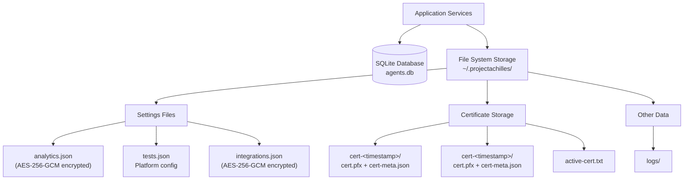

# Database & Migrations

## Database Location

- **Docker/PaaS**: `~/.projectachilles/agents.db` (better-sqlite3, WAL mode)
- **Vercel**: Turso (`@libsql/client`, async)

## Schema

Tables are created via `CREATE TABLE IF NOT EXISTS` in `database.ts` with incremental migrations.

### Tables

| Table | Purpose |
|-------|---------|
| `agents` | Enrolled agents with status, OS, tags |
| `enrollment_tokens` | Registration tokens with TTL and max uses |
| `tasks` | Task queue with status lifecycle |
| `agent_versions` | Uploaded binary versions per platform |
| `schedules` | Recurring execution schedules |
| `cli_auth_codes` | CLI device authorization codes with short TTL |

## Table Recreation Migrations

SQLite has no `ALTER COLUMN`, so changing CHECK constraints requires recreating the table:

:::danger Follow This Exact Pattern

```typescript
// 1. Drop leftover temp tables (previous crash may leave them)
database.exec('DROP TABLE IF EXISTS agents_temp');

// 2. Disable FK checks (tasks references agents)
database.pragma('foreign_keys = OFF');

// 3. Create temp table with new schema
database.exec(`CREATE TABLE agents_temp (...)`);

// 4. Copy data
database.exec('INSERT INTO agents_temp SELECT * FROM agents');

// 5. Swap
database.exec('DROP TABLE agents');
database.exec('ALTER TABLE agents_temp RENAME TO agents');

// 6. Recreate indexes
database.exec('CREATE INDEX ...');

// 7. Re-enable FK checks
database.pragma('foreign_keys = ON');
```

:::

### Key Gotchas

1. **Always `DROP TABLE IF EXISTS <temp>` first** — a previous crashed run may leave the temp table
2. **Disable FK checks** — `PRAGMA foreign_keys = OFF` before the swap. Tables with FK references refuse DROP
3. **Use `database.pragma()`** not `database.exec('PRAGMA ...')` — PRAGMA only works outside transactions

## Storage Architecture

Beyond the SQLite database, the backend persists configuration, certificates, and binary artifacts to a file-system-based storage layer. On serverless (Vercel), an equivalent Blob storage layer is used instead.



### File System Layout (Docker/PaaS)

```
~/.projectachilles/
├── agents.db                    # SQLite database (WAL mode)
├── analytics.json               # ES connection config (encrypted fields)
├── tests.json                   # Platform/arch build settings
├── integrations.json            # Defender + alerting config (encrypted fields)
├── certs/
│   ├── active-cert.txt          # ID of active signing certificate
│   ├── cert-1709234567/
│   │   ├── cert.pfx             # PKCS#12 certificate bundle
│   │   └── cert-meta.json       # Label, subject, expiry, source
│   └── cert-1709345678/
│       ├── cert.pfx
│       └── cert-meta.json
└── logs/                        # Activity and audit logs
```

### Vercel Blob Layout (Serverless)

On the serverless backend, the same logical structure is mirrored in Vercel Blob with hierarchical key prefixes:

```
settings/analytics.json
settings/tests.json
settings/agent-settings.json
certs/cert-<timestamp>/cert.pfx
certs/cert-<timestamp>/cert-meta.json
certs/active-cert.txt
binaries/<os>-<arch>/<filename>
builds/<uuid>/build-meta.json
```

## Encrypted Settings Management

Sensitive configuration fields are encrypted at rest using **AES-256-GCM**. This applies to both the Docker backend (file system) and the serverless backend (Vercel Blob).

### How It Works

1. The `ENCRYPTION_SECRET` environment variable provides the encryption key (32+ characters recommended). If unset, a machine-derived fallback is used.
2. Sensitive fields (Elasticsearch `cloudId`, `apiKey`, `password`; Defender `clientSecret`; alerting webhook URLs) are encrypted before being written to JSON files.
3. Encrypted values are stored with an `enc:` prefix so the settings service can distinguish encrypted from plaintext values.
4. On read, the service detects the `enc:` prefix and decrypts transparently.

### Configuration Priority (Analytics Settings)

The `SettingsService` resolves Elasticsearch connection config in this order:

1. **User-configured settings** (via UI) -- stored in `analytics.json` with encrypted fields
2. **Environment variables** -- `ELASTICSEARCH_CLOUD_ID`, `ELASTICSEARCH_NODE`, `ELASTICSEARCH_API_KEY`, etc.
3. **Default settings** -- last resort

:::warning Always set ENCRYPTION_SECRET in production
Without `ENCRYPTION_SECRET`, the backend falls back to a machine-derived key. This means encrypted settings become unreadable if the application moves to a different machine or container. Always set a stable `ENCRYPTION_SECRET` for any deployment.
:::

### Settings Files Reference

| File | Encrypted Fields | Purpose |
|------|-----------------|---------|
| `analytics.json` | `cloudId`, `apiKey`, `password` | Elasticsearch connection |
| `integrations.json` | `clientSecret`, webhook URLs | Defender + alerting credentials |
| `tests.json` | Certificate passwords | Build platform config |

### Serverless Storage Differences

| Aspect | Docker/PaaS (`backend/`) | Serverless (`backend-serverless/`) |
|--------|--------------------------|--------------------------------------|
| Storage layer | `fs` (file system) | `@vercel/blob` (Vercel Blob API) |
| Read operation | `fs.readFileSync()` | `blobReadText(key)` -- returns `null` on error |
| Write operation | `fs.writeFileSync()` | `blobWrite(key, data)` -- returns public URL |
| Existence check | `fs.existsSync()` | `blobExists(key)` -- HEAD request |
| List operation | `fs.readdirSync()` | `blobList(prefix)` -- key/URL/size array |
| Delete operation | `fs.unlinkSync()` | `blobDelete(key)` -- silently ignores missing keys |
| Caching | None (reads from disk) | None (reads from Blob API) |
| Access model | Process-local file access | Public URLs with `BLOB_READ_WRITE_TOKEN` |

:::info Blob storage error handling
The serverless storage module follows a "fail-safe" philosophy: read operations return `null` on any error (network, missing file, permission), and delete operations silently succeed even for non-existent keys. This prevents cascading failures in calling services.
:::
