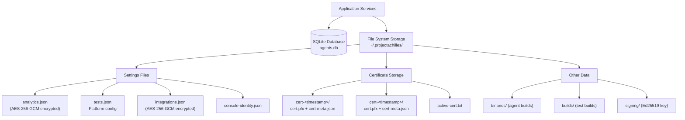

# Database & Migrations

## Database Location

- **Docker/PaaS**: `~/.projectachilles/agents.db` (better-sqlite3, WAL mode)
- **Vercel**: Turso (`@libsql/client`, async)

## Schema

Tables are created via `CREATE TABLE IF NOT EXISTS` in `database.ts` with incremental migrations.

### Tables

| Table | Purpose |
|-------|---------|
| `agents` | Enrolled agents with status, OS, tags |
| `enrollment_tokens` | Registration tokens with TTL and max uses |
| `tasks` | Task queue with status lifecycle |
| `deleted_tasks` | Archive of deleted tasks: the full row as JSON with `deleted_at` / `deleted_by`. Task lists never read it |
| `agent_versions` | Registered agent binary versions per platform |
| `schedules` | Recurring execution schedules |
| `heartbeat_history` | Heartbeat samples per agent |
| `agent_events` | Agent lifecycle events (went offline, key rotation, and so on) |
| `agent_key_digests` | HMAC-SHA256 digest of an agent key that already passed bcrypt, so later requests skip bcrypt |
| `run_notices` | Pre-execution notices (`tasks.notice_id` points here) |
| `notice_digests` | Advance (day-before) notice digests |
| `campaigns` | Saved test campaigns |
| `campaign_runs` | Campaign runs with a JSON snapshot of the campaign (`tasks.campaign_run_id` points here; no foreign key to `campaigns`) |
| `api_keys` | API keys (hashed) with their scope |
| `cli_auth_codes` | CLI device authorization codes with short TTL |
| `cli_refresh_tokens` | CLI refresh tokens |
| `cli_session_revocations` | Revoked CLI sessions |

The serverless backend has its own schema and does not have the campaign, notice, API key or archive tables.

## Table Recreation Migrations

SQLite has no `ALTER COLUMN`, so changing CHECK constraints requires recreating the table:

:::danger[Follow This Exact Pattern]

```typescript
// 1. Drop leftover temp tables (previous crash may leave them)
database.exec('DROP TABLE IF EXISTS agents_temp');

// 2. Disable FK checks (tasks references agents)
database.pragma('foreign_keys = OFF');

// 3. Create temp table with new schema
database.exec(`CREATE TABLE agents_temp (...)`);

// 4. Copy data (name the columns; do not rely on column order)
database.exec('INSERT INTO agents_temp (<cols>) SELECT <cols> FROM agents');

// 5. Swap
database.exec('DROP TABLE agents');
database.exec('ALTER TABLE agents_temp RENAME TO agents');

// 6. Recreate indexes
database.exec('CREATE INDEX ...');

// 7. Re-enable FK checks
database.pragma('foreign_keys = ON');
```

:::

### Key Gotchas

1. **Always `DROP TABLE IF EXISTS <temp>` first** — a previous crashed run may leave the temp table
2. **Disable FK checks** — `PRAGMA foreign_keys = OFF` before the swap. Tables with FK references refuse DROP
3. **Use `database.pragma()`** not `database.exec('PRAGMA ...')` — PRAGMA only works outside transactions
4. **A recreate drops every column it does not list.** `migrateExecuteCommandType` recreates the `tasks` table and runs even on a fresh database. Columns added later by `ALTER TABLE` (for example `notice_id`, `campaign_run_id`, `result_compacted_at`) survive only because they are listed in its `optionalCols`. When you add a `tasks` column, add it to `optionalCols`, and add its index to the index recreation in the same function. `migrateUninstalledStatus` has the same list for `agents`

## Storage Architecture

Beyond the SQLite database, the backend persists configuration, certificates, and binary artifacts to a file-system-based storage layer. On serverless (Vercel), an equivalent Blob storage layer is used instead.


```mermaid
graph TD
    APP[Application Services] --> DB[(SQLite Database<br/>agents.db)]
    APP --> FS[File System Storage<br/>~/.projectachilles/]

    FS --> SETTINGS[Settings Files]
    FS --> CERTS[Certificate Storage]
    FS --> MISC[Other Data]

    SETTINGS --> AJ["analytics.json<br/>(AES-256-GCM encrypted)"]
    SETTINGS --> TJ[tests.json<br/>Platform config]
    SETTINGS --> IJ["integrations.json<br/>(AES-256-GCM encrypted)"]
    SETTINGS --> CI[console-identity.json]

    CERTS --> CD1["cert-&lt;timestamp&gt;/<br/>cert.pfx + cert-meta.json"]
    CERTS --> CD2["cert-&lt;timestamp&gt;/<br/>cert.pfx + cert-meta.json"]
    CERTS --> ACT[active-cert.txt]

    MISC --> BIN["binaries/ (agent builds)"]
    MISC --> BLD["builds/ (test builds)"]
    MISC --> SIG["signing/ (Ed25519 key)"]
```

### File System Layout (Docker/PaaS)

```
~/.projectachilles/
├── agents.db                    # SQLite database (WAL mode)
├── analytics.json               # ES connection config (encrypted fields)
├── tests.json                   # Platform/arch build settings
├── integrations.json            # EDR integrations, alerting, pre-execution notices (encrypted fields)
├── console-identity.json        # Console identity (code, name, colour)
├── certs/
│   ├── active-cert.txt          # ID of active signing certificate
│   ├── cert-1709234567/
│   │   ├── cert.pfx             # PKCS#12 certificate bundle
│   │   └── cert-meta.json       # Label, subject, expiry, source, encrypted password
│   └── cert-1709345678/
│       ├── cert.pfx
│       └── cert-meta.json
├── binaries/<os>-<arch>/        # Registered agent binaries
├── builds/<test-uuid>/          # Test build output + build-meta.json
└── signing/                     # Ed25519 key that signs agent update binaries
```

### Vercel Blob Layout (Serverless)

On the serverless backend, the same logical structure is mirrored in Vercel Blob with hierarchical key prefixes:

```
settings/analytics.json
settings/tests.json
settings/agent-settings.json
certs/cert-<timestamp>/cert.pfx
certs/cert-<timestamp>/cert-meta.json
certs/active-cert.txt
binaries/<os>-<arch>/<filename>
builds/<uuid>/build-meta.json
```

## Encrypted Settings Management

Sensitive configuration fields are encrypted at rest using **AES-256-GCM**. This applies to both the Docker backend (file system) and the serverless backend (Vercel Blob).

### How It Works

1. The `ENCRYPTION_SECRET` environment variable provides the secret the key is derived from (HKDF-SHA256). It is required and must be at least 32 characters; encryption throws without it.
2. Sensitive fields (Elasticsearch `cloudId`, `apiKey`, `password`; EDR client secrets and API tokens; alerting webhook URLs and SMTP password; certificate passwords) are encrypted before being written to JSON files.
3. Encrypted values are stored with an `enc:` prefix so the settings service can distinguish encrypted from plaintext values.
4. On read, the service detects the `enc:` prefix and decrypts transparently.

### Configuration Priority (Analytics Settings)

The `SettingsService` resolves Elasticsearch connection config in this order:

1. **User-configured settings** (via UI) -- stored in `analytics.json` with encrypted fields
2. **Environment variables** -- `ELASTICSEARCH_CLOUD_ID`, `ELASTICSEARCH_NODE`, `ELASTICSEARCH_API_KEY`, etc.
3. **Default settings** -- last resort

:::warning[Keep ENCRYPTION_SECRET stable]
Settings encrypted with one `ENCRYPTION_SECRET` cannot be read with another. Generate it once (`openssl rand -base64 32`), keep it in your secret store and reuse it when the application moves to a different machine or container. Values written by old versions (keyed by a plain hash of the secret, or by a machine-derived key) are still decrypted for backward compatibility, but nothing is written with those keys any more.
:::

### Settings Files Reference

| File | Encrypted Fields | Purpose |
|------|-----------------|---------|
| `analytics.json` | `cloudId`, `apiKey`, `password` | Elasticsearch connection |
| `integrations.json` | Client secrets, API tokens, webhook URLs, SMTP password | EDR integration and alerting credentials, pre-execution notice settings |
| `tests.json` | None | Build platform config |
| `certs/<id>/cert-meta.json` | `password` | Signing certificate metadata |
| `console-identity.json` | None | Console identity |

### Serverless Storage Differences

| Aspect | Docker/PaaS (`backend/`) | Serverless (`backend-serverless/`) |
|--------|--------------------------|--------------------------------------|
| Storage layer | `fs` (file system) | `@vercel/blob` (Vercel Blob API) |
| Read operation | `fs.readFileSync()` | `blobReadText(key)` -- returns `null` on error |
| Write operation | `fs.writeFileSync()` | `blobWrite(key, data)` -- returns public URL |
| Existence check | `fs.existsSync()` | `blobExists(key)` -- HEAD request |
| List operation | `fs.readdirSync()` | `blobList(prefix)` -- key/URL/size array |
| Delete operation | `fs.unlinkSync()` | `blobDelete(key)` -- silently ignores missing keys |
| Caching | None (reads from disk) | None (reads from Blob API) |
| Access model | Process-local file access | Public URLs with `BLOB_READ_WRITE_TOKEN` |

:::info[Blob storage error handling]
The serverless storage module follows a "fail-safe" philosophy: read operations return `null` on any error (network, missing file, permission), and delete operations silently succeed even for non-existent keys. This prevents cascading failures in calling services.
:::
