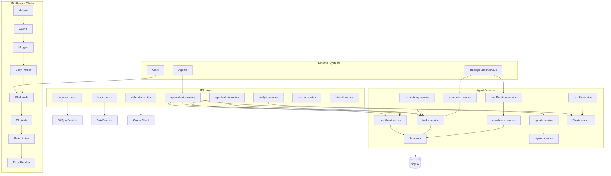
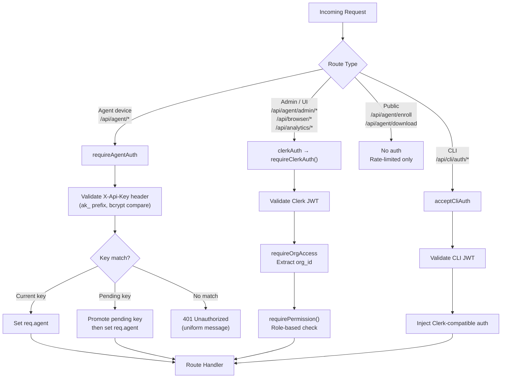

# Routes & Middleware

## Service Architecture

The backend is organized around several service domains that coordinate through a shared database layer. The diagram below shows how the major components connect:

## Route Organization

Routes are organized by module in `backend/src/api/`:

| File | Auth | Purpose |
|------|------|---------|
| `browser.routes.ts` | Clerk | Security test browser |
| `analytics.routes.ts` | Clerk | Elasticsearch analytics |
| `agent/enrollment.routes.ts` | None (public) | Agent enrollment, binary download |
| `agent/heartbeat.routes.ts` | Agent key / Clerk | Heartbeat + admin agent management |
| `agent/tasks.routes.ts` | Agent key / Clerk | Task distribution + admin task CRUD |
| `agent/update.routes.ts` | Agent key / Clerk | Agent updates + admin version management |
| `agent/schedules.routes.ts` | Clerk | Schedule management |
| `agent/catalog.routes.ts` | Clerk | Test catalog administration |
| `agent/binary.routes.ts` | Agent key | Binary download for test execution |
| `tests.routes.ts` | Clerk | Build system, certificates |
| `defender.routes.ts` | Clerk | Defender integration |
| `integrations.routes.ts` | Clerk | Defender credentials, alerting config |
| `risk-acceptance.routes.ts` | Clerk | Risk acceptance management |
| `cli-auth.routes.ts` | Mixed | CLI device authorization flow |
| `users.routes.ts` | Clerk | User management |

:::info Agent routes use a two-tier split
Agent endpoints live under `/api/agent/`. Admin endpoints (Clerk-authenticated) are mounted at `/api/agent/admin/*`, while device endpoints (API-key-authenticated) are mounted directly at `/api/agent/*`. The parent router in `agent/index.ts` applies the correct auth middleware at mount time.
:::

## Middleware Chain

Every request passes through the middleware stack in the order shown below. The chain is configured in `server.ts`:

### 1. Helmet — Security Headers

Configures Content Security Policy with directives for Clerk SDK (`'unsafe-inline'` for scripts), Tailwind (`'unsafe-inline'` for styles), and Clerk domains for `connectSrc`. Cross-origin embedder policy is disabled.

### 2. CORS

Origin is set via `CORS_ORIGIN` env var (defaults to `http://localhost:5173`). Credentials are enabled. `Authorization` and `Content-Disposition` headers are exposed for Clerk auth flows and file downloads.

### 3. Morgan — Request Logging

Uses `dev` format for colorized, concise HTTP logs during development.

### 4. Body Parser

`express.json()` with a 10 MB limit (required for binary uploads and large test payloads). URL-encoded parsing is enabled with `extended: true`.

### 5. Clerk Auth (global)

`clerkAuth` from `@clerk/express` runs on every request. It parses the JWT from the `Authorization` header and populates `req.auth` but does **not** reject unauthenticated requests. Route-level guards (`requireClerkAuth()`, `requireOrgAccess`, `requirePermission()`) enforce access on specific endpoints.

### 6. CLI Auth (global)

`acceptCliAuth()` checks for a CLI-issued JWT when Clerk has not already authenticated the request. If valid, it injects Clerk-compatible properties into `req.auth` so downstream `requireClerkAuth()` middleware works transparently.

### 7. Global API Rate Limiter

Applied to all `/api` routes except agent device endpoints (which have their own dedicated limiter). 1000 requests per 15-minute window per IP.

### 8. Error Handlers

`notFoundHandler` catches unmatched routes with a 404 response. `errorHandler` catches thrown `AppError` instances and unhandled errors, returning the standard `{ success: false, error: "message" }` format. Development mode includes stack traces.

## Authentication Flow

The backend supports three authentication methods depending on who is calling:

### Agent Authentication Details

The `requireAgentAuth` middleware (`agentAuth.middleware.ts`) implements:

- **In-memory cache** — Avoids repeated database lookups for frequently authenticating agents. Falls back to DB on cache miss.
- **Timing-attack protection** — Always runs `bcrypt.compare` against a dummy hash when the agent is not found, preventing enumeration via response timing.
- **Key rotation support** — During rotation, agents may present either the current or pending key. If the pending key matches, it is promoted atomically to become the new current key.
- **Replay protection** — Validates the `X-Request-Timestamp` header with a 5-minute clock skew tolerance.
- **Uniform error responses** — All failure modes return an identical `401 Unauthorized` message to prevent information leakage.

### User Authentication Details

Clerk integration (`clerk.middleware.ts`) provides:

- **`requireClerkAuth()`** — Rejects requests without a valid Clerk session.
- **`requireOrgAccess`** — Extracts the organization ID from multiple JWT claim locations (`auth.orgId`, `sessionClaims.org_id`, `sessionClaims.metadata.org_id`) and validates access.
- **`requireAgentOrgAccess`** — Verifies the requesting user belongs to the same organization as the target agent.
- **`requirePermission(...permissions)`** — Middleware factory that checks role-based permissions. Supported roles: `admin`, `operator`, `analyst`, `explorer`.

### CLI Authentication Details

The CLI device flow (`cliAuth.middleware.ts`) uses JWT tokens with `type: 'cli'`, signed with `CLI_AUTH_SECRET` (falls back to `ENCRYPTION_SECRET`). The `acceptCliAuth()` middleware only activates when Clerk has not already authenticated the request, ensuring zero interference with normal web auth.

## Rate Limiting Strategy

Rate limiting uses `express-rate-limit` with separate budgets for different endpoint types. Agent device endpoints key on the `X-Agent-ID` header (not IP) so agents behind a shared proxy do not exhaust each other's budgets.

| Endpoint Group | Limit | Window | Key | Rationale |
|---------------|-------|--------|-----|-----------|
| Global API | 1000 req | 15 min | IP | General UI/dashboard traffic |
| Enrollment | 5 req | 15 min | IP | Brute-force token protection |
| Binary download | 10 req | 15 min | IP | Bandwidth protection |
| Agent device | 100 req | 15 min | `X-Agent-ID` | Per-agent budget (heartbeat + polling) |
| Key rotation | 3 req | 15 min | IP | Expensive bcrypt operations |
| CLI device code | 10 req | 15 min | IP | Device code generation |
| CLI polling | 60 req | 1 min | IP | Frequent polling during auth flow |

:::tip Agent device rate limiting
The agent device limiter uses `X-Agent-ID` as the rate-limit key instead of IP. This prevents agents behind a shared reverse proxy (e.g., ngrok) from exhausting a single per-IP bucket with routine heartbeats and task polls, which would starve low-frequency requests like version checks.
:::

:::warning Global limiter skips agent routes
The global `apiLimiter` (1000/15min) explicitly skips paths starting with `/api/agent/` (excluding `/api/agent/admin/`). Agent device endpoints rely solely on their own dedicated limiter. This ensures agent traffic and UI traffic are rate-limited independently.
:::

## Backend vs Serverless Differences

The middleware module exists in both `backend/` and `backend-serverless/` with key differences:

| Aspect | `backend/` (Docker/PaaS) | `backend-serverless/` (Vercel) |
|--------|--------------------------|-------------------------------|
| Database operations | Synchronous (better-sqlite3) | Async (Turso `@libsql/client`) |
| Agent auth cache | In-memory cache for performance | No caching (stateless functions) |
| DB queries | Prepared statements | Promise-based queries |
| Background tasks | `setInterval` (schedules, auto-rotation) | Vercel Cron routes |
| CLI auth | SQLite `cli_auth_codes` table | Same pattern, async Turso |
