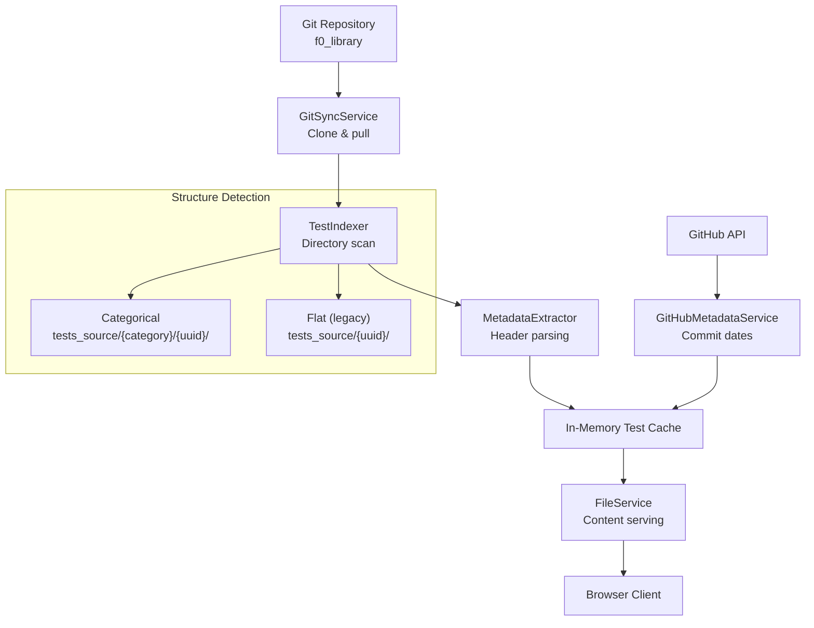
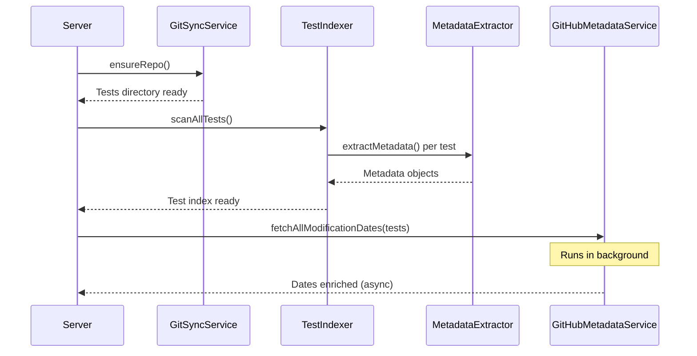

# Test Browser Service

The Test Browser module provides a complete system for discovering, indexing, and serving security test repositories. It handles Git repository synchronization, metadata extraction from Go source headers, and file content serving with type detection.

**Key source files:** `backend/src/services/browser/`

## Architecture



## Core Services

### GitSyncService

Manages Git repository cloning and synchronization with support for sparse checkout and private repository authentication.

**Key features:**
- **Sparse checkout** -- downloads only required directories (`tests_source`, `preludeorg-libraries`) to minimize clone time and disk usage
- **GitHub token authentication** -- injects `ghp_` token into the clone URL for private repositories
- **Force-push resilience** -- uses hard reset to handle upstream force-pushes cleanly
- **Configurable source subdirectories** -- supports multiple test source paths within a single repository

**Lifecycle methods:**

| Method | Behavior |
|--------|----------|
| `ensureRepo()` | Clone if missing, do not pull. Used at startup for fast initialization |
| `sync()` | Clone if missing, pull if exists. Used when user triggers manual sync |
| `getStatus()` | Returns last sync time, test count, and sync state |
| `getTestsSourcePath()` | Resolves the absolute path to the test source directory |

:::info Serverless difference
On Vercel, the test library is cloned at build time via the `vercel-build` script (not at runtime). The `GitSyncService` is not used in `backend-serverless/`. Instead, tests are included via the `includeFiles` directive in `vercel.json`.
:::

### TestIndexer

Discovers and indexes test directories by scanning the file system for valid test structures. Supports both the modern categorical layout and the legacy flat layout.

**Structure detection:**

- **Categorical** (current): `tests_source/{category}/{uuid}/` -- tests organized into categories like `defense-evasion`, `persistence`, etc.
- **Flat** (legacy): `tests_source/{uuid}/` -- all tests in a single directory level

**Multi-source support:** The indexer can scan multiple test source directories with different provenances, allowing upstream and local tests to coexist:

```typescript
const indexer = new TestIndexer([
  { path: './upstream-tests', provenance: 'upstream' },
  { path: './local-tests', provenance: 'local' }
]);
```

**File categorization:** Files within each test directory are automatically categorized based on naming patterns and extensions:

| Category | Matched Patterns |
|----------|-----------------|
| `documentation` | `README.md`, info cards |
| `source` | `.go`, `.ps1` files |
| `detection` | Sigma rules (`.yml`), KQL queries (`.kql`), YARA rules (`.yar`) |
| `defense` | Defense guidance, hardening rules |
| `config` | Shell scripts (`.sh`), `go.mod`, `go.sum` |

### MetadataExtractor

Extracts structured metadata from multiple file sources within each test directory. This is the most complex service in the module, parsing several complementary formats and merging them into a unified metadata object.

**Extraction sources (in priority order):**

1. **Go file headers** -- primary metadata from structured comment blocks at the top of `.go` files
2. **README.md** -- descriptions, technique mappings, and contextual information
3. **Info cards** -- scoring, validation details, and detection guidance
4. **Stage files** -- multi-stage test architecture with per-stage technique mappings

**Go header format:** Both legacy (5-field) and modern (12+ field) formats are supported:

```go
/*
ID: 550e8400-e29b-41d4-a716-446655440000
NAME: Test Name
TECHNIQUES: T1055.002, T1055.012
TACTICS: Defense Evasion, Privilege Escalation
SEVERITY: high
TARGET: windows, linux
COMPLEXITY: medium
THREAT_ACTOR: APT29
SUBCATEGORY: Process Injection
INTEGRATIONS: edr, siem
TAGS: persistence, injection
AUTHOR: Security Team
CREATED: 2024-01-15
UNIT: test-unit-001
*/
```

**Multi-stage detection:** Automatically identifies multi-stage tests by scanning for `stage-T*.go` files and extracts per-stage information including technique mappings and execution order.

:::tip Agent integration
The agent service reuses `MetadataExtractor` directly via the `test-catalog.service.ts` at startup to build a UUID-keyed metadata cache. This ensures metadata parsing is consistent between the browser UI and the task creation pipeline.
:::

### FileService

Provides secure file content serving with size limits and content type detection for syntax highlighting in the frontend.

**Security features:**
- **5 MB file size limit** -- prevents serving excessively large files
- **Path sanitization** -- error messages never expose internal file system paths to clients
- **Content type detection** -- maps file extensions to appropriate MIME types for syntax highlighting

**Supported file types:**

| Extension | Content Type | Use Case |
|-----------|-------------|----------|
| `.go` | Go source | Test source code |
| `.ps1` | PowerShell | Windows test scripts |
| `.sh` | Bash | Build scripts, config |
| `.md` | Markdown | Documentation |
| `.kql` | KQL | Detection queries |
| `.yar` | YARA | Detection rules |
| `.yml` / `.yaml` | YAML | Sigma rules, config |
| `.json` | JSON | Configuration |
| `.ndjson` | NDJSON | Sigma rules |

### GitHubMetadataService

Fetches additional metadata from the GitHub API, including last-modified dates and commit messages for each test directory.

**Features:**
- **Batched API requests** -- groups requests with delays to respect GitHub rate limits
- **In-memory caching** -- avoids redundant API calls within a session
- **Graceful degradation** -- missing dates do not break functionality; the UI falls back to "Unknown"
- **Token authentication** -- uses GitHub token for higher rate limits (5000/hour vs 60/hour unauthenticated)

**Background operation:** GitHub metadata fetching runs asynchronously after startup. The initial test listing is available immediately; GitHub dates are enriched once the background fetch completes.

## API Routes

The browser services are exposed through `browser.routes.ts`:

| Endpoint | Method | Purpose |
|----------|--------|---------|
| `/api/browser/tests` | GET | List all tests with metadata and filtering |
| `/api/browser/tests/:uuid` | GET | Get detailed metadata for a single test |
| `/api/browser/file` | GET | Serve file content with type detection |
| `/api/browser/sync` | POST | Trigger manual Git repository sync |
| `/api/browser/status` | GET | Get Git sync status and test count |

## Startup Sequence

During server initialization, the browser services are set up in this order:



## Error Handling

The module implements defensive error handling at every layer:

- **Git operations** -- token information is sanitized from error messages before logging or returning to clients
- **File operations** -- full paths are logged server-side but generic errors are returned to clients
- **GitHub API** -- rate limit responses (HTTP 429) are handled gracefully; processing continues without metadata
- **Test scanning** -- invalid test directories are skipped with a warning log; one bad test does not break the entire index
