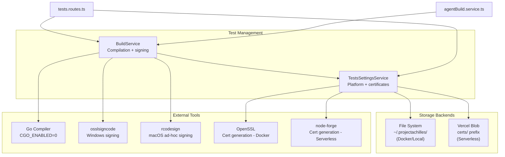
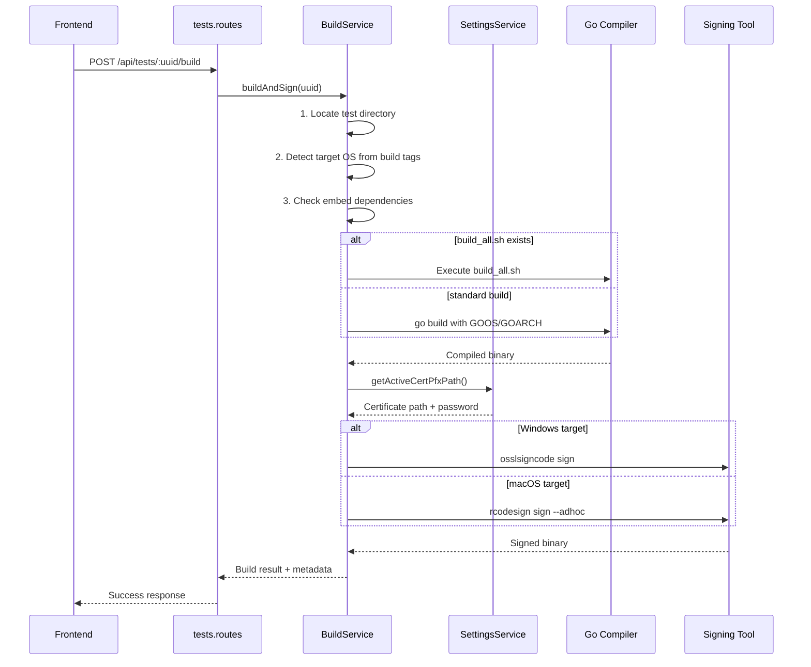
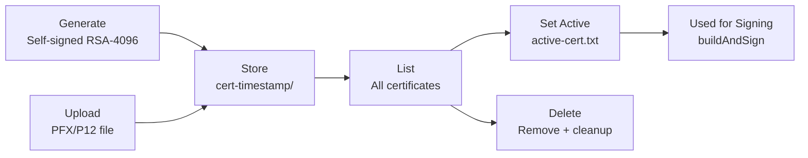

# Test Management Service

The Test Management module handles cross-platform compilation of Go-based security tests, code signing with certificates, and secure certificate storage. It provides the build pipeline that turns test source code into signed, deployable binaries.

**Key source files:** `backend/src/services/tests/`

## Architecture



## BuildService

The `BuildService` handles the complete build pipeline from Go source code to signed binary. It supports standard single-binary tests, multi-binary bundles (with `build_all.sh`), and direct binary uploads.

### Build Process Flow



### Key Methods

| Method | Purpose |
|--------|---------|
| `buildAndSign(uuid)` | Complete build pipeline: compile, sign, store metadata |
| `getEmbedDependencies(uuid)` | Analyze `//go:embed` directives, detect missing files |
| `uploadBinary(uuid, buffer)` | Direct binary upload with PE header validation |
| `saveUploadedFile(uuid, filename, buffer)` | Upload embed dependencies with security checks |

### Platform Detection

The build service automatically detects the target OS by scanning for Go build tags in the source files:

```go
//go:build windows    // Target: windows
//go:build darwin     // Target: darwin (macOS)
//go:build linux      // Target: linux
```

If no build tag is found, the global platform setting from `TestsSettingsService` is used as the fallback. Architecture (amd64/arm64) always comes from the global setting.

### Embed Dependency Management

Tests that use `//go:embed` directives may require pre-built binary dependencies. The build service distinguishes between two types:

| Type | Detection | Build Button | Upload |
|------|-----------|-------------|--------|
| **Source-built** | Has matching `.go` source or listed in `build_all.sh` | Enabled (wrench icon, "Auto-built" label) | Rejected |
| **External (pre-built)** | No matching source found | Blocked until uploaded | Allowed |

Source-built detection uses four heuristics in order:

1. **Direct match** -- `foo.exe` has a corresponding `foo.go`
2. **Hyphen-to-underscore** -- `validator-defender.exe` matches `validator_defender.go`
3. **UUID-prefix stage** -- `<uuid>-T1486.exe` strips UUID, checks `stage-T1486.go` or prefix patterns
4. **Fallback** -- parses `build_all.sh` for literal `go build -o <filename>` commands

### Multi-Binary Bundle Builds

Some tests use a multi-binary architecture with a `build_all.sh` orchestrator script. When detected, the build service:

1. Passes the active signing certificate via environment variables (`F0_SIGN_CERT_PATH`, `F0_SIGN_CERT_PASS_FILE`)
2. Executes `build_all.sh` which compiles and signs each validator binary
3. The password file uses mode `0o600` and is deleted in a `finally` block

:::warning Signing certificate required for bundle builds
Multi-binary bundles that include Windows validators need an active signing certificate. Without one, `build_all.sh` will produce unsigned binaries, which may be quarantined by endpoint protection during testing.
:::

### Code Signing

| Platform | Tool | Method | Certificate Required |
|----------|------|--------|---------------------|
| Windows | `osslsigncode` | Authenticode (PFX certificate) | Yes |
| macOS | `rcodesign` | Ad-hoc (`--code-signature-flags adhoc`) | No |
| Linux | -- | No signing | -- |

:::info Signing failures are non-fatal
If the signing tool is not installed or the certificate is unavailable, the build completes with an unsigned binary. The build result metadata includes a `signed: false` flag so the UI can display a warning.
:::

## TestsSettingsService

Manages platform configuration and code-signing certificates with encrypted storage.

### Platform Management

Stores the target platform (OS + architecture) used when no build tag is present in the source code. Invalid combinations like `darwin/386` are rejected at validation time.

### Certificate Management

The service supports up to 5 certificates simultaneously, with one designated as "active" for signing operations.

**Certificate lifecycle:**



**Certificate sources:**

| Source | Method | Key Generation | Notes |
|--------|--------|---------------|-------|
| Generated | `generateCertificate()` | RSA-4096 | Docker: OpenSSL CLI. Serverless: `node-forge` (pure JS, 2-8s) |
| Uploaded | `uploadCertificate()` | User-provided | PFX password validated on import |

**Storage structure:** Each certificate is stored in an isolated directory:

```
certs/
├── active-cert.txt                  # Contains ID of active cert
├── cert-1709234567/
│   ├── cert.pfx                     # PKCS#12 bundle (private key + cert chain)
│   └── cert-meta.json               # Label, subject, expiry, source, created
└── cert-1709345678/
    ├── cert.pfx
    └── cert-meta.json
```

**Security features:**
- Certificate passwords are encrypted at rest using **AES-256-GCM** (key derived from `ENCRYPTION_SECRET`)
- Temporary password files for `osslsigncode` use restrictive permissions (`0o600`) and are deleted immediately after use
- Path traversal protection on all file operations
- Maximum of 5 certificates enforced (uploaded + generated combined)

### Legacy Migration

On the Docker backend, certificates stored in the old flat-file layout (`~/.projectachilles/cert.pfx`) are automatically migrated to the subdirectory structure on the first call to `listCertificates()`.

### Docker vs Serverless Differences

| Aspect | Docker (`backend/`) | Serverless (`backend-serverless/`) |
|--------|--------------------|------------------------------------|
| Certificate generation | OpenSSL CLI (`openssl req`, `openssl pkcs12`) | `node-forge` (pure JavaScript) |
| PFX parsing | OpenSSL CLI | `node-forge` (try/catch with graceful fallback) |
| Storage | File system (`~/.projectachilles/certs/`) | Vercel Blob (`certs/` prefix) |
| Key generation time | Sub-second (native OpenSSL) | 2-8 seconds (pure JS RSA-4096) |
| External dependencies | `openssl`, `osslsigncode`, `rcodesign` | None (pure JS) |

:::tip node-forge compatibility
`node-forge` uses `3des` (not AES) for PKCS#12 encoding to maintain compatibility with OpenSSL's default PFX parsing. X.509 validity times have second precision only -- always truncate milliseconds before setting `notAfter`.
:::

## API Routes

The test management services are exposed through `tests.routes.ts`:

| Endpoint | Method | Purpose |
|----------|--------|---------|
| `/api/tests/:uuid/build` | POST | Build and sign a test binary |
| `/api/tests/:uuid/files/:filename` | POST | Upload an embed dependency |
| `/api/tests/:uuid/binary` | POST | Direct binary upload |
| `/api/tests/platform` | GET | Get current platform settings |
| `/api/tests/platform` | PUT | Update platform settings |
| `/api/tests/certificates` | GET | List all certificates |
| `/api/tests/certificates` | POST | Upload a PFX certificate |
| `/api/tests/certificates/generate` | POST | Generate a self-signed certificate |
| `/api/tests/certificates/:id/active` | PUT | Set active certificate |
| `/api/tests/certificates/:id` | DELETE | Delete a certificate |

## Error Handling

Build errors use a custom `BuildError` type that includes:
- The failing command and its arguments
- `stderr` output from the build process
- A user-friendly message describing what went wrong

Certificate operations include validation and rollback mechanisms to prevent partial failures from leaving the system in an inconsistent state (e.g., a certificate directory created but metadata write failed).

## Agent Build Integration

The `BuildService` is also used by `agentBuild.service.ts` to compile and sign agent binaries. The agent build service uses the same certificate infrastructure, signing pipeline, and platform detection -- ensuring consistent behavior between test builds and agent builds.
