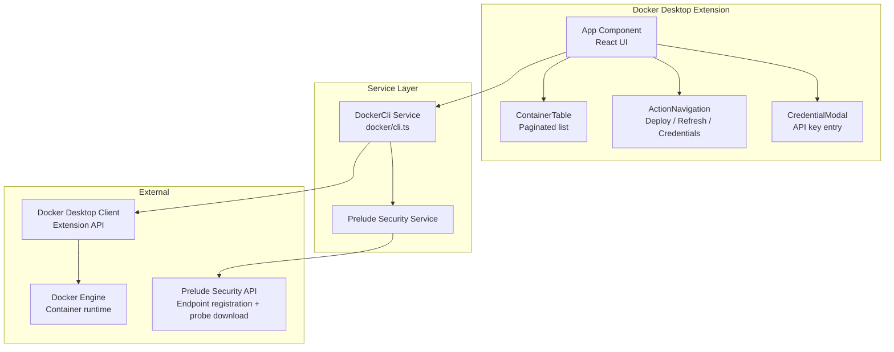
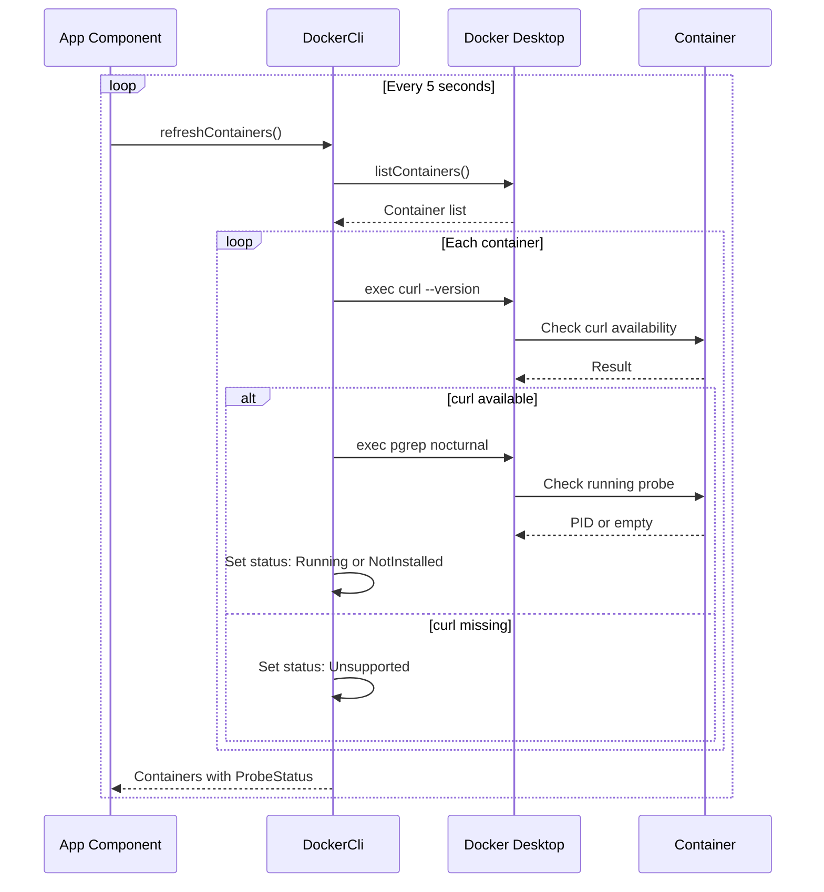
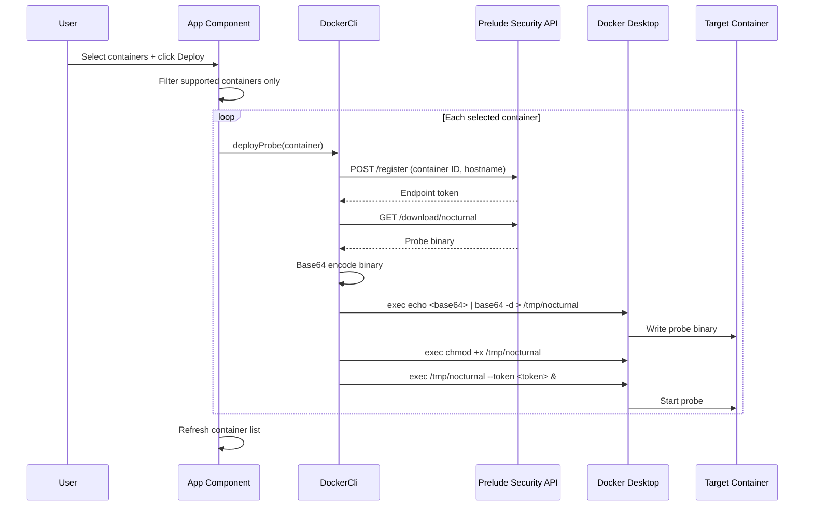

# Container Extension

The Container Extension is a Docker Desktop extension that provides a graphical interface for deploying and managing security probes inside running Docker containers. It integrates with Prelude Security's platform for continuous container security monitoring.

## What It Does

- View all running Docker containers in a unified interface
- Deploy security probes ("nocturnal") to supported containers
- Monitor probe status and container compatibility
- Manage Prelude Security API credentials

## Architecture



## Core Components

### App Component (`App.tsx`)

The main application component manages:

- **Container state**: List of running containers with probe status
- **Multi-select**: Checkbox selection for batch probe deployment
- **Auto-refresh**: Container list refreshes every 5 seconds
- **Alert feedback**: Temporary status messages via `fireAlert()` system

### DockerCli Service (`docker/cli.ts`)

The bridge between Docker Desktop and Prelude Security:

```typescript
class DockerCli {
  #ddClient: DockerDesktopClient;
  #service: Service;
}
```

**Container management:**
- `listContainers()` — Retrieves running containers from Docker Engine
- `checkDependencies()` — Validates container compatibility (checks for `curl`)
- `#checkRunningProbe()` — Detects if a probe is already installed
- `#checkCurl()` — Verifies required dependencies exist in container

**Probe deployment:**
- `deployProbe()` — Full deployment workflow (register, download, transfer, execute)
- `#registerEndpoint()` — Registers container with Prelude Security API
- `#downloadProbe()` — Fetches the nocturnal probe binary

**Credential management:**
- `setCredentials()` — Stores API credentials in localStorage
- `getCredentials()` — Retrieves stored credentials

### UI Components

**ContainerTable** — Paginated table (10 rows per page) showing container name, image, and probe status with visual indicators. Supports multi-selection via checkboxes.

**ActionNavigation** — Three primary actions:
- **Deploy Probes** — Disabled when credentials are missing
- **Refresh** — Manual container list refresh
- **Set Credentials** — Opens credential entry modal

**ProbeStatusIcon** — Visual status indicators:

| Icon | Color | Status |
|------|-------|--------|
| Running icon | Green | Probe is active |
| Close icon | Pink | Supported but not installed |
| Do-not-disturb icon | Gray | Container unsupported |

**CredentialModal** — Dialog for entering Prelude Security account ID and API token. Validates required fields before saving.

## Data Flow

### Container Discovery



### Probe Deployment



## Probe Status Model

```typescript
enum ProbeStatus {
  Unsupported = 0,    // Container lacks curl — cannot deploy
  NotInstalled = 1,   // Compatible but probe not running
  Running = 2         // Probe deployed and active
}
```

:::info Compatibility Requirement
Containers must have `curl` available to receive the probe binary. Alpine-based images and minimal distroless containers are typically marked as Unsupported. Use a full base image (e.g., `ubuntu`, `debian`) for probe compatibility.
:::

## Integration Points

| System | Integration | Purpose |
|--------|-------------|---------|
| Docker Desktop Extension API | Container listing, CLI command execution | Discover and manage containers |
| Prelude Security API | Endpoint registration, probe downloads | Security monitoring backend |
| localStorage | Credential persistence | Store API keys across sessions |

## Error Handling

The extension provides user feedback through the `ActionStatus` component:

- **Network errors**: API failures show human-readable error messages
- **Validation errors**: Prevents deployment to unsupported containers
- **Status feedback**: Real-time alerts for all operations with 5-second auto-dismiss
- **Graceful degradation**: Continues processing remaining containers if one fails

:::tip
If a container shows as Unsupported, verify that the container image includes `curl`. You can test manually with `docker exec <container-id> which curl`.
:::
