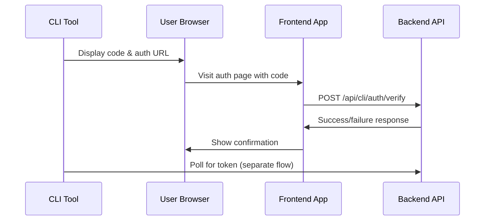
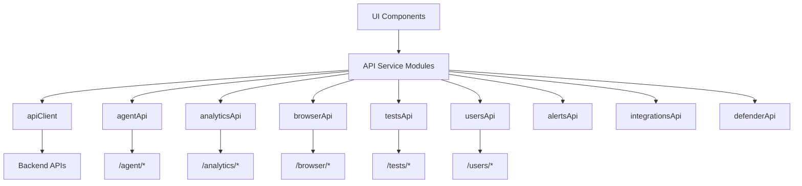

# Auth Hooks

## useAuthenticatedApi

The primary hook for making authenticated API calls. It automatically injects the Clerk JWT token into request headers.

```typescript
const api = useAuthenticatedApi();

// All requests include Authorization: Bearer <jwt>
const response = await api.get('/api/browser/tests');
```

## Three-Tier Auth Model

1. **Clerk (global)** — All web routes require Clerk authentication
2. **Analytics** — `AnalyticsAuthProvider` context redirects to setup if ES is unconfigured
3. **Agent admin** — Clerk JWT required; agent device endpoints use agent API key

## AnalyticsAuthProvider

Wraps Analytics pages and redirects to `/analytics/setup` if Elasticsearch is not configured:

```typescript
<AnalyticsAuthProvider>
  <AnalyticsDashboard />
</AnalyticsAuthProvider>
```

The companion hook `useAnalyticsAuth` exposes the configuration state:

```typescript
const { configured, loading, settings, checkConfiguration } = useAnalyticsAuth();

if (!configured) {
  return <AnalyticsSetupWizard />;
}
```

---

## Clerk Integration Details

All authentication flows are powered by Clerk's React SDK. The integration provides:

- **`useAuth()`** -- Token management and session state
- **Pre-built UI** -- `<SignIn>`, `<SignUp>`, `<UserProfile>` components for consistent UX
- **Automatic session management** -- Token refresh handled transparently
- **Environment-aware keys** -- `VITE_CLERK_PUBLISHABLE_KEY` (Vite prefix required)

### Auth Pages

| Page | Route | Purpose |
|------|-------|---------|
| `SignInPage` | `/sign-in/*` | Login flow, cross-links to sign-up |
| `SignUpPage` | `/sign-up/*` | Registration flow, cross-links to sign-in |
| `UserProfilePage` | `/user-profile` | Self-service account management |

All auth pages redirect to `/dashboard` after successful authentication.

### CLI Device Flow

The `CliAuthPage` implements an OAuth2-style device flow for authenticating CLI tools:



**Flow steps:**
1. CLI generates a device code and displays the auth URL
2. User visits the URL (code auto-populated from query param) or enters code manually
3. Frontend verifies code with the backend using the user's Clerk JWT
4. CLI receives authentication confirmation via a separate polling mechanism

:::info
Device codes are automatically uppercased on input. A `useRef` guard prevents double-execution in React Strict Mode. CLI sessions expire after 7 days.
:::

## Role-Based Access Control

Roles are stored in Clerk's public metadata and exposed through three hooks:

| Hook | Purpose | Example |
|------|---------|---------|
| `useAppRole()` | Get current role | `'admin'`, `'operator'`, `'analyst'`, `'explorer'`, or `undefined` |
| `useHasPermission(perm)` | Check specific permission | `useHasPermission('agent:write')` |
| `useCanAccessModule(mod)` | Check module access | `useCanAccessModule('analytics')` |

```typescript
// Check if user can access a specific module
const canViewAnalytics = useCanAccessModule('analytics');

// Check for specific permissions
const canManageAgents = useHasPermission('agent:write');

// Get current role
const role = useAppRole();
```

:::tip
Users without explicit roles get full access. This ensures smooth transitions during role system deployment -- no one is locked out before roles are assigned.
:::

### Route Protection Pattern

```tsx
// Basic authentication requirement
<RequireAuth>
  <DashboardPage />
</RequireAuth>

// Module-specific access control (layered)
<RequireAuth>
  <RequireModule module="analytics">
    <AnalyticsPage />
  </RequireModule>
</RequireAuth>
```

`RequireModule` redirects unauthorized users to `/dashboard` (not a hard block).

---

## API Client Architecture

All backend communication flows through a centralized `apiClient` instance created by the `useAuthenticatedApi` hook. Domain-specific service objects wrap this client with typed methods.



### How the API Client Works

The `useAuthenticatedApi` hook (called once in `AppContent`) creates a module-level Axios instance with interceptors that:

1. **Attach JWT tokens** from Clerk's `getToken()` on every request
2. **Extract error messages** from backend `{ success: false, error: "..." }` responses
3. **Detect auth failures** disguised as HTML redirects (Clerk redirect pages)

```
UI Action --> API Service --> apiClient --> Token Validation --> Backend Request
```

:::warning
The token is registered synchronously during render to eliminate race conditions. Do not call API services before `useAuthenticatedApi` has run (it runs in `AppContent`, which is inside `ClerkProvider`).
:::

## Service Module Catalog

All services live in `frontend/src/services/api/` and re-export their TypeScript interfaces.

### Agent API (`agentApi`)

| Category | Methods |
|----------|---------|
| **Agent management** | `listAgents()`, `getAgent()`, `updateAgent()`, `deleteAgent()`, `rotateAgentKey()` |
| **Task operations** | `createTasks()`, `createCommandTasks()`, `triggerUpdate()`, `createUninstallTasks()`, `listTasks()`, `listTasksGrouped()`, `cancelTask()` |
| **Scheduling** | `createSchedule()`, `updateSchedule()`, `deleteSchedule()` |

### Analytics API (`analyticsApi`)

| Category | Methods |
|----------|---------|
| **Defense score** | `getDefenseScore()`, `getDefenseScoreTrend()`, `getDefenseScoreByTest()`, `getDefenseScoreBySeverity()` |
| **Executions** | `getPaginatedExecutions()`, `getGroupedPaginatedExecutions()`, `getErrorRate()`, `getErrorRateTrend()` |
| **Risk management** | `acceptRisk()`, `revokeRisk()`, `listAcceptances()` |

### Browser API (`browserApi`)

`getAllTests()`, `syncTests()`, `getTestDetails()`, `getFileContent()`, `getAttackFlow()`

### Tests API (`testsApi`)

| Category | Methods |
|----------|---------|
| **Certificates** | `listCertificates()`, `generateCertificateWithLabel()`, `uploadCertificate()`, `setActiveCertificate()` |
| **Builds** | `buildTest()`, `getBuildInfo()`, `downloadBuild()`, `uploadEmbedFile()` |

### Integration APIs

| Service | Key Methods |
|---------|-------------|
| `integrationsApi` | `saveAzureSettings()`, `testAzureConnection()` |
| `defenderApi` | `getSecureScore()`, `getAlerts()`, `getDetectionRate()` |
| `alertsApi` | `getAlertSettings()`, `testAlertChannels()` |

### Backend Route Mapping

| Backend route prefix | Frontend service |
|---------------------|-----------------|
| `/agent/*` | `agentApi` |
| `/analytics/*` | `analyticsApi` |
| `/browser/*` | `browserApi` |
| `/tests/*` | `testsApi` |
| `/users/*` | `usersApi` |
| `/integrations/*` | `alertsApi`, `integrationsApi` |

## Error Handling Patterns

### Graceful Degradation

Services that power optional features return safe defaults on failure:

```typescript
// From alertsApi — returns unconfigured state if backend is unreachable
async getAlertSettings(): Promise<AlertSettingsMasked> {
  try {
    const response = await apiClient.get('/integrations/alerts');
    return response.data;
  } catch {
    return { configured: false }; // Safe default
  }
}
```

### Type-Safe Responses

All services export TypeScript interfaces for request/response types:

```typescript
export interface CreateTasksRequest {
  org_id: string;
  agent_ids: string[];
  task_type: string;
}

export interface AgentTask {
  id: string;
  status: 'pending' | 'running' | 'completed' | 'failed';
  created_at: string;
}
```

### Usage in Components vs Redux

```typescript
// Direct usage in components
import { agentApi } from '@/services/api/agent';

useEffect(() => {
  agentApi.listAgents({ status: 'active' })
    .then(setAgents)
    .catch(handleError);
}, []);

// Usage in Redux async thunks
const fetchAgents = createAsyncThunk(
  'agents/fetchAgents',
  async (params: ListAgentsRequest) => {
    return await agentApi.listAgents(params);
  }
);
```
