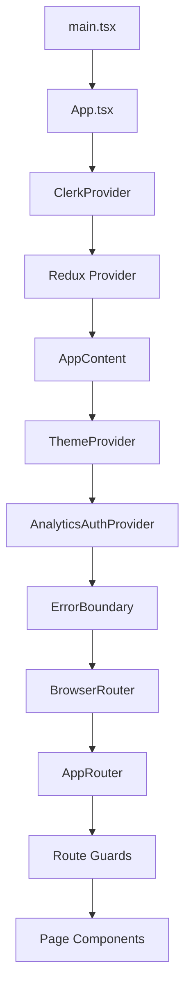

# React Patterns

## Component Patterns

### Functional Components with Hooks

All components use functional components with hooks. No class components.

```typescript
interface SecurityTestCardProps {
  test: SecurityTest;
  onFavorite: (uuid: string) => void;
}

export function SecurityTestCard({ test, onFavorite }: SecurityTestCardProps) {
  // Component implementation
}
```

### Path Alias

Use `@/` for imports within `frontend/src/`:

```typescript
import { Button } from '@/components/shared/ui/Button';
import { useAuthenticatedApi } from '@/hooks/useAuthenticatedApi';
```

### Import Ordering

Group imports: external libraries first, then internal modules:

```typescript
// External
import { useState, useEffect } from 'react';
import { useDispatch } from 'react-redux';

// Internal
import { Button } from '@/components/shared/ui/Button';
import { fetchTests } from '@/services/api/browser';
```

### Authentication Wrapping

All authenticated routes use the `<RequireAuth>` wrapper component, which redirects to Clerk sign-in if the user is not authenticated.

---

## Application Architecture

The frontend follows a layered provider pattern. Each provider adds a capability (auth, state, theming, analytics) and the tree converges into a single `AppRouter` that renders page components inside a persistent layout shell.



### Provider Hierarchy

| Layer | Provider | Responsibility |
|-------|----------|----------------|
| 1 | `ClerkProvider` | Authentication state, JWT tokens |
| 2 | Redux `Provider` | Global state management |
| 3 | `AppContent` | Sets up API interceptors via `useAuthenticatedApi` |
| 4 | `ThemeProvider` | Visual theme (light/dark, style variants) |
| 5 | `AnalyticsAuthProvider` | Elasticsearch configuration status |
| 6 | `ErrorBoundary` | Global React error catching |
| 7 | `BrowserRouter` / `AppRouter` | URL routing and route guards |

:::info
The two-tier structure (`App` handles auth providers, `AppContent` handles theme/analytics/routing) exists because `useAuthenticatedApi` must run inside `ClerkProvider` to obtain JWT tokens.
:::

### Navigation Flow

1. **Entry** -- `main.tsx` renders the app in React StrictMode
2. **Authentication** -- ClerkProvider handles auth state
3. **State** -- Redux Provider makes the store available
4. **Setup** -- `useAuthenticatedApi` configures API interceptors with JWT
5. **Routing** -- `AppRouter` determines which component to render based on URL and permissions
6. **Layout** -- Authenticated routes render within the persistent `AppLayout` (sidebar + top bar)
7. **Guards** -- Route guards enforce access control before rendering pages

## Routing Structure

### Route Categories

**Public Routes** (no authentication required):
- `/` -- Hero landing page
- `/sign-in/*`, `/sign-up/*` -- Authentication flows
- `/user-profile` -- User profile management

**Protected Routes** (all share persistent `AppLayout`):

| Module | Routes | Access Control |
|--------|--------|----------------|
| **Browser** | `/dashboard`, `/favorites`, `/recent`, `/browser/test/:uuid` | `RequireAuth` |
| **Analytics** | `/analytics/*` | `RequireAuth` + `AnalyticsProtectedRoute` |
| **Endpoints** | `/endpoints/*` | `RequireAuth` + `RequireModule` |
| **Settings** | `/settings` | `RequireAuth` + `RequireModule` |

### Route Guards

**`RequireAuth`** -- Wraps all authenticated routes; redirects to sign-in if not logged in.

**`RequireModule`** -- Enforces role-based access to specific modules. Unauthorized users are redirected to `/dashboard`.

```tsx
<RequireAuth>
  <RequireModule module="endpoints">
    <EndpointsPage />
  </RequireModule>
</RequireAuth>
```

**`AnalyticsProtectedRoute`** -- Checks analytics configuration status:
- Shows loading state during the configuration check
- Redirects to settings if unconfigured (for users with settings access)
- Shows an error message for users without settings access

### Persistent Layout

All authenticated routes share a single `AppLayout` component rendered via React Router's `<Outlet>` pattern. This keeps the sidebar and top bar mounted across page navigations, improving performance and preserving sidebar collapse state.

## Environment Configuration

The app supports two environment variable strategies for flexible deployment:

| Strategy | Mechanism | Use Case |
|----------|-----------|----------|
| **Build-time** | `import.meta.env.VITE_*` | Standard Vite builds |
| **Runtime** | `window.__env__` injected by server | Docker / PaaS deploys where env vars change without rebuilding |

Runtime variables take precedence when both are present.

## Theme System

Three selectable visual styles, each with light/dark variants:

| Style | Description | CSS Class |
|-------|-------------|-----------|
| **Default** | Standard light/dark | `.light` / `.dark` |
| **Neobrutalism** | Hot pink accent, bold borders | `.neobrutalism` |
| **Hacker Terminal** | Phosphor green or amber scanlines | `.hackerterminal` + optional `.phosphor-amber` |

:::warning
The `hackerterminal` style forces dark mode regardless of the user's theme preference. The original light/dark choice is remembered and restored when switching away.
:::

Theme CSS variables are defined in Tailwind CSS v4 `@theme` blocks and drive all component styling. The `useTheme` hook manages the `<html>` element classes:

```typescript
const { theme, themeStyle, setTheme, setThemeStyle, toggleThemeStyle } = useTheme();
```

## Build Configuration

| Tool | Version | Notes |
|------|---------|-------|
| Vite | 7 | Dev server on port 5173; proxies `/api` to backend |
| TypeScript | Strict mode | `tsc -b` for type checking |
| Tailwind CSS | v4 | `@theme` blocks for CSS variables |
| React | 19 | StrictMode enabled in `main.tsx` |

```bash
# Type-check + production build
cd frontend && npm run build    # tsc -b && vite build

# Dev server with hot reload
cd frontend && npm run dev      # Vite dev server on :5173
```
