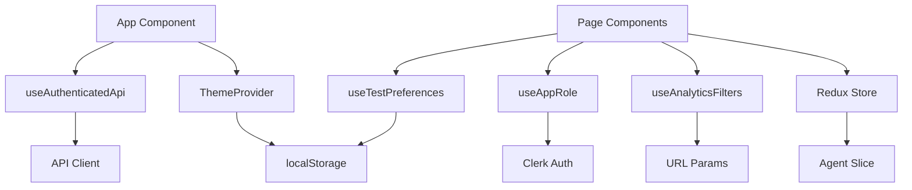

# Redux State

## Redux Toolkit Setup

State management uses Redux Toolkit with typed hooks.

### Typed Hooks

Always use the typed hooks instead of raw `useDispatch`/`useSelector`:

```typescript
// Correct
import { useAppDispatch, useAppSelector } from '@/store';

// Incorrect
import { useDispatch, useSelector } from 'react-redux';
```

### Slices

Each module has its own Redux slice:

```typescript
import { createSlice, createAsyncThunk } from '@reduxjs/toolkit';

export const fetchTests = createAsyncThunk('browser/fetchTests', async (_, { getState }) => {
  // API call
});

const browserSlice = createSlice({
  name: 'browser',
  initialState,
  reducers: { /* sync reducers */ },
  extraReducers: (builder) => {
    builder.addCase(fetchTests.fulfilled, (state, action) => {
      state.tests = action.payload;
    });
  },
});
```

---

## State Management Architecture

The state management layer spans Redux (global async state), React hooks (local/domain state), and browser APIs (persistence). Here is how they connect:



### Where State Lives

| State category | Mechanism | Persistence |
|----------------|-----------|-------------|
| Agent list, tasks, metrics | Redux (`agentSlice`) | None (refetched) |
| Analytics filters | `useAnalyticsFilters` hook + URL params | URL (shareable) |
| Test favorites & recents | `useTestPreferences` hook | localStorage (per-user key) |
| Theme preference | `useTheme` hook | localStorage |
| Sidebar collapse | `SidebarLayout` | localStorage |
| Auth tokens | Clerk SDK | Clerk session |
| Analytics config | `AnalyticsAuthProvider` context | Backend settings |
| Feature flags | `useCapabilities` hook | None (fetched on mount) |

## Agent Slice (Deep Dive)

The `agentSlice` is the primary Redux slice, managing distributed agent operations.

### State Shape

```typescript
interface AgentState {
  agents: AgentSummary[];
  selectedAgent: Agent | null;
  tasks: AgentTask[];
  metrics: AgentMetrics | null;
  loading: boolean;
  error: string | null;
  filters: ListAgentsRequest;
  pagination: PaginationState;
}
```

### Async Thunks

| Thunk | Purpose |
|-------|---------|
| `fetchAgents` | Load agent list with filtering and pagination |
| `fetchAgent` | Load detailed agent information |
| `fetchTasks` | Load task history |
| `createTasks` | Dispatch new tasks to agents |
| `updateAgentStatus` | Change agent operational status |
| `tagAgent` / `untagAgent` | Manage agent categorization tags |

### Usage Pattern

```typescript
const dispatch = useAppDispatch();
const { agents, loading, error } = useAppSelector(state => state.agent);

// Load agents with filters
dispatch(fetchAgents({ status: 'active', limit: 50 }));

// Create tasks for multiple agents
dispatch(createTasks({
  agentIds: selectedAgentIds,
  testUuids: selectedTests,
  priority: 'high'
}));
```

### Error Handling in Thunks

All async thunks use `rejectWithValue` for consistent error propagation:

```typescript
try {
  return await agentApi.listAgents(filters);
} catch (error: unknown) {
  return rejectWithValue(extractErrorMessage(error, 'Failed to fetch agents'));
}
```

Components read errors from the slice:

```typescript
const { error } = useAppSelector(state => state.agent);
if (error) {
  return <Alert variant="destructive">{error}</Alert>;
}
```

## Custom Hooks Catalog

Beyond Redux, several standalone hooks manage domain-specific state.

### useAnalyticsFilters

Manages 11+ filter types for analytics dashboards with bidirectional URL synchronization.

**Filter categories:**
- **Basic** -- Organization, date range, result status
- **Advanced** -- Hostnames, tests, techniques, categories, severities, threat actors, tags, errors, bundles

```typescript
const {
  filters,
  isExpanded,
  hasActiveFilters,
  setDateRange,
  setResult,
  clearAllFilters,
  getApiParams
} = useAnalyticsFilters();

// Convert to API parameters
const apiParams = getApiParams();
const data = await analyticsApi.getExecutions(apiParams);
```

:::tip
Filters automatically sync with URL parameters while preserving other query params (like active tabs). This enables shareable dashboard URLs and browser back/forward navigation.
:::

**Date range windowing** -- The `getWindowDaysForDateRange` utility maps ranges to rolling window sizes:

| Selected range | Window size |
|----------------|-------------|
| 7 days or less | 7-day (full coverage) |
| 8--30 days | 7-day rolling |
| 31--90 days | 30-day rolling |
| Custom | Calculated from actual span |

### useTestPreferences

Manages user-specific favorites and recently-viewed tests. Data is stored in localStorage with user-specific keys.

```typescript
const { favorites, recentTests, isFavorite, toggleFavorite, trackView } = useTestPreferences();

// Track when user views a test
trackView(testUuid, testName);

// Check/toggle favorite status
if (isFavorite(testUuid)) {
  // Show filled star
}
```

**Cross-tab sync** -- Uses custom events to synchronize preference changes across browser tabs in real-time. The recent list auto-maintains the 20 most recently viewed tests.

### useTheme

Multi-theme system with style variants:

```typescript
const { theme, themeStyle, phosphorVariant, setTheme, setThemeStyle, toggleThemeStyle } = useTheme();
```

| Property | Type | Values |
|----------|------|--------|
| `theme` | Base | `'light'` \| `'dark'` |
| `themeStyle` | Variant | `'default'` \| `'neobrutalism'` \| `'hackerterminal'` |
| `phosphorVariant` | Terminal color | `'green'` \| `'amber'` |

The hook manages CSS classes on `<html>`: `.dark`/`.light` for base themes, `.neobrutalism`/`.hackerterminal` for variants, `.phosphor-amber` for terminal color.

### useCapabilities

Detects available features based on deployment environment (Docker vs Railway vs Vercel, etc.):

```typescript
const { build, buildUpload, certGenerate, gitSync, platform } = useCapabilities();

if (build) {
  // Show build button
}
```

:::info
Defaults to all features available (Docker-style deployment). Gracefully handles backends that don't expose a `/api/capabilities` endpoint.
:::

### useDefenderConfig

Checks if Microsoft Defender integration is configured, for conditional UI rendering:

```typescript
const { configured, loading } = useDefenderConfig();
```

## URL State Synchronization Pattern

The analytics filters demonstrate the pattern for syncing complex state with URL parameters:

```typescript
// Preserve non-filter params while updating filters
setSearchParams(prev => {
  const newParams = new URLSearchParams(prev);
  // Clear filter params, then add current values
  filterKeys.forEach(key => newParams.delete(key));
  Object.entries(filterParams).forEach(([key, value]) => {
    newParams.set(key, value);
  });
  return newParams;
}, { replace: true });
```

This pattern enables shareable URLs while maintaining other application state like active tabs or modal states.

## Provider Setup

Several hooks require provider components in the app root. The order matters:

```typescript
function App() {
  return (
    <ClerkProvider>
      <ThemeProvider>
        <AnalyticsAuthProvider>
          <Provider store={store}>
            <AppContent />
          </Provider>
        </AnalyticsAuthProvider>
      </ThemeProvider>
    </ClerkProvider>
  );
}
```

:::warning
`useAuthenticatedApi` must run inside `ClerkProvider`. `useAnalyticsAuth` must run inside `AnalyticsAuthProvider`. Placing hooks outside their required provider will throw a runtime error or return `undefined`.
:::
