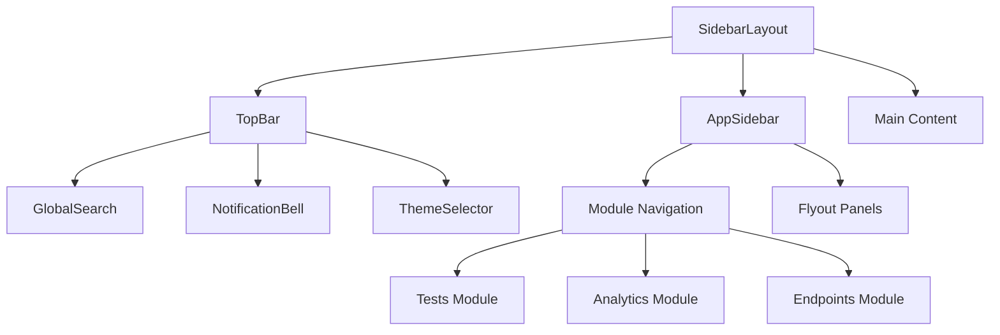
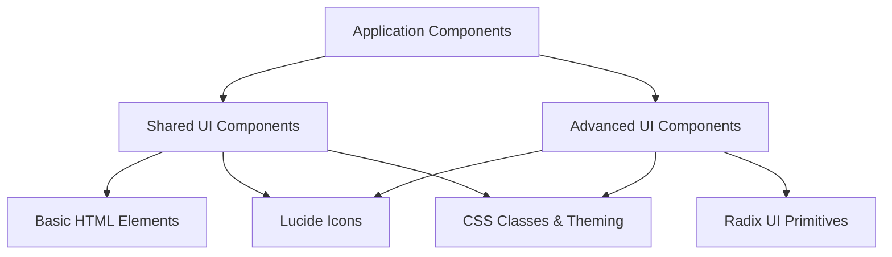

# UI Components

## Component Library

UI primitives live in `frontend/src/components/shared/ui/`:

| Component | Purpose |
|-----------|---------|
| `Button` | Primary action buttons with variants |
| `Card` | Content container with optional header/footer |
| `Input` | Text input with label and error state |
| `Badge` | Status indicators and labels |
| `Tabs` | Tab navigation component |
| `Alert` | Informational/warning/error alerts |
| `Spinner` | Loading indicator |

## Usage

```typescript
import { Button } from '@/components/shared/ui/Button';
import { Card } from '@/components/shared/ui/Card';
import { Badge } from '@/components/shared/ui/Badge';

<Card>
  <Badge variant="success">Protected</Badge>
  <Button onClick={handleRun}>Execute Test</Button>
</Card>
```

## Theming

All components respect the active visual theme (Default, Neobrutalism, Hacker Terminal) via CSS variables defined in Tailwind CSS v4 `@theme` blocks.

### CSS Custom Properties

Components use a consistent set of theme-aware CSS variables:

| Variable | Purpose |
|----------|---------|
| `border-theme` | Consistent border styling across themes |
| `shadow-theme` | Unified shadow effects |
| `rounded-base` | Standard border radius |
| `--theme-hover-translate` | Hover animation offset |
| `--theme-hover-shadow` | Hover shadow effect |

### Theme Options

| Style | Description | Special Behavior |
|-------|-------------|------------------|
| **Default** | Standard light/dark | Follows system preference |
| **Neobrutalism** | Hot pink accent, bold borders, high contrast | Works in both light and dark |
| **Hacker Terminal** | Phosphor green or amber with CRT scanlines | Forces dark mode |

---

## Layout System

The layout is built around a hierarchical structure with `SidebarLayout` as the root container.



### SidebarLayout

The main layout container. Provides:

- **Layout Context** -- Enables pages to register dynamic TopBar actions via `useLayoutActions()`
- **Sidebar State** -- Persists collapsed/expanded state in localStorage
- **Responsive Design** -- Adapts to different screen sizes

```typescript
// Pages can register dynamic actions in the TopBar
const { setTopBarActions } = useLayoutActions();
setTopBarActions({
  onRefreshClick: handleRefresh,
  isRefreshing: loading
});
```

### AppSidebar

Collapsible navigation sidebar with role-based module access:

- **Collapsible** -- Transitions between full and icon-only modes
- **Role-based** -- Uses `useCanAccessModule()` and `useHasPermission()` to show/hide modules
- **Flyout panels** -- Shows sub-navigation when collapsed (rendered via React portals)
- **Module locking** -- Displays locked state for unconfigured modules (e.g., Analytics without ES)

**Module structure:**

```typescript
const modules: ModuleWithItems[] = [
  {
    label: "Tests",
    icon: Shield,
    path: "/dashboard",
    subItems: [
      { label: "Dashboard", icon: LayoutDashboard, path: "/dashboard" },
      { label: "Browse All", icon: Home, path: "/dashboard?tab=browse" },
      { label: "Favorites", icon: Bookmark, path: "/favorites" }
    ]
  }
  // ... Analytics, Endpoints, Settings modules
];
```

### TopBar

Application header with dynamic content:

- **Breadcrumbs** -- Auto-generated from current route via `getBreadcrumb()`
- **Global search** -- Embedded search trigger (`Cmd/Ctrl + K`)
- **User context** -- Role badges and user information
- **Action buttons** -- Refresh, settings, documentation, notifications

### GlobalSearch

Command palette-style search (`Cmd/Ctrl + K`) with multi-entity results:

| Feature | Detail |
|---------|--------|
| **Search scope** | Tests, agents, tasks across multiple APIs |
| **Debounce** | 200ms delay to prevent excessive API calls |
| **Keyboard** | Arrow keys to navigate, Enter to select, Escape to close |
| **Caching** | Avoids repeated API calls within a session |
| **Grouping** | Results grouped by entity type with icons and badges |

### NotificationBell

Real-time alert notifications with dropdown history:

- Connects to `alertsApi` for system alerts
- Red dot indicator for unseen notifications
- Shows setup prompts when alerting is not configured
- Relative timestamps (e.g., "5 minutes ago")

---

## Two-Layer Component Architecture

The UI is organized into two distinct layers:



### Shared UI (`frontend/src/components/shared/ui/`)

Self-contained components built directly on HTML elements with custom styling. These are the base primitives used everywhere.

### Advanced UI (`frontend/src/components/ui/`)

More sophisticated components built on **Radix UI** primitives, providing enhanced accessibility and complex interactions (dropdown menus, sheets, charts).

## Shared UI Components (Full Catalog)

### Form Components

#### Button

5 visual variants, 4 sizes, built-in hover animations:

```typescript
<Button variant="primary" size="lg" onClick={handleClick}>
  Submit
</Button>
```

| Variant | Use case |
|---------|----------|
| `primary` | Primary actions |
| `secondary` | Secondary actions |
| `ghost` | Inline/subtle actions |
| `destructive` | Dangerous actions (delete, remove) |
| `outline` | Bordered neutral actions |

Sizes: `sm`, `md`, `lg`, `icon`

#### Input

Text input with label, error state, and icon support:

```typescript
<Input
  label="Email"
  error="Invalid email format"
  leftIcon={<Mail />}
  placeholder="Enter your email"
/>
```

#### Select

Dropdown selection component:

```typescript
<Select
  label="Platform"
  options={[
    { value: 'windows', label: 'Windows' },
    { value: 'linux', label: 'Linux' }
  ]}
/>
```

#### Checkbox & Switch

Boolean input components with custom styling and indeterminate state support.

### Layout Components

#### Card System

Flexible card layout with semantic sub-components:

```typescript
<Card>
  <CardHeader>
    <CardTitle>Task Details</CardTitle>
  </CardHeader>
  <CardContent>
    Content goes here
  </CardContent>
  <CardFooter>
    <Button>Action</Button>
  </CardFooter>
</Card>
```

#### Table Components

Complete table system: `Table`, `TableHeader`, `TableBody`, `TableRow`, `TableHead`, `TableCell`. Includes overflow handling, hover effects, and responsive design.

### Feedback Components

#### Alert

5 semantic variants with icon integration:

```typescript
<Alert variant="success" title="Success!" onClose={handleClose}>
  Task completed successfully
</Alert>
```

Variants: `default`, `success`, `warning`, `destructive`, `info`

#### Spinner & LoadingOverlay

Loading indicators with multiple sizes and an overlay variant:

```typescript
<LoadingOverlay message="Processing task..." />
```

### Navigation Components

#### Tabs

Context-based tab system supporting both controlled and uncontrolled modes:

```typescript
<Tabs defaultValue="details" onValueChange={setActiveTab}>
  <TabsList>
    <TabsTrigger value="details">Details</TabsTrigger>
    <TabsTrigger value="settings">Settings</TabsTrigger>
  </TabsList>
  <TabsContent value="details">Details content</TabsContent>
</Tabs>
```

#### Dialog

Modal dialog with backdrop, Escape key handling, and focus management:

```typescript
<Dialog open={isOpen} onClose={handleClose}>
  <DialogHeader onClose={handleClose}>
    <DialogTitle>Confirm Action</DialogTitle>
  </DialogHeader>
  <DialogContent>Are you sure?</DialogContent>
  <DialogFooter>
    <Button variant="outline" onClick={handleClose}>Cancel</Button>
    <Button onClick={handleConfirm}>Confirm</Button>
  </DialogFooter>
</Dialog>
```

### Specialized Components

| Component | Purpose |
|-----------|---------|
| `Badge` | Status indicators with variants (`success`, `warning`, `destructive`, etc.) |
| `PlatformBadge` | OS-specific badges (Windows, Linux, macOS) |
| `StatusDot` | Simple online/offline indicator |

## Advanced UI Components (Radix-based)

These components are built on [Radix UI](https://www.radix-ui.com/) primitives for enhanced accessibility and complex interactions.

### Avatar System

User representation with image, fallback initials, and badge:

```typescript
<Avatar size="lg">
  <AvatarImage src="/user.jpg" />
  <AvatarFallback>JD</AvatarFallback>
  <AvatarBadge>3</AvatarBadge>
</Avatar>
```

### DropdownMenu

Complex menu system with nested items and keyboard navigation:

```typescript
<DropdownMenu>
  <DropdownMenuTrigger asChild>
    <Button variant="outline">Options</Button>
  </DropdownMenuTrigger>
  <DropdownMenuContent>
    <DropdownMenuItem>Edit</DropdownMenuItem>
    <DropdownMenuSeparator />
    <DropdownMenuItem variant="destructive">Delete</DropdownMenuItem>
  </DropdownMenuContent>
</DropdownMenu>
```

### Sheet

Slide-out panel component:

```typescript
<Sheet>
  <SheetTrigger asChild>
    <Button>Open Panel</Button>
  </SheetTrigger>
  <SheetContent side="right">
    <SheetHeader>
      <SheetTitle>Panel Title</SheetTitle>
    </SheetHeader>
    Panel content
  </SheetContent>
</Sheet>
```

### Chart System

Recharts integration with theme-aware configuration:

```typescript
<ChartContainer config={chartConfig}>
  <LineChart data={data}>
    <ChartTooltip content={<ChartTooltipContent />} />
  </LineChart>
</ChartContainer>
```

:::warning
When writing custom `content` renderers for Recharts components (Treemap, etc.), always set `stroke="none"` on `<text>` elements. Recharts sets `stroke` on the parent SVG container for cell borders, and SVG `stroke` inherits to text children -- causing visible dark outlines around glyphs in dark mode.
:::

## Integration Patterns

### Styling with `cn()`

All components use the `cn()` utility (clsx + tailwind-merge) for class merging:

```typescript
<div className={cn("base-class", isActive && "active-class", className)}>
```

### Icon Integration

Components integrate with [Lucide React](https://lucide.dev/) icons:

```typescript
<Button>
  <Save className="w-4 h-4" />
  Save Changes
</Button>
```

### Variant System

Most components accept a `variant` prop following this pattern:

```typescript
type ButtonVariant = 'primary' | 'secondary' | 'ghost' | 'destructive' | 'outline';
type AlertVariant = 'default' | 'success' | 'warning' | 'destructive' | 'info';
```

## Composite Usage Examples

### Form Building

```typescript
function TaskForm() {
  return (
    <Card>
      <CardHeader>
        <CardTitle>Create Task</CardTitle>
      </CardHeader>
      <CardContent>
        <Input label="Task Name" />
        <Select label="Priority" options={priorityOptions} />
        <Checkbox label="Send notifications" />
      </CardContent>
      <CardFooter>
        <Button variant="outline">Cancel</Button>
        <Button>Create Task</Button>
      </CardFooter>
    </Card>
  );
}
```

### Data Display

```typescript
function TaskList({ tasks }) {
  return (
    <Table>
      <TableHeader>
        <TableRow>
          <TableHead>Name</TableHead>
          <TableHead>Status</TableHead>
          <TableHead>Platform</TableHead>
        </TableRow>
      </TableHeader>
      <TableBody>
        {tasks.map(task => (
          <TableRow key={task.id}>
            <TableCell>{task.name}</TableCell>
            <TableCell>
              <Badge variant={task.status === 'active' ? 'success' : 'default'}>
                {task.status}
              </Badge>
            </TableCell>
            <TableCell>
              <PlatformBadge platform={task.platform} />
            </TableCell>
          </TableRow>
        ))}
      </TableBody>
    </Table>
  );
}
```

## Performance Considerations

- **Search debouncing** -- GlobalSearch uses a 200ms delay to prevent excessive API calls
- **Portal rendering** -- Sidebar flyout panels use React portals to escape stacking contexts
- **Memoized calculations** -- Search results and breadcrumbs are memoized
- **Conditional rendering** -- Role-based components only render when the user has access

## Accessibility

- Full keyboard navigation for search, menus, dialogs, and tabs
- Proper ARIA labels and roles on all interactive elements
- Automatic focus management in overlays (dialogs, search, sheets)
- Semantic HTML (`<nav>`, `<header>`, `<main>`, `<table>`) throughout
