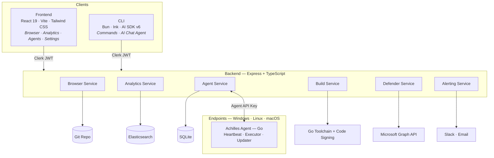
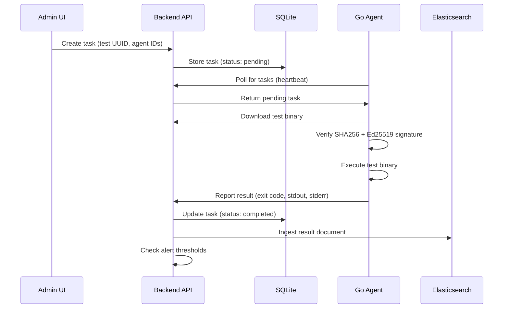
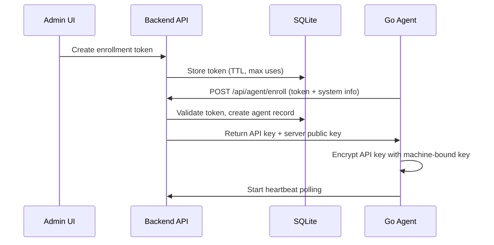
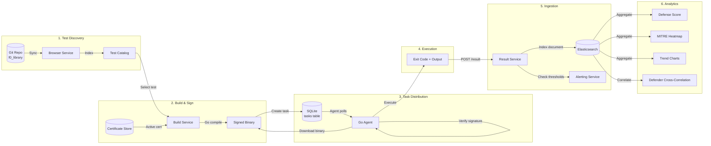
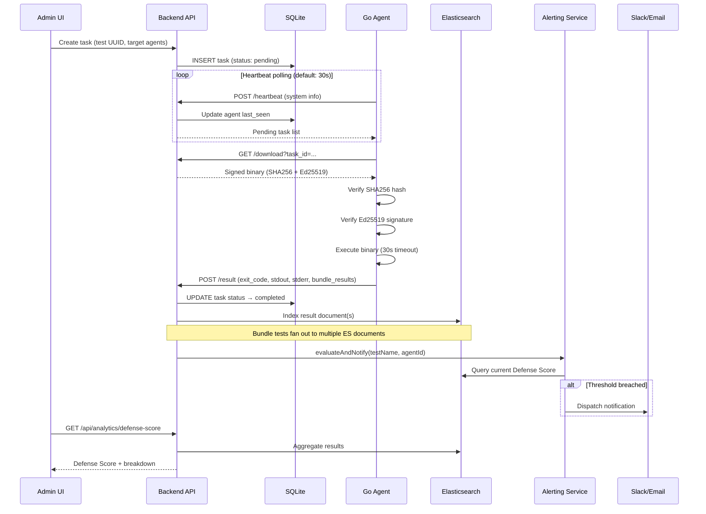

# Architecture

ProjectAchilles follows a three-tier architecture: a React SPA frontend, an Express API backend, and Go agents deployed to target endpoints. Elasticsearch stores test results for analytics, while SQLite manages agent state.

## System Overview



## Data Flow

### Test Execution Flow



### Agent Enrollment Flow



## Tech Stack

| Layer | Technology | Version | Purpose |
|-------|------------|---------|---------|
| **Frontend** | React | 19.2 | UI framework |
| | Vite | 7.2 | Build tool and dev server |
| | Tailwind CSS | 4.1 | Utility-first styling |
| | Redux Toolkit | 2.10 | State management |
| | React Router | 7.13 | Client-side routing |
| | Clerk | 5.x | Authentication |
| **Backend** | Express | 4.18 | HTTP framework |
| | TypeScript | 5.9 | Type-safe development |
| | better-sqlite3 | — | Agent database |
| | @elastic/elasticsearch | 8.x | Analytics queries |
| **Agent** | Go | 1.24 | Cross-platform binary |
| **Analytics** | Elasticsearch | 8.17 | Result storage and aggregation |
| **Signing** | osslsigncode | — | Windows Authenticode |
| | rcodesign | — | macOS ad-hoc signing |
| **CI** | GitHub Actions | — | Test + security review |

## Project Structure

```
ProjectAchilles/
├── frontend/                  # React 19 + TypeScript + Vite
│   └── src/
│       ├── components/        # Shared UI primitives (Button, Card, etc.)
│       ├── pages/             # Module pages (browser, analytics, agents, settings)
│       ├── services/api/      # API client modules
│       ├── hooks/             # Custom hooks (useAuthenticatedApi, etc.)
│       └── store/             # Redux slices
├── backend/                   # Express + TypeScript (ES modules)
│   └── src/
│       ├── api/               # Route handlers (*.routes.ts)
│       ├── services/          # Business logic by module
│       │   ├── agent/         # Enrollment, heartbeat, tasks, schedules
│       │   ├── analytics/     # Elasticsearch queries, client factory
│       │   ├── browser/       # Git sync, test indexing
│       │   ├── tests/         # Go cross-compilation, cert management
│       │   ├── defender/      # Microsoft Graph API client
│       │   └── alerting/      # Slack + email dispatch
│       ├── middleware/        # Auth, error handling, rate limiting
│       └── types/             # TypeScript definitions
├── backend-serverless/        # Vercel serverless fork (Turso + Blob)
├── agent/                     # Go agent source
│   ├── main.go                # CLI entry point (--enroll, --run, --install)
│   └── internal/              # Agent modules
│       ├── config/            # Configuration management
│       ├── enrollment/        # Token-based registration
│       ├── executor/          # Test binary execution
│       ├── httpclient/        # HTTP client with auth
│       ├── poller/            # Task polling loop
│       ├── reporter/          # Result reporting
│       ├── service/           # OS service management
│       ├── store/             # Encrypted credential storage
│       ├── sysinfo/           # Platform-specific system info
│       └── updater/           # Self-update mechanism
├── scripts/                   # Shell scripts and PowerShell bootstrap
├── docs/                      # Documentation source files
├── wiki/                      # This documentation site (Docusaurus)
└── docker-compose.yml         # Multi-service deployment
```

## Deployment Architecture

ProjectAchilles supports five deployment targets, each with different trade-offs:

| Target | Backend | Database | File Storage | Agent Builds | Cost |
|--------|---------|----------|-------------|-------------|------|
| **Docker Compose** | `backend/` | SQLite (volume) | Filesystem (volume) | Yes | Free |
| **Railway** | `backend/` | SQLite (volume) | Filesystem (volume) | Partial | ~$10-13/mo |
| **Render** | `backend/` | SQLite (persistent disk) | Filesystem (disk) | Partial | ~$14/mo |
| **Fly.io** | `backend/` | SQLite (volume) | Filesystem (volume) | Yes | ~$8/mo |
| **Vercel** | `backend-serverless/` | Turso (libSQL) | Vercel Blob | No | ~$20/mo |

The Vercel target uses a purpose-built serverless fork (`backend-serverless/`) that replaces SQLite with Turso, filesystem with Vercel Blob, and process-based scheduling with Vercel Cron jobs. See [Deployment Overview](../deployment/overview) for detailed comparisons.

## End-to-End Data Flow

The following diagram shows the complete journey of data through the platform — from test discovery to defense metrics:



### Detailed Execution Sequence



### Integration Data Flows

Beyond the core test execution pipeline, several integration-specific flows run in parallel:

**Microsoft Defender Sync** (background, every 5 min / 6 hours):
```
Microsoft Graph API → Graph Client → Sync Service → achilles-defender index
```

**Alert Evaluation** (triggered per result ingestion):
```
Result Ingestion → Defense Score Query → Threshold Check → Slack/Email Dispatch
```

**Risk Acceptance** (user-initiated):
```
Accept Risk → achilles-risk-acceptances index → Exclusion Filter Cache → Defense Score recalculation
```
