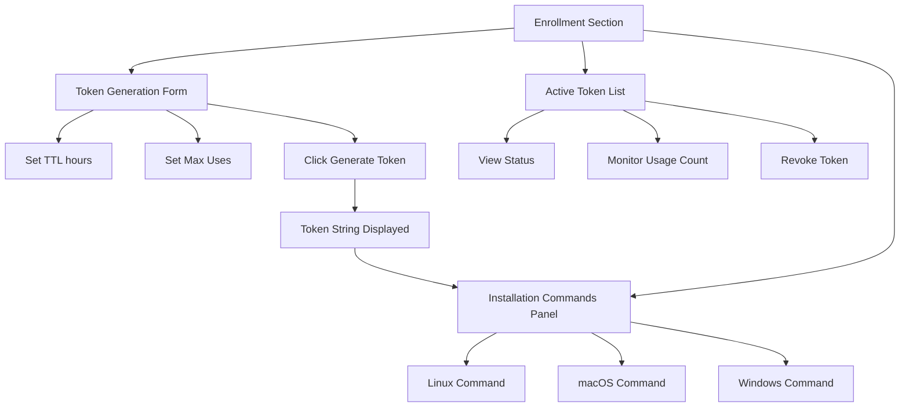

# Agent Enrollment

## Overview

Agent enrollment is a token-based registration process. An admin creates an enrollment token via the web UI, then provides it to the agent binary at install time.

## Creating Enrollment Tokens

1. Navigate to **Agents** → **Enrollment Tokens**
2. Click **Create Token**
3. Configure:
   - **TTL** — How long the token is valid (hours/days)
   - **Max Uses** — Maximum number of agents that can enroll with this token
4. Click **Create**

The token string is displayed once — copy it and provide it to the person installing the agent.

## Enrolling an Agent

```bash
# Linux/macOS
sudo ./achilles-agent --enroll --server https://your-backend.example.com --token <enrollment-token>

# Windows (PowerShell as Administrator)
.\achilles-agent.exe --enroll --server https://your-backend.example.com --token <enrollment-token>
```

During enrollment:
1. The agent sends system information (hostname, OS, architecture) to the backend
2. The backend validates the token (TTL, max uses, not revoked)
3. The backend creates an agent record and returns an API key + server public key
4. The agent encrypts the API key with a machine-bound key and saves it to disk
5. The agent starts its heartbeat loop

## Token Security

- Tokens use **constant-time bcrypt comparison** to prevent timing oracles
- A dummy hash is compared when no matching token exists (prevents distinguishing "no tokens" from "wrong token")
- Tokens are revocable through the admin UI
- Enrollment is rate-limited to **5 requests per 15 minutes** per IP

## Revoking Tokens

In the Enrollment Tokens list, click **Revoke** to immediately invalidate a token. Agents already enrolled are unaffected.

## Enrollment UI Walkthrough

The enrollment interface is accessed from the **Agents** section and provides two main areas: token generation and token management.



### Token Generation

1. Set the **TTL (hours)** -- how long the token remains valid
2. Set the **Max Uses** -- how many agents can enroll with this token
3. Click **Generate Token**
4. The token string and platform-specific installation commands appear immediately

:::warning Copy the Token Immediately
The full token string is displayed only once at creation time. Copy it before navigating away. You can still see the token's status and metadata in the token list, but the raw string is not shown again.
:::

### Installation Commands

When a token is generated, the UI automatically produces ready-to-copy installation commands for every supported platform:

- **Linux (amd64/arm64)** -- `curl`-based download with the token and server URL embedded
- **macOS (Intel / Apple Silicon)** -- Platform-specific binary download
- **Windows** -- PowerShell-based installation command

Each command includes a **Copy** button for one-click clipboard copying.

### Token Status Indicators

The token list table shows a status badge for each token:

| Badge | Meaning |
|-------|---------|
| **Active** | Token is valid and has remaining uses |
| **Expired** | Token has passed its TTL expiration time |
| **Exhausted** | Token has reached its maximum use count |

:::tip Bulk Enrollment
For large deployments, create a token with a high **Max Uses** value and distribute the same installation command across your fleet using your configuration management tool (Ansible, SCCM, etc.).
:::

## Agent Management Dashboard

After agents are enrolled, the **Agent Dashboard** provides fleet-wide monitoring:


- **Fleet Metrics** -- Total agents, online/offline counts, pending tasks
- **Health KPIs** -- Fleet uptime, task success rates, mean time between failures
- **Distribution Charts** -- Agent version distribution, OS breakdown, status summary
- **Recent Tasks** -- Latest task executions across the fleet

The dashboard auto-refreshes every 30 seconds. Stale agents (those that have not sent a heartbeat recently) are flagged with a warning indicator.

### Agent List

The main agent list supports:


- **Filtering** by hostname, OS, status, and online state
- **Bulk operations** such as tagging, triggering updates, and uninstalling
- **Real-time polling** every 15 seconds for silent status updates
- **Version tracking** with outdated-agent detection and one-click update prompts

### Agent Detail View

Click any agent to open its detail page with four tabs:

| Tab | Contents |
|-----|----------|
| **Overview** | System info, metadata, tags, recent tasks |
| **Task History** | Paginated execution history with status filtering |
| **Heartbeat** | Time-series charts for CPU, memory, and disk usage |
| **Event Log** | Chronological lifecycle events (enrollment, key rotation, updates) |

The detail view refreshes automatically every 30 seconds.

## Administrative Operations

### Key Rotation

Rotate an agent's API key from the agent detail page. The rotation uses a two-phase process with a configurable grace period, allowing the old key to remain valid briefly while the agent picks up the new one.

### Uninstall

Agents can be uninstalled individually or in bulk. The uninstall dialog includes cleanup options and handles batch processing with progress feedback.

### Tag Management

Apply tags to one or more agents at a time for organizational grouping. Tags can be used as filters when creating tasks or viewing the agent list.

## Permissions

Agent management actions are gated by role-based permissions:

| Action | Required Permission |
|--------|-------------------|
| Create enrollment tokens | `endpoints:tokens:create` |
| Modify agents (enable/disable, tag) | `endpoints:agents:write` |
| Delete agents | `endpoints:agents:delete` |

UI elements are hidden when the current user lacks the required permission.
