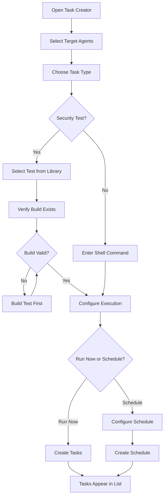

# Task Execution

## Creating a Task

1. Navigate to **Agents** → select an agent
2. Click **Create Task**
3. Select the **test** to execute
4. Choose the **platform** and **architecture** for the binary
5. Optionally specify a target **Elasticsearch index**
6. Click **Submit**

The task enters the pending queue and is picked up by the agent on its next poll.

## Task Lifecycle

```
pending → assigned → downloading → executing → reporting → completed/failed
```

1. **Pending** — Task created, waiting for agent to poll
2. **Assigned** — Agent picked up the task
3. **Downloading** — Agent downloading the test binary
4. **Executing** — Binary running on the endpoint
5. **Reporting** — Agent sending results back
6. **Completed/Failed** — Final state with exit code and output

## Task Results

Results include:
- **Exit code** — 0 (unprotected), 1 (protected), other (error)
- **Stdout/Stderr** — Captured output from the test binary
- **Execution duration**
- **Timestamp**

Results are ingested into Elasticsearch for analytics.

## Binary Verification

Before execution, the agent verifies:
1. **SHA256 checksum** — Matches the expected hash
2. **Ed25519 signature** — Cryptographically signed by the server's private key

If either check fails, the task is rejected.

## Task Creation Dialog

The task creation dialog supports two task types and multiple scheduling options.



### Task Types

- **Security Tests** -- Select a pre-built test from the library. The dialog validates that a compiled binary exists before allowing submission.
- **Shell Commands** -- Run an arbitrary command across selected agents. Useful for ad-hoc diagnostics or custom scripts.

### Agent Selection

The agent selector provides filtering and bulk operations:

- **Search** by hostname
- **Filter by tags** using multi-select dropdowns
- **Online-only toggle** to exclude offline agents
- **Select All / Deselect All** for the currently filtered list
- Each agent row shows its online/offline status, hostname, OS, architecture, and tags

### Scheduling Options

| Schedule Type | Description |
|--------------|-------------|
| **Run Now** | Immediate execution on next agent poll |
| **Once** | One-time execution at a specific date and time |
| **Daily** | Recurring daily at a fixed time, or randomized within business hours (09:00--17:00) |
| **Weekly** | Recurring on selected days of the week |
| **Monthly** | Recurring on a specific day of the month |

All schedule types support timezone selection. Randomized scheduling distributes execution times across business hours on weekdays to avoid predictable patterns.

:::tip Randomized Schedules
Use randomized daily schedules for production environments. This prevents defenses from learning a predictable test execution pattern, giving you a more realistic measure of detection capability.
:::

### Integration Validation

Before submitting, the dialog checks for required integrations:

- Tests that target Azure/Entra ID validate that Azure credentials are configured
- A target Elasticsearch index can be selected for result storage

## Task Management Page

The Tasks page is the central control panel for all task activity.

### Task List

Tasks are displayed in a hierarchical table:

- **Grouped tasks** -- When a task targets multiple agents, all sub-tasks are grouped under a collapsible parent row with an aggregated status summary
- **Single tasks** -- Direct display for single-agent operations
- **Expandable details** -- Click any task row to reveal stdout/stderr output with a copy-to-clipboard button

### Status Badges

Each task shows a color-coded status badge:

| Status | Color | Description |
|--------|-------|-------------|
| Pending | Gray | Waiting for agent to poll |
| Assigned | Blue | Agent picked up the task |
| Downloading | Blue | Agent downloading binary |
| Executing | Amber | Binary running on endpoint |
| Completed | Green | Finished successfully |
| Failed | Red | Finished with error |
| Expired | Gray | Agent did not pick up in time |

### Filtering and Search

- Filter by task status using the status dropdown
- Free-text search across task content (test names, hostnames, commands)
- Search is debounced to avoid excessive API calls while typing

### Bulk Operations

Select multiple tasks using checkboxes, then use bulk actions to:

- **Cancel** all selected pending/assigned tasks
- **Delete** selected tasks from the list

### Pagination

Configure page sizes of 25, 50, or 100 tasks per page with navigation controls at the bottom.

### Real-Time Updates

The task list polls every 10 seconds for status changes. Polling is silent -- it does not clear your current selection or scroll position.

## Schedule Management

Below the task list, the **Schedules** section displays all recurring schedules:

- Human-readable schedule descriptions (e.g., "Every weekday at 09:30 UTC")
- Next and last run timestamps with relative formatting
- Status indicators: **Active**, **Paused**, or **Completed**
- Agent count per schedule
- Actions: **Pause/Resume** and **Delete** (with confirmation)

:::warning Pausing vs. Deleting
Pausing a schedule stops future executions but preserves the configuration. Deleting is permanent. Pause first if you are unsure.
:::

## Task Notes

Add annotations to any task by clicking the notes icon. Notes are useful for documenting:

- Why a task failed and what was investigated
- Follow-up actions taken after a test result
- Context for other team members reviewing task history

## Permissions

Task-related actions are gated by role-based permissions:

| Action | Required Permission |
|--------|-------------------|
| Create tasks | `endpoints:tasks:create` |
| Cancel tasks | `endpoints:tasks:cancel` |
| Delete tasks | `endpoints:tasks:delete` |
| Manage schedules | `endpoints:schedules:write` |
| Delete schedules | `endpoints:schedules:delete` |

Actions are hidden from the UI when the current user lacks the required permission.
