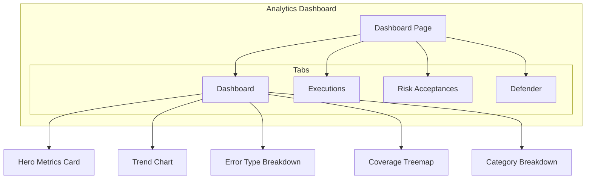

# Defense Score & Trends

The Defense Score is the primary metric for measuring your security posture.

## What Is the Defense Score?

The Defense Score is an aggregate percentage representing how many of your executed security tests were detected (or blocked) by your defenses. A score of 85% means 85% of test executions resulted in a "Protected" outcome.

## Score Calculation

```
Defense Score = (Protected Executions / Total Executions) × 100
```

Each test execution is classified by its exit code:
- **Exit code 1** → "Protected" (defense detected/blocked the test)
- **Exit code 0** → "Unprotected" (test completed without detection)
- **Other exit codes** → "Error" (test failed to execute properly)

## Breakdowns

The Defense Score can be broken down by:
- **Test** — Score per individual test
- **Technique** — Score per MITRE ATT&CK technique
- **Category** — Score per test category
- **Hostname** — Score per endpoint
- **Severity** — Score per severity level

## Trend Analysis

The trend chart shows the Defense Score over time with a configurable rolling window:
- **7 days** — Short-term operational view
- **30 days** — Monthly trend
- **90 days** — Quarterly trend

A downward trend indicates deteriorating security posture and may trigger [threshold alerts](../integrations/alerting).

## Dual Defense Score

The dashboard overlays the real-time score with a trend line, making it easy to see both the current state and the trajectory.

## Dashboard Layout


The Analytics Dashboard uses a multi-tab interface with four main areas:



### Dashboard Tab

The **Dashboard** tab is the primary visualization hub. It contains the following components:

- **Hero Metrics Card** -- Displays the Defense Score with a trend indicator (up/down arrow), total unique endpoints, executed test count, error rate percentage, and risk-accepted count.
- **Trend Chart** -- Multi-series time chart plotting Defense Score and error rate over time. When Microsoft Defender is configured, the Secure Score trend is overlaid for cross-platform comparison.
- **Error Type Breakdown** -- Pie chart showing the distribution of error types across executions.
- **Coverage Treemap** -- Interactive hierarchical visualization of per-host test coverage (see below).
- **Category Breakdown** -- Nested donut chart with an outer ring for test categories and an inner ring for subcategories, sized by execution count.

### Executions Tab

The **Executions** tab provides a full data table of individual test executions. Features include:

- Configurable column visibility and sortable columns
- Multi-select with bulk operations (archive, accept risk)
- Bundle grouping -- related bundle controls are grouped under collapsible parent rows showing a "X/Y Protected" summary badge
- CSV and JSON export with consistent timestamp formatting
- Expandable detail panels for each execution

### Risk Acceptances Tab

The **Risk Acceptances** tab tracks security exceptions:

1. Select failed executions from the Executions table
2. Provide a justification (minimum 10 characters)
3. Choose scope: test-specific, host-specific, or global
4. Active acceptances appear with badges throughout the dashboard and are factored into the Defense Score

Risk acceptances can be revoked with a single click, which re-includes those results in score calculations.

### Defender Tab

When Microsoft Defender is configured, a dedicated **Defender** tab appears with:

- Secure Score metrics and trends
- Security alert summaries
- Detection analysis with MITRE technique correlation
- Top remediation controls

## Coverage Treemap

The Coverage Treemap provides a drill-down view of test coverage per endpoint:

- Each cell represents a host, sized by the number of tests executed
- Cells are color-coded by coverage percentage:
  - **Green** (80%+) -- Strong coverage
  - **Amber** (50--79%) -- Partial coverage
  - **Red** (below 50%) -- Low coverage
- Click a host cell to drill down to individual test results on that endpoint
- Three baseline comparison modes control how "100% coverage" is defined:
  - **90-day baseline** -- Uses the total distinct tests seen in the last 90 days
  - **30-day baseline** -- Uses the total distinct tests seen in the last 30 days
  - **Current window** -- Uses only tests within the currently selected date range

## Filtering

The filter bar runs across the top of every tab and supports multiple simultaneous dimensions:

| Filter | Description |
|--------|-------------|
| **Date Range** | Preset ranges (24h, 7d, 30d, 90d, all time) or a custom start/end date |
| **Hosts** | Multi-select dropdown of endpoint hostnames |
| **Tests** | Multi-select dropdown of test names |
| **Techniques** | Multi-select dropdown of MITRE ATT&CK technique IDs |
| **Categories** | Multi-select dropdown of test categories |

Filters are additive -- selecting multiple values in the same dropdown narrows results. Each dropdown shows a count badge when filters are active. The filter bar is collapsible to save screen space.

:::tip Date Range Shortcuts
Use the preset date range buttons (24h, 7d, 30d, 90d) for quick time-window changes. The trend chart automatically adjusts its time axis granularity to match the selected range.
:::

## Data Export

From the **Executions** tab, you can export data in two formats:

- **CSV** -- Spreadsheet-compatible format with consistent timestamp formatting
- **JSON** -- Machine-readable format suitable for integration with other tools

The export respects all currently applied filters, so you can narrow the dataset before exporting.

## Real-Time Updates

The dashboard automatically reloads data when you:

- Change any filter or date range
- Switch tabs
- Modify Elasticsearch settings (index pattern changes)
- Toggle Defender integration on or off

:::info Conditional Loading
Only the active tab's data is fetched, so switching tabs triggers a fresh load for that tab while keeping others cached.
:::
