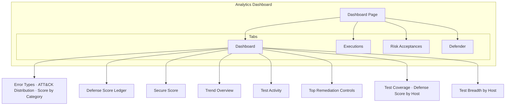

# Defense Score & Trends

The Defense Score is the primary metric for measuring your security posture.

## What Is the Defense Score?

The Defense Score is an aggregate percentage representing how many of your executed security tests were detected (or blocked) by your defenses. A score of 85% means 85% of test executions resulted in a "Protected" outcome.

## Score Calculation

```
Defense Score = (Protected Executions / Total Executions) × 100
```

Each test execution is classified by its exit code:
- **Exit code 1** → "Protected" (defense detected/blocked the test)
- **Exit code 0** → "Unprotected" (test completed without detection)
- **Other exit codes** → "Error" (test failed to execute properly)

## Breakdowns

The Defense Score can be broken down by:
- **Test** — Score per individual test
- **Technique** — Score per MITRE ATT&CK technique
- **Category** — Score per test category
- **Hostname** — Score per endpoint
- **Severity** — Score per severity level

## Trend Analysis

The trend chart shows the Defense Score over time with a configurable rolling window:
- **7 days** — Short-term operational view
- **30 days** — Monthly trend
- **90 days** — Quarterly trend

A downward trend indicates deteriorating security posture and may trigger [threshold alerts](../integrations/alerting).

## Dual Defense Score

The dashboard overlays the real-time score with a trend line, making it easy to see both the current state and the trajectory.

## Time window

Analytics defaults to a **90-day** window. Most fleets run scheduled bundles
weekly or monthly, so a 30-day default showed empty charts for healthy
programmes. Change it from the range selector in the page header; the choice is
carried in the URL, so a filtered view is shareable.

The Security Dashboard has its own independent **7d / 30d / 90d** selector,
also defaulting to 90 days.

## Dashboard Layout


The Analytics Dashboard uses a multi-tab interface with four main areas:


```mermaid
graph TB
    subgraph "Analytics Dashboard"
        ADP[Dashboard Page]

        subgraph "Tabs"
            DT[Dashboard]
            ET[Executions]
            RT[Risk Acceptances]
            DefT[Defender]
        end
    end

    ADP --> DT
    ADP --> ET
    ADP --> RT
    ADP --> DefT

    DT --> TRIO[Error Types · ATT&CK Distribution · Score by Category]
    DT --> LED[Defense Score Ledger]
    DT --> SEC[Secure Score]
    DT --> TREND[Trend Overview]
    DT --> ACT[Test Activity]
    DT --> TOP[Top Remediation Controls]
    DT --> COV[Test Coverage · Defense Score by Host]
    DT --> TREE[Test Breadth by Host]
```

### Dashboard Tab


The **Dashboard** tab is the primary visualization hub. Since 2.1 it is laid out
in analyst columns: a narrow left column carrying the numbers you quote, and a
wide right column carrying the shapes you read.

**Top row — three cards**

- **Results by error type** — donut plus a legend list of `name · count · pct`
- **ATT&CK technique distribution** — one row per technique with a stacked
  protected/unprotected bar and a percentage; a warning chip counts techniques
  that also raised Defender alerts
- **Score by category** — bar list of defense score per category, with
  subcategories nested underneath

**Posture row — left column**

- **Defense Score ledger** — a ring gauge beside four reconciling lines:
  *Actual* (raw protected share), *EDR-only*, *Risk-accepted* (how many results
  are excluded), and *Inconclusive*. A footer strip carries endpoints, tests,
  and result counts. The ledger replaced the old hero card, which showed one
  big number and left the reconciliation implicit.
- **Secure Score** — Microsoft Defender's score and raw points, when configured

**Posture row — right column**

- **Trend Overview** — Defense Score, Actual Score, error rate, and (when
  configured) Secure Score on one 30-day-rolling axis. Actual Score renders as a
  neutral dashed reference line rather than a fourth green series.

**Lower rows** — Test activity, Top Remediation Controls (ranked by Secure Score
impact), Test Coverage and Defense Score by Host as flat bar lists, and the
Test Breadth by Host treemap.

:::note Without Microsoft Defender
The Secure Score and Top Remediation Controls cards are Defender-only. When the
integration is not configured they are omitted and the remaining cards reflow to
fill the row — the layout stays balanced rather than leaving a gap.
:::

### Executions Tab

The **Executions** tab provides a full data table of individual test executions. Features include:

- **Master-detail layout** — grouped runs on the left, the selected run's
  per-control results on the right; `↑` / `↓` move the selection
- Bundle grouping -- related bundle controls are grouped under collapsible parent rows showing a "X/Y Protected" summary badge
- Multi-select with bulk operations (archive, accept risk)
- CSV and JSON export with consistent timestamp formatting
- Deep-linkable — the selected run rides in `?expanded=<id>`, so a dashboard
  "recent executions" row or a shared link opens straight to that result


### Risk Acceptances Tab

The **Risk Acceptances** tab tracks security exceptions:

1. Select failed executions from the Executions table
2. Provide a justification (minimum 10 characters)
3. Choose scope: test-specific, host-specific, or global
4. Active acceptances appear with badges throughout the dashboard and are factored into the Defense Score

Risk acceptances can be revoked with a single click, which re-includes those results in score calculations.

### Defender Tab

When Microsoft Defender is configured, a dedicated **Defender** tab appears
with a per-execution detection rate, Secure Score, alert correlation, MITRE
technique overlap, and an alert drill-down drawer. See
[Microsoft Defender](./microsoft-defender) for the full tab walkthrough.

:::info Detection Rate vs. Defense Score
These are distinct metrics. The **Defense Score** measures whether a test's
*exit code* reported it as protected; the Defender tab's **Detection Rate**
measures whether *Microsoft Defender raised a correlated alert*. The Defense
Score counts cyber-hygiene controls; the Detection Rate excludes them. Auto-
resolve never affects either score.
:::

## Coverage Treemap

The Coverage Treemap provides a drill-down view of test coverage per endpoint:

- Each cell represents a host, sized by the number of tests executed
- Cells are color-coded by coverage percentage:
  - **Green** (80%+) -- Strong coverage
  - **Amber** (50--79%) -- Partial coverage
  - **Red** (below 50%) -- Low coverage
- Click a host cell to drill down to individual test results on that endpoint


- Three baseline comparison modes control how "100% coverage" is defined:
  - **90-day baseline** -- Uses the total distinct tests seen in the last 90 days
  - **30-day baseline** -- Uses the total distinct tests seen in the last 30 days
  - **Current window** -- Uses only tests within the currently selected date range

## Filtering

The filter bar runs across the top of every tab and supports multiple simultaneous dimensions:

| Filter | Description |
|--------|-------------|
| **Date Range** | Preset ranges (24h, 7d, 30d, 90d, all time) or a custom start/end date |
| **Hosts** | Multi-select dropdown of endpoint hostnames |
| **Tests** | Multi-select dropdown of test names |
| **Techniques** | Multi-select dropdown of MITRE ATT&CK technique IDs |
| **Categories** | Multi-select dropdown of test categories |

Filters are additive -- selecting multiple values in the same dropdown narrows results. Each dropdown shows a count badge when filters are active. The filter bar is collapsible to save screen space.

:::tip Date Range Shortcuts
Use the preset date range buttons (24h, 7d, 30d, 90d) for quick time-window changes. The trend chart automatically adjusts its time axis granularity to match the selected range.
:::

## Data Export

From the **Executions** tab, you can export data in two formats:

- **CSV** -- Spreadsheet-compatible format with consistent timestamp formatting
- **JSON** -- Machine-readable format suitable for integration with other tools

The export respects all currently applied filters, so you can narrow the dataset before exporting.

## Real-Time Updates

The dashboard automatically reloads data when you:

- Change any filter or date range
- Switch tabs
- Modify Elasticsearch settings (index pattern changes)
- Toggle Defender integration on or off

:::info Conditional Loading
Only the active tab's data is fetched, so switching tabs triggers a fresh load for that tab while keeping others cached.
:::
