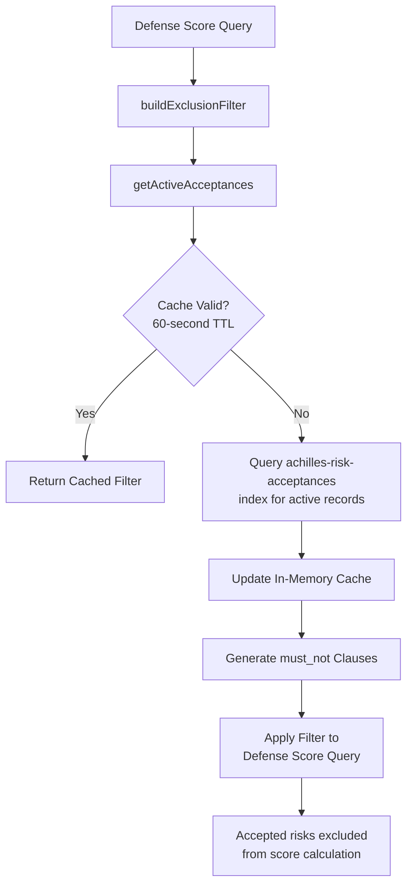
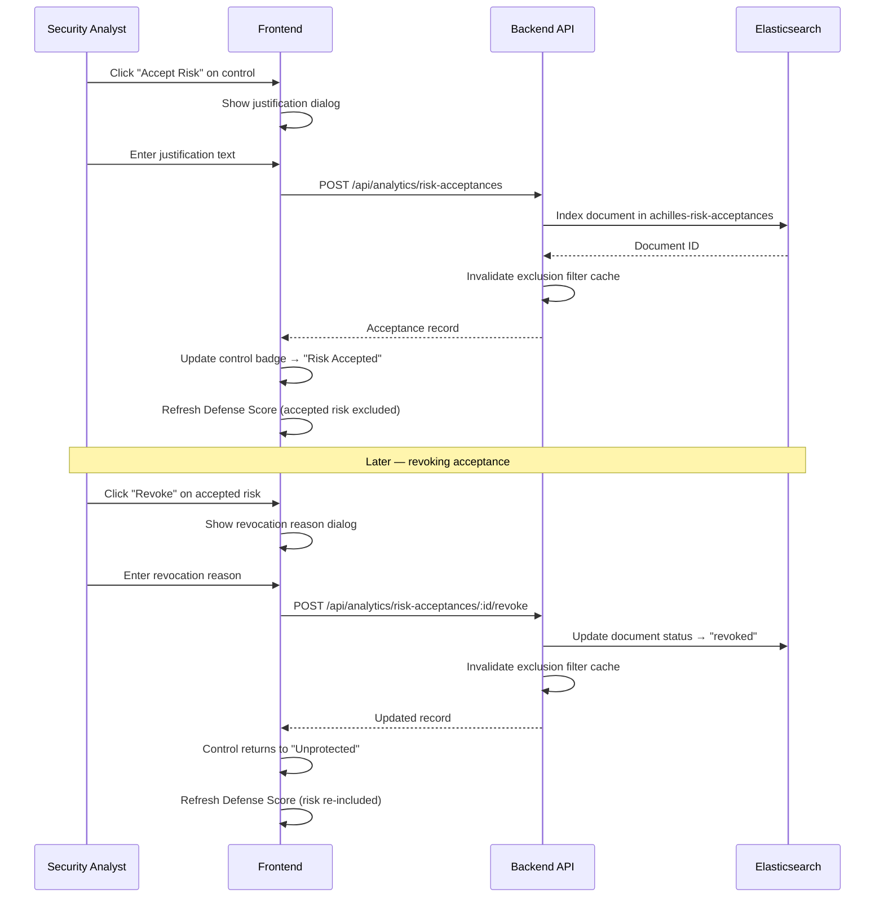

# Risk Acceptance

## Overview

Risk Acceptance allows you to formally acknowledge that certain security controls are not detected — and that this is an accepted risk rather than a gap to fix.

## Accepting Risk

1. In the Execution Table or Defense Score breakdown, find the unprotected control
2. Click the **Accept Risk** button on the row
3. Provide a justification (required)
4. The control is marked as "Risk Accepted" and excluded from the Defense Score calculation

## Audit Trail

All risk acceptance decisions are tracked with:
- **Who** accepted the risk (Clerk user ID)
- **When** the decision was made
- **Why** (the justification provided)

## Revoking Acceptance

Risk acceptance can be revoked at any time, which returns the control to the "Unprotected" category and recalculates the Defense Score.

## Acceptance Granularity

Risk acceptance supports three levels of specificity:

| Level | Scope | Example Use Case |
|-------|-------|------------------|
| **Global Test** | All failures for a specific test across all hosts | A test that triggers false positives everywhere |
| **Global Control** | All failures for a specific control within a bundle | A CIS control that conflicts with business requirements |
| **Host-Specific** | Failures for a test/control on one particular host | A legacy server that cannot be patched |

When accepting risk, choose the narrowest scope that fits the business justification. Host-specific acceptances are preferred over global ones.

## Risk Scoring Model

Accepted risks are excluded from the Defense Score calculation through an Elasticsearch exclusion filter. The flow works as follows:

The exclusion filter generates Elasticsearch `must_not` clauses that match the `test_name`, `control_id`, and `hostname` fields of each active acceptance. This means:

- **Accepted tests** no longer count as "Unprotected" in the Defense Score
- **Heatmap cells** for accepted risks show a distinct visual state
- **Treemap tiles** for accepted controls are grouped separately

:::info Performance
Active acceptances are cached in memory for 60 seconds to avoid hitting Elasticsearch on every Defense Score query. The cache is automatically invalidated when a new acceptance is created or revoked.
:::

## Heatmap Integration

Accepted risks appear as a distinct state in the MITRE ATT&CK heatmap:

| Heatmap Color | Meaning |
|---------------|---------|
| Green | Protected (test passed) |
| Red | Unprotected (test failed) |
| Yellow/Amber | Risk Accepted (excluded from scoring) |
| Gray | Not tested |

This visual distinction ensures that accepted risks are visible to the team without inflating the "unprotected" count.

## Acceptance Workflow

The full lifecycle of a risk acceptance:

## Data Model

Each risk acceptance is stored as an immutable document in the `achilles-risk-acceptances` Elasticsearch index:

| Field | Type | Description |
|-------|------|-------------|
| `acceptance_id` | keyword | Unique UUID |
| `test_name` | keyword | Security test name |
| `control_id` | keyword | Bundle control ID (optional) |
| `hostname` | keyword | Target hostname (optional) |
| `justification` | text | Business justification (required) |
| `accepted_by` | keyword | Clerk user ID |
| `accepted_by_name` | keyword | Display name |
| `accepted_at` | date | ISO timestamp |
| `status` | keyword | `active` or `revoked` |
| `revoked_at` | date | Revocation timestamp (if revoked) |
| `revoked_by` | keyword | Revoker user ID (if revoked) |
| `revoked_by_name` | keyword | Revoker display name (if revoked) |
| `revocation_reason` | text | Reason for revocation (if revoked) |

:::warning Immutable Records
Revoking an acceptance does **not** delete the original record. Instead, the document is updated with `status: 'revoked'` and the revocation metadata fields are populated. This preserves the complete audit trail for compliance reporting.
:::

## Audit Trail

The audit trail captures every risk decision with full context:

- **Who** accepted or revoked the risk (Clerk user ID and display name)
- **When** the action was taken (ISO timestamp)
- **What** was accepted (test name, control ID, hostname)
- **Why** the decision was made (justification or revocation reason)

Use the **Risk Acceptances** table in the Analytics dashboard to review all active and historical acceptances. Filter by status (`active` / `revoked`), test name, or date range.
