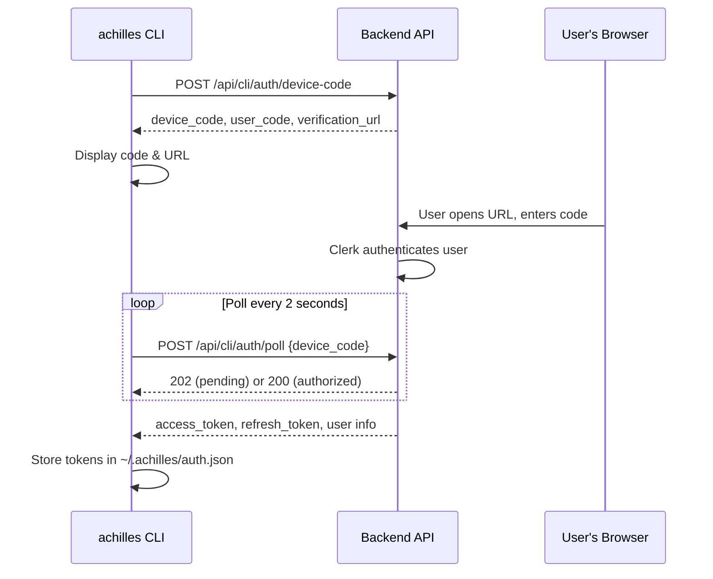

# Authentication

The CLI authenticates using the **OAuth2 Device Authorization Grant** ([RFC 8628](https://datatracker.ietf.org/doc/html/rfc8628)). This flow is designed for devices without a browser -- it lets you authenticate by opening a URL on any device and entering a short code.

## Login

```bash
achilles login
```

The login flow works in three steps:

1. The CLI requests a device code from the backend
2. You open the provided URL in a browser and enter the displayed code
3. The CLI polls the backend until you authorize, then stores the tokens

```
  Authenticating with http://localhost:3000

  Open this URL in your browser:
  https://your-deployment.example.com/cli/verify
  Enter code: ABCD-1234
  Expires: 10:35:00 PM

  Waiting for authorization......

  ✓ Logged in successfully!
```



:::info
The device code expires after **10 minutes**. If you don't complete authorization in time, run `achilles login` again.
:::

### Profile-Aware Login

If you have multiple profiles configured, `achilles login` authenticates against the **active profile's** server URL. Each profile maintains its own authentication state.

```bash
# Switch to production profile, then login
achilles config use production
achilles login
```

## Token Storage

Tokens are stored as JSON files in the `~/.achilles/` directory:

| File | Description |
|------|-------------|
| `~/.achilles/auth.json` | Tokens for the `default` profile |
| `~/.achilles/auth-{profile}.json` | Tokens for named profiles (e.g., `auth-railway.json`) |

All auth files are created with **`0600` permissions** (owner read/write only).

The stored token contains:

| Field | Description |
|-------|-------------|
| `access_token` | JWT for API authentication |
| `refresh_token` | Token for obtaining new access tokens |
| `expires_at` | Expiration timestamp |
| `user_id` | Clerk user ID |
| `org_id` | Organization ID |
| `role` | User role (admin, operator, analyst, explorer) |
| `email` | User email address |
| `display_name` | Human-readable name |
| `issued_at` | When the token was issued |

## Automatic Token Refresh

The CLI automatically handles token lifecycle:

- **Before each API call**, the stored token is checked for expiration
- Tokens are considered expired **5 minutes before** their actual expiry time (refresh margin)
- If expired, the HTTP client attempts a transparent refresh using the `refresh_token`
- If refresh fails, you are prompted to run `achilles login` again

:::tip
You generally never need to think about token refresh -- it happens transparently. If you see an authentication error, just run `achilles login`.
:::

## Logout

```bash
achilles logout
```

This deletes the token file for the active profile. It does not revoke the token on the server side.

```
  ✓ Logged out. Tokens cleared.
```

## Checking Auth Status

Use the `status` command to verify your authentication state:

```bash
achilles status
```

```
  ProjectAchilles CLI v0.1.0

  Server:    http://localhost:3000
  User:      John Doe
  Org:       org_default
  Role:      admin

  ● Backend connected
  Fleet:     12 agents (10 online, 2 offline)

  Defense Score: 73.2% ████████████████████░░░░░░░░
  42 protected / 16 unprotected / 58 total
```

If you are not logged in, the status command shows:

```
  Auth:      Not logged in — run achilles login
```

## Error Handling

The CLI provides clear guidance when authentication issues occur:

| Error | Meaning | Solution |
|-------|---------|----------|
| `AuthError` | Token expired or invalid | Run `achilles login` |
| `NetworkError` | Cannot reach the backend | Check server URL with `achilles config get server_url` |
| HTTP 410 during login | Device code expired | Run `achilles login` again |

```bash
# If you see auth errors with any command:
  ✗ Authentication required
    Run achilles login to authenticate.
```
