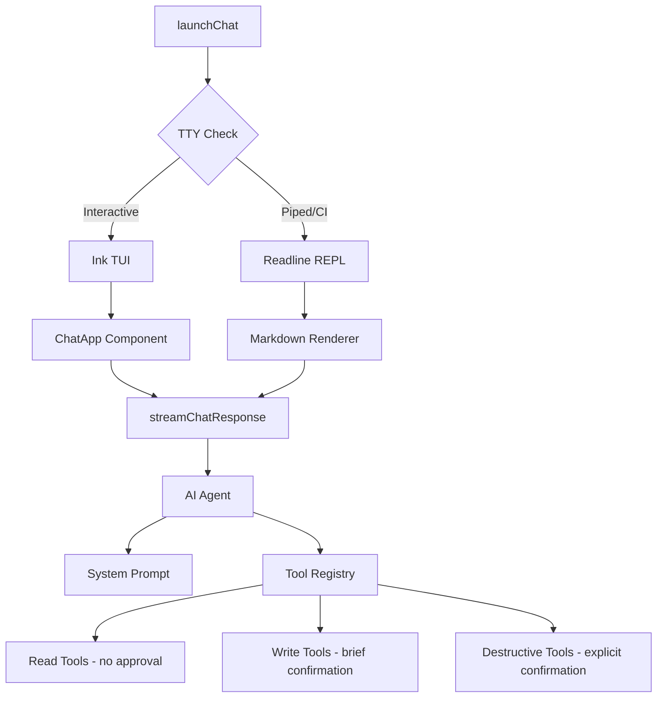

# AI Chat Agent

The chat agent (`achilles chat`) provides a natural language interface to the entire ProjectAchilles platform. Instead of remembering command syntax, you can describe what you want in plain English and the AI agent executes the appropriate operations.

```bash
achilles chat
```

## Architecture



## Two Interface Modes

The chat agent automatically detects your terminal environment and picks the best interface:

### Interactive Mode (TUI)

When running in a real terminal with TTY support, you get a full-screen interface built with [Ink](https://github.com/vadimdemedes/ink):

- ASCII art welcome banner
- Scrollable message history
- Real-time streaming responses with a spinner
- Markdown rendering (bold, headers, tables, code blocks)
- Persistent input field at the bottom
- Status bar showing server URL and AI model

**Chat commands:**

| Command | Description |
|---------|-------------|
| `/clear` | Clear conversation history |
| `/help` | Show available chat commands |
| `/quit`, `/exit`, `/q` | Exit the chat |
| `Ctrl+C` | Quit immediately |

### Piped Mode (Readline)

When stdin is not a TTY (piped input, CI environments), the chat falls back to a simple readline REPL with markdown-to-ANSI rendering:

```bash
# Piped mode — send a single query
echo "What's our current defense score?" | achilles chat

# Interactive readline mode in non-TTY environments
achilles chat
▸ Show me offline agents
◆ I found 3 agents with stale heartbeats:
  - prod-web-01 (last seen 2 hours ago)
  - dev-db-03 (last seen 4 hours ago)
  - staging-api-02 (last seen 6 hours ago)
```

## Available Tools

The AI agent has access to **33 tools** organized into three approval tiers:

### Read Tools (No Confirmation Required)

These tools only query data and are executed immediately:

| Tool | Description |
|------|-------------|
| `list_agents` | List enrolled agents with filters |
| `get_agent` | Get detailed agent info |
| `get_agent_heartbeats` | Heartbeat history (CPU, memory, disk) |
| `get_agent_events` | Agent event log |
| `get_fleet_metrics` | Fleet-wide metrics |
| `get_fleet_health` | Health KPIs (uptime, success rate, MTBF) |
| `list_tokens` | List enrollment tokens |
| `list_tasks` | List tasks with filters |
| `get_task` | Get task details and results |
| `list_schedules` | List recurring schedules |
| `get_schedule` | Get schedule details |
| `list_versions` | List agent binary versions |
| `list_tests` | Search the test library |
| `get_test` | Get test details by UUID |
| `get_categories` | List test categories |
| `get_defense_score` | Current defense score |
| `get_score_trend` | Score trend over time |
| `get_score_by_test` | Score breakdown by test |
| `get_score_by_technique` | Score by MITRE technique |
| `get_score_by_hostname` | Score by hostname |
| `get_executions` | Recent test executions |
| `get_error_rate` | Test error rate |
| `get_test_coverage` | Coverage matrix |
| `get_technique_distribution` | MITRE technique distribution |
| `get_secure_score` | Microsoft Secure Score |
| `get_defender_alerts` | Defender alerts |
| `get_score_correlation` | Defense Score vs Secure Score |
| `get_build_info` | Build info for a test |
| `get_dependencies` | Embed dependencies for a test |
| `list_certificates` | List signing certificates |
| `get_azure_config` | Azure AD config (masked) |
| `get_alert_config` | Alerting configuration |
| `get_alert_history` | Alert dispatch history |
| `list_risk_acceptances` | Risk acceptances |
| `list_users` | Team members |
| `list_invitations` | Pending invitations |

### Write Tools (Brief Confirmation)

These tools modify data. The agent will describe the action and ask for quick confirmation:

```
→ Create test task for 5 agents [Y/n]:
```

| Tool | Description |
|------|-------------|
| `create_token` | Create enrollment token |
| `create_tasks` | Create test execution tasks |
| `create_command_task` | Execute shell command on agents |
| `create_update_tasks` | Push agent updates |
| `update_agent` | Update agent status |
| `add_agent_tag` / `remove_agent_tag` | Manage agent tags |
| `update_task_notes` | Add notes to a task |
| `update_schedule` | Modify a schedule |
| `trigger_sync` | Trigger test library sync |
| `build_test` | Compile and sign a test binary |
| `accept_risk` | Create a risk acceptance |
| `invite_user` | Invite a team member |

### Destructive Tools (Explicit Confirmation)

These tools perform irreversible operations. The agent requires you to type "yes" to confirm:

```
⚠️  Decommission agent prod-web-01
   Type "yes" to confirm:
```

| Tool | Description |
|------|-------------|
| `delete_agent` | Decommission an agent |
| `rotate_agent_key` | Rotate an agent's API key |
| `revoke_token` | Revoke an enrollment token |
| `cancel_task` | Cancel a pending task |
| `delete_task` | Delete a completed task |
| `delete_schedule` | Delete a schedule |
| `create_uninstall_tasks` | Uninstall agents from endpoints |
| `delete_build` | Delete a build artifact |
| `delete_certificate` | Delete a signing certificate |
| `revoke_risk_acceptance` | Revoke a risk acceptance |
| `delete_user` | Remove a team member |

## Usage Examples

```bash
achilles chat
```

**Querying information:**

> What's our current defense score?

> Show me all Windows agents that are offline

> Which MITRE techniques have the lowest protection rate?

> How many tests were executed this week?

**Taking action:**

> Run the T1059 PowerShell test on all production agents

> Pause the "Daily Ransomware Check" schedule

> Rotate the API key for agent prod-web-01

> Create an enrollment token that expires in 48 hours

**Complex queries:**

> Compare our defense score trend over the last 30 days with the Microsoft Secure Score

> Find agents that haven't been updated to the latest version and create update tasks for them

> Show me the top 5 worst-performing tests by hostname

## Security Domain Knowledge

The AI agent understands ProjectAchilles-specific concepts:

- **Exit codes**: 0 = attack succeeded (unprotected), 1 = attack blocked (protected), 2+ = error
- **Agent states**: active, disabled, decommissioned, uninstalled
- **Task flow**: pending, assigned, downloading, executing, completed/failed/expired
- **MITRE ATT&CK**: Technique IDs (T1059, T1486, etc.), tactics, and the kill chain
- **Defense scoring**: 0-100% scale where higher means better defense coverage
- **Bundle tests**: Multi-control tests that fan out into individual scored controls

## Step Limit

The agent enforces a **10-step limit** per response to prevent infinite tool-calling loops. If the agent needs more steps to complete your request, it will explain what remains and you can follow up.

## Error Handling

| Error | What Happens |
|-------|-------------|
| Network failure | Retry suggestion displayed |
| Auth expired | Guidance to run `achilles login` |
| Tool execution failure | Detailed error with context |
| AI provider unavailable | Fallback suggestions and config help |

## AI Provider Configuration

See the [Configuration & Profiles](./configuration.md) page for details on setting up your AI provider (Anthropic, OpenAI, or Ollama).
