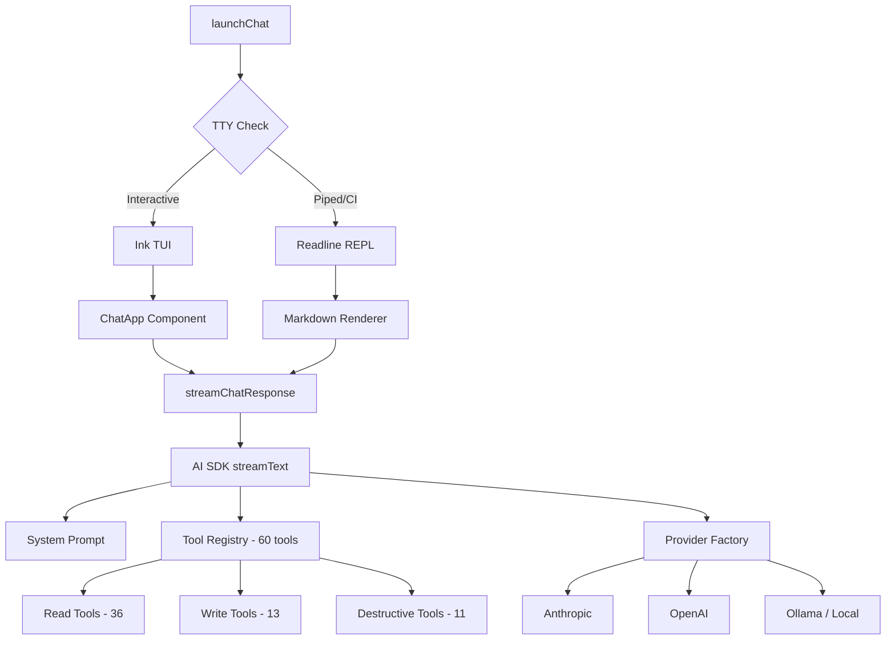

# AI Chat Agent

The chat agent (`achilles chat`) provides a natural language interface to the entire ProjectAchilles platform. Instead of remembering command syntax, you can describe what you want in plain English and the AI agent executes the appropriate operations.

```bash
achilles chat
```

## Architecture



## Two Interface Modes

The chat agent automatically detects your terminal environment and picks the best interface:

### Interactive Mode (Ink TUI)

When running in a real terminal with TTY support, you get a full-screen interface built with [Ink](https://github.com/vadimdemedes/ink) (React for the terminal):

- **ANSI Shadow ASCII art banner** — large block-character "PROJECT ACHILLES" title in green
- **Green terminal theme** — all UI elements use a hacker-green aesthetic (borders, labels, spinner, headers)
- **Scrollable message history** — user and assistant messages with role labels
- **Markdown rendering** — responses rendered with `marked-terminal` for proper box-drawn tables, styled headers, horizontal rules, and reflowed text. A post-processor handles bold/italic/code inside list items that `marked-terminal` misses
- **Streaming spinner** — animated dots while waiting for the first AI token
- **Bordered input area** — text input with placeholder text, green border (gray when streaming)
- **Dynamic status bar** — shows the active server URL and configured AI model (reads from config, not hardcoded)
- **Keyboard hints** — `/clear reset` and `ctrl+c quit` displayed below the input

**Chat commands:**

| Command | Description |
|---------|-------------|
| `/clear` | Clear conversation history |
| `/help` | Show available chat commands |
| `/quit`, `/exit`, `/q` | Exit the chat |
| `Ctrl+C` | Quit immediately |

### Piped Mode (Readline)

When stdin is not a TTY (piped input, CI environments), the chat falls back to a readline REPL with full markdown-to-ANSI rendering via `marked-terminal`:

```bash
# Piped mode — send a single query
echo "What's our current defense score?" | achilles chat

# The response includes rendered markdown:
# ┌─────────────────────┬───────┐
# │ Metric              │ Value │
# ├─────────────────────┼───────┤
# │ 🟢 Protected        │ 263   │
# │ 🔴 Unprotected      │ 313   │
# │ 📊 Total Executions │ 576   │
# └─────────────────────┴───────┘
```

:::info Piped stdin handling
When input is piped (`echo "..." | achilles chat`), the readline `close` event fires immediately after the line is read. The chat defers `process.exit()` until the streaming AI response completes, preventing truncated output.
:::

## AI Provider Configuration

The chat agent supports three AI providers. Configure via `achilles config set`:

### Anthropic (Default)

```bash
achilles config set ai.provider anthropic
achilles config set ai.model claude-sonnet-4-6
achilles config set ai.api_key sk-ant-...
```

### OpenAI

```bash
achilles config set ai.provider openai
achilles config set ai.model gpt-4o
achilles config set ai.api_key sk-...
```

### Ollama (Local Models)

Run any model locally without API costs:

```bash
# 1. Start Ollama with your model
ollama run llama3

# 2. Configure the CLI
achilles config set ai.provider ollama
achilles config set ai.model llama3
achilles config set ai.base_url http://localhost:11434/v1
achilles config set ai.api_key ollama   # Required by SDK but ignored by Ollama
```

Works with any Ollama model: `llama3`, `qwen3`, `mistral`, `codellama`, etc.

:::tip LM Studio and other local servers
Any OpenAI-compatible local server works — just set `ai.provider ollama` and point `ai.base_url` to your server (e.g., `http://localhost:1234/v1` for LM Studio).
:::

:::note Technical detail
The provider factory uses `openai.chat(modelId)` (Chat Completions API) instead of the default `openai(modelId)` (Responses API) because Ollama and local servers don't support OpenAI's newer Responses API (`/v1/responses`) which uses `item_reference` message types.
:::

### Environment Variables

As an alternative to config, you can set environment variables:

```bash
ANTHROPIC_API_KEY=sk-ant-...  achilles chat
OPENAI_API_KEY=sk-...         achilles chat
```

## Available Tools

The AI agent has access to **60 tools** organized into three approval tiers:

### Read Tools (36 — No Confirmation Required)

These tools only query data and are executed immediately:

| Tool | Description |
|------|-------------|
| `list_agents` | List enrolled agents with filters |
| `get_agent` | Get detailed agent info |
| `get_agent_heartbeats` | Heartbeat history (CPU, memory, disk) |
| `get_agent_events` | Agent event log |
| `get_fleet_metrics` | Fleet-wide metrics |
| `get_fleet_health` | Health KPIs (uptime, success rate, MTBF) |
| `list_tokens` | List enrollment tokens |
| `list_tasks` | List tasks with filters |
| `get_task` | Get task details and results |
| `list_schedules` | List recurring schedules |
| `get_schedule` | Get schedule details |
| `list_versions` | List agent binary versions |
| `list_tests` | Search the test library |
| `get_test` | Get test details by UUID |
| `get_categories` | List test categories |
| `get_defense_score` | Current defense score |
| `get_score_trend` | Score trend over time |
| `get_score_by_test` | Score breakdown by test |
| `get_score_by_technique` | Score by MITRE technique |
| `get_score_by_hostname` | Score by hostname |
| `get_executions` | Recent test executions |
| `get_error_rate` | Test error rate |
| `get_test_coverage` | Coverage matrix |
| `get_technique_distribution` | MITRE technique distribution |
| `get_secure_score` | Microsoft Secure Score |
| `get_defender_alerts` | Defender alerts |
| `get_score_correlation` | Defense Score vs Secure Score |
| `get_build_info` | Build info for a test |
| `get_dependencies` | Embed dependencies for a test |
| `list_certificates` | List signing certificates |
| `get_azure_config` | Azure AD config (masked) |
| `get_alert_config` | Alerting configuration |
| `get_alert_history` | Alert dispatch history |
| `list_risk_acceptances` | Risk acceptances |
| `list_users` | Team members |
| `list_invitations` | Pending invitations |

### Write Tools (13 — Brief Confirmation)

These tools modify data. The agent will describe the action before executing:

| Tool | Description |
|------|-------------|
| `create_token` | Create enrollment token |
| `create_tasks` | Create test execution tasks |
| `create_command_task` | Execute shell command on agents |
| `create_update_tasks` | Push agent updates |
| `update_agent` | Update agent status |
| `add_agent_tag` / `remove_agent_tag` | Manage agent tags |
| `update_task_notes` | Add notes to a task |
| `update_schedule` | Modify a schedule |
| `trigger_sync` | Trigger test library sync |
| `build_test` | Compile and sign a test binary |
| `accept_risk` | Create a risk acceptance |
| `invite_user` | Invite a team member |

### Destructive Tools (11 — Explicit Confirmation)

These tools perform irreversible operations:

| Tool | Description |
|------|-------------|
| `delete_agent` | Decommission an agent |
| `rotate_agent_key` | Rotate an agent's API key |
| `revoke_token` | Revoke an enrollment token |
| `cancel_task` | Cancel a pending task |
| `delete_task` | Delete a completed task |
| `delete_schedule` | Delete a schedule |
| `create_uninstall_tasks` | Uninstall agents from endpoints |
| `delete_build` | Delete a build artifact |
| `delete_certificate` | Delete a signing certificate |
| `revoke_risk_acceptance` | Revoke a risk acceptance |
| `delete_user` | Remove a team member |

## Visual Style

### Ink TUI Welcome Screen

The interactive mode opens with a styled welcome screen:

```
          ██████╗ ██████╗  ██████╗      ██╗███████╗ ██████╗████████╗
          ██╔══██╗██╔══██╗██╔═══██╗     ██║██╔════╝██╔════╝╚══██╔══╝
          ██████╔╝██████╔╝██║   ██║     ██║█████╗  ██║        ██║
          ██╔═══╝ ██╔══██╗██║   ██║██   ██║██╔══╝  ██║        ██║
          ██║     ██║  ██║╚██████╔╝╚█████╔╝███████╗╚██████╗   ██║
          ╚═╝     ╚═╝  ╚═╝ ╚═════╝  ╚════╝ ╚══════╝ ╚═════╝   ╚═╝

           █████╗  ██████╗██╗  ██╗██╗██╗     ██╗     ███████╗███████╗
          ██╔══██╗██╔════╝██║  ██║██║██║     ██║     ██╔════╝██╔════╝
          ███████║██║     ███████║██║██║     ██║     █████╗  ███████╗
          ██╔══██║██║     ██╔══██║██║██║     ██║     ██╔══╝  ╚════██║
          ██║  ██║╚██████╗██║  ██║██║███████╗███████╗███████╗███████║
          ╚═╝  ╚═╝ ╚═════╝╚═╝  ╚═╝╚═╝╚══════╝╚══════╝╚══════╝╚══════╝

┌──────────────────────────────────────────────────────────────────────────┐
│ ▸ Ask anything... "What's our defense score?"                            │
│                                                                          │
│ Server  https://tpsgl.agent.projectachilles.io  ·  Model  qwen3 (ollama) │
└──────────────────────────────────────────────────────────────────────────┘
                           /clear reset  ctrl+c quit
```

### Markdown Rendering Pipeline

AI responses go through a rendering pipeline for terminal display:

1. **`marked` + `marked-terminal`** — Converts markdown to ANSI escape codes (box-drawn tables, colored headers, horizontal rules, reflowed text)
2. **`fixRemainingMarkdown()`** — Post-processor that handles inline formatting `marked-terminal` misses inside list items:
   - `**bold**` → ANSI bold (`\e[1m...\e[22m`)
   - `*italic*` → ANSI italic (`\e[3m...\e[23m`)
   - `` `code` `` → ANSI cyan (`\e[36m...\e[39m`)

This pipeline is used in both Ink TUI mode and readline fallback mode.

## Usage Examples

```bash
achilles chat
```

**Querying information:**

> What's our current defense score?

> Show me all Windows agents that are offline

> Which MITRE techniques have the lowest protection rate?

> How many tests were executed this week?

**Taking action:**

> Run the T1059 PowerShell test on all production agents

> Pause the "Daily Ransomware Check" schedule

> Rotate the API key for agent prod-web-01

> Create an enrollment token that expires in 48 hours

**Complex queries:**

> Compare our defense score trend over the last 30 days with the Microsoft Secure Score

> Find agents that haven't been updated to the latest version and create update tasks for them

> Show me the top 5 worst-performing tests by hostname

## Security Domain Knowledge

The AI agent understands ProjectAchilles-specific concepts:

- **Exit codes**: 0 = attack succeeded (unprotected), 1 = attack blocked (protected), 2+ = error
- **Agent states**: active, disabled, decommissioned, uninstalled
- **Task flow**: pending, assigned, downloading, executing, completed/failed/expired
- **MITRE ATT&CK**: Technique IDs (T1059, T1486, etc.), tactics, and the kill chain
- **Defense scoring**: 0-100% scale where higher means better defense coverage
- **Bundle tests**: Multi-control tests that fan out into individual scored controls

## Step Limit

The agent enforces a **10-step limit** per response to prevent infinite tool-calling loops. If the agent needs more steps to complete your request, it will explain what remains and you can follow up.

## Error Handling

| Error | What Happens |
|-------|-------------|
| Network failure | Retry suggestion displayed |
| Auth expired | Guidance to run `achilles login` |
| Tool execution failure | Detailed error with context |
| AI provider unavailable | Fallback suggestions and config help |

## Technical Implementation

| Component | Technology | Purpose |
|-----------|-----------|---------|
| TUI Framework | [Ink](https://github.com/vadimdemedes/ink) v6 | React for the terminal |
| Text Input | `ink-text-input` | Controlled text input component |
| Spinner | `ink-spinner` | Animated loading indicator |
| Markdown | `marked` + `marked-terminal` | ANSI terminal markdown rendering |
| AI SDK | `ai` v6 + `@ai-sdk/anthropic` / `@ai-sdk/openai` | Streaming text, tool calling |
| Tool Schemas | `zod` + `inputSchema` (MCP-aligned) | Type-safe tool parameter validation |
| Provider Factory | `provider.ts` | Creates proper model instances with API keys |

### Key Files

| File | Purpose |
|------|---------|
| `cli/src/chat/launch.ts` | Entry point — TTY detection, mode selection |
| `cli/src/chat/view.tsx` | Ink TUI components (ChatApp, Message, AsciiTitle) |
| `cli/src/chat/agent.ts` | AI SDK `streamText` with tool calling |
| `cli/src/chat/provider.ts` | Provider factory (Anthropic, OpenAI, Ollama) |
| `cli/src/chat/tools.ts` | 60 tool definitions (read/write/destructive) |
| `cli/src/chat/system-prompt.ts` | Domain-specific system prompt builder |
