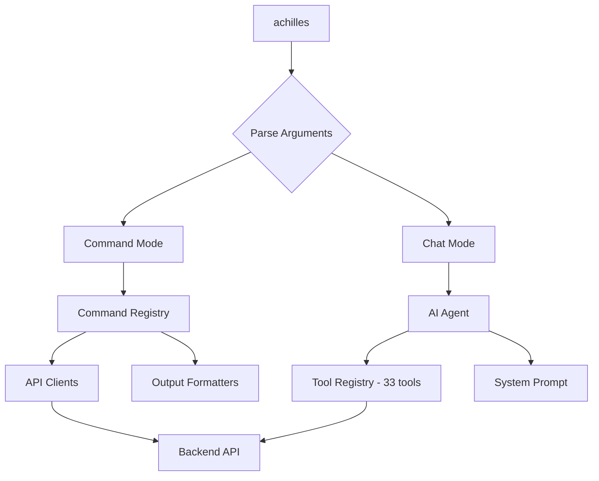

# Overview & Installation

The ProjectAchilles CLI (`achilles`) is a terminal-based management tool for the purple team security validation platform. It provides full control over agents, tasks, schedules, analytics, builds, certificates, and integrations -- all from the command line.

## Dual-Mode Architecture

The CLI operates in two modes:



- **Command Mode** (`achilles <command> [subcommand] [flags]`): Traditional CLI commands with structured output. Ideal for scripting, CI/CD pipelines, and quick operations.
- **Chat Mode** (`achilles chat`): AI-powered conversational interface that understands natural language and can execute any platform operation through tool calling.

## Requirements

The CLI is built on **[Bun](https://bun.sh/)** -- a fast JavaScript runtime. Bun is required to run the CLI.

```bash
# Install Bun (if not already installed)
curl -fsSL https://bun.sh/install | bash
```

## Installation

```bash
# Clone the repository (if you haven't already)
git clone <repo-url> ProjectAchilles
cd ProjectAchilles/cli

# Install dependencies
bun install

# Run directly
bun run bin/achilles.ts

# Or use the dev script
bun run dev
```

:::tip
You can create a shell alias for convenience:

```bash
alias achilles="bun run /path/to/ProjectAchilles/cli/bin/achilles.ts"
```
:::

### Building a Standalone Binary

```bash
cd cli
bun run build
# Output: dist/achilles
```

## Available Commands

| Command | Alias | Description |
|---------|-------|-------------|
| `status` | `st` | Health check -- backend connectivity, auth, and fleet summary |
| `login` | | Authenticate with the backend (OAuth2 Device Flow) |
| `logout` | | Clear stored authentication tokens |
| `config` | | View and modify CLI configuration and profiles |
| `agents` | `a` | Manage enrolled agents |
| `tokens` | | Manage enrollment tokens |
| `tasks` | `t` | Manage security test tasks |
| `schedules` | | Manage recurring test schedules |
| `versions` | | Manage agent binary versions |
| `browser` | | Browse the security test library |
| `analytics` | `an` | Query security analytics from Elasticsearch |
| `defender` | | Microsoft Defender integration |
| `builds` | | Manage test builds and dependencies |
| `certs` | | Manage code signing certificates |
| `integrations` | | Configure Azure AD and alerting |
| `risk` | | Risk acceptance workflow management |
| `users` | | Team member and invitation management |
| `help` | | Show help |
| `chat` | | Launch AI conversational agent |

## Global Flags

These flags work with any command:

| Flag | Short | Description |
|------|-------|-------------|
| `--json` | | Output structured JSON instead of human-readable text. Useful for scripting, CI/CD, and LLM integration. |
| `--help` | `-h` | Show help for the current command or subcommand. |
| `--version` | `-V` | Show CLI version. |

### JSON Mode

Every command supports `--json` for machine-readable output. This is especially useful for:

- **Scripting**: Parse output with `jq` or other JSON tools
- **CI/CD pipelines**: Reliable structured data for automation
- **AI agents**: Consistent schema for LLM consumption

```bash
# Human-readable output
achilles agents list

# JSON output for scripting
achilles agents list --json

# Pipe to jq for filtering
achilles agents list --json | jq '.agents[] | select(.status == "active")'
```

## Quick Start

```bash
# 1. Check connectivity and status
achilles status

# 2. Authenticate
achilles login

# 3. List your agents
achilles agents list

# 4. Check defense score
achilles analytics score

# 5. Launch AI chat for natural language interaction
achilles chat
```

## Getting Help

```bash
# Global help
achilles --help

# Command-specific help
achilles agents --help

# JSON-formatted help (for tooling)
achilles agents --help --json
```

The help system is auto-generated from command definitions, so it always reflects the current state of available commands, flags, and arguments.
