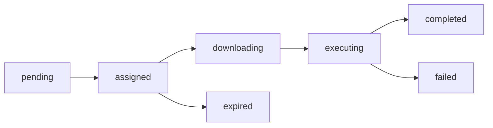

# Task & Schedule Commands

Tasks and schedules are how security tests get executed on your fleet. A **task** is a one-time execution order sent to one or more agents. A **schedule** automates recurring task creation.

## Task Commands

```bash
achilles tasks <subcommand> [flags]
```

Alias: `t`

### Subcommands

| Subcommand | Description |
|------------|-------------|
| `create` | Create test execution tasks |
| `command` | Execute an arbitrary command on agents |
| `update` | Create agent update tasks |
| `uninstall` | Create uninstall tasks |
| `list` | List tasks with filters |
| `grouped` | List tasks grouped by batch |
| `show` | Show task details |
| `cancel` | Cancel a pending/assigned task |
| `delete` | Delete a completed/failed/expired task |
| `notes` | Update task notes |

### Task Lifecycle

Tasks progress through these states:



### tasks create

Create security test execution tasks for one or more agents.

```bash
achilles tasks create --test <uuid> --agents <id1,id2,...> [flags]
```

**Flags:**

| Flag | Type | Required | Description |
|------|------|----------|-------------|
| `--test` | string | Yes | Test UUID from the test library |
| `--agents` | string | Yes | Comma-separated agent IDs |
| `--timeout` | number | No | Execution timeout in seconds |
| `--priority` | number | No | Priority level (0-10) |

**Example:**

```bash
# Run a test on two agents
achilles tasks create \
  --test 7659eeba-f315-440e-9882-4aa015d68b27 \
  --agents a1b2c3d4,e5f6g7h8

# With priority and timeout
achilles tasks create \
  --test 7659eeba-f315-440e-9882-4aa015d68b27 \
  --agents a1b2c3d4 \
  --priority 8 \
  --timeout 300
```

```
  ✓ Created 2 task(s)
  Task IDs: ["task-uuid-1", "task-uuid-2"]
```

### tasks command

Execute an arbitrary shell command on one or more agents.

```bash
achilles tasks command --cmd <command> --agents <id1,id2,...> [flags]
```

**Flags:**

| Flag | Type | Required | Description |
|------|------|----------|-------------|
| `--cmd` | string | Yes | Shell command to execute |
| `--agents` | string | Yes | Comma-separated agent IDs |
| `--timeout` | number | No | Execution timeout in seconds |

**Example:**

```bash
# Run a diagnostic command on agents
achilles tasks command \
  --cmd "systeminfo | findstr /B /C:OS" \
  --agents a1b2c3d4,e5f6g7h8
```

### tasks update

Push the latest agent binary version to agents.

```bash
achilles tasks update --agents <id1,id2,...>
```

**Example:**

```bash
achilles tasks update --agents a1b2c3d4,e5f6g7h8,i9j0k1l2
```

### tasks uninstall

Create tasks to remove the agent software from endpoints.

```bash
achilles tasks uninstall --agents <id1,id2,...> [flags]
```

**Flags:**

| Flag | Type | Description |
|------|------|-------------|
| `--agents` | string | Comma-separated agent IDs (required) |
| `--cleanup` | boolean | Perform cleanup after uninstall |

:::warning
Uninstall tasks will remove the agent from the target endpoints. This is a destructive operation.
:::

### tasks list

List tasks with optional filters and pagination.

```bash
achilles tasks list [flags]
```

**Flags:**

| Flag | Type | Choices | Description |
|------|------|---------|-------------|
| `--status` | string | `pending`, `assigned`, `downloading`, `executing`, `completed`, `failed`, `expired` | Filter by status |
| `--type` | string | `execute_test`, `update_agent`, `uninstall`, `execute_command` | Filter by type |
| `--agent-id` | string | | Filter by agent ID |
| `--search` | string | | Search test name or command |
| `--limit` | number | | Max results (default: 50) |
| `--offset` | number | | Pagination offset (default: 0) |

**Example:**

```bash
# List all pending tasks
achilles tasks list --status pending

# Find failed test executions
achilles tasks list --status failed --type execute_test

# Search by test name
achilles tasks list --search "T1059"
```

**Example output:**

```
  ID          Type              Host              Status        Test/Cmd               Created
  ─────────   ───────────────   ────────────────  ────────────  ────────────────────   ────────────
  f1a2b3c4…   execute_test      prod-web-01       ● completed   T1059-PowerShell       2h ago
  d5e6f7g8…   execute_test      dev-db-03         ● failed      T1486-Ransomware       3h ago
  h9i0j1k2…   update_agent      staging-api-02    ◷ pending     —                      5m ago
```

### tasks grouped

View tasks grouped by batch (all tasks created in a single operation).

```bash
achilles tasks grouped [flags]
```

**Flags:**

| Flag | Type | Description |
|------|------|-------------|
| `--status` | string | Filter by status |
| `--type` | string | Filter by type |
| `--limit` | number | Max results (default: 20) |

### tasks show

Show detailed information about a task, including its execution result.

```bash
achilles tasks show <id>
```

**Example:**

```bash
achilles tasks show f1a2b3c4-5678-9abc-def0-123456789abc
```

The output includes task metadata (type, status, agent, priority, timestamps) and, if completed, the execution result (exit code, hostname, duration).

### tasks cancel

Cancel a task that is still `pending` or `assigned`.

```bash
achilles tasks cancel <id>
```

### tasks delete

Delete a task that is `completed`, `failed`, or `expired`.

```bash
achilles tasks delete <id>
```

### tasks notes

Add or update notes on a task.

```bash
achilles tasks notes <id> <content>
```

**Example:**

```bash
achilles tasks notes f1a2b3c4 "False positive — AV quarantined test binary"
```

---

## Schedule Commands

```bash
achilles schedules <subcommand> [flags]
```

### Subcommands

| Subcommand | Description |
|------------|-------------|
| `create` | Create a new recurring schedule |
| `list` | List schedules |
| `show` | Show schedule details |
| `update` | Update a schedule (pause/resume/modify) |
| `delete` | Delete a schedule |

### schedules create

Create a new recurring test schedule.

```bash
achilles schedules create \
  --test <uuid> \
  --agents <id1,id2,...> \
  --type <schedule-type> \
  --config <json> \
  [flags]
```

**Flags:**

| Flag | Type | Required | Default | Description |
|------|------|----------|---------|-------------|
| `--name` | string | No | | Schedule display name |
| `--test` | string | Yes | | Test UUID |
| `--agents` | string | Yes | | Comma-separated agent IDs |
| `--type` | string | Yes | | Schedule type: `once`, `daily`, `weekly`, `monthly` |
| `--config` | string | Yes | | Schedule configuration as JSON |
| `--timezone` | string | No | `UTC` | Timezone for scheduling |

**Schedule config format by type:**

| Type | Config Example | Description |
|------|---------------|-------------|
| `once` | `{"time":"2026-03-20T14:00:00Z"}` | Run once at specified time |
| `daily` | `{"time":"14:00"}` | Run daily at specified time |
| `weekly` | `{"time":"09:00","day_of_week":1}` | Run weekly (0=Sun, 1=Mon, ..., 6=Sat) |
| `monthly` | `{"time":"08:00","day_of_month":15}` | Run monthly on specified day |

**Examples:**

```bash
# Daily scan at 2 PM UTC
achilles schedules create \
  --name "Daily Ransomware Check" \
  --test 7659eeba-f315-440e-9882-4aa015d68b27 \
  --agents a1b2c3d4,e5f6g7h8 \
  --type daily \
  --config '{"time":"14:00"}'

# Weekly scan on Mondays at 9 AM Europe/London
achilles schedules create \
  --name "Weekly Full Scan" \
  --test abc12345-def6-7890-abcd-ef1234567890 \
  --agents a1b2c3d4 \
  --type weekly \
  --config '{"time":"09:00","day_of_week":1}' \
  --timezone Europe/London
```

### schedules list

List all schedules with optional status filter.

```bash
achilles schedules list [flags]
```

**Flags:**

| Flag | Type | Choices | Description |
|------|------|---------|-------------|
| `--status` | string | `active`, `paused`, `completed`, `deleted` | Filter by status |

**Example:**

```bash
achilles schedules list
achilles schedules list --status active
```

**Example output:**

```
  ID          Name              Test                  Type      Status      Next Run    Agents
  ─────────   ────────────────  ────────────────────  ────────  ──────────  ──────────  ───────
  s1a2b3c4…   Daily Ransom…     T1486-Ransomware      daily     ⏱ active    2h          3
  s5e6f7g8…   Weekly Full…      CyberHygiene-Bun…     weekly    ⏱ active    5d          5
  s9h0i1j2…   One-time test     T1059-PowerShell      once      ✓ completed —           1
```

### schedules show

Show detailed information about a schedule.

```bash
achilles schedules show <id>
```

Output includes: ID, name, test name, schedule type, configuration, timezone, status, next/last run times, target agents, priority, creator, and creation timestamp.

### schedules update

Pause, resume, or modify a schedule.

```bash
achilles schedules update <id> [flags]
```

**Flags:**

| Flag | Type | Description |
|------|------|-------------|
| `--pause` | boolean | Pause the schedule |
| `--resume` | boolean | Resume a paused schedule |
| `--config` | string | New schedule config JSON |
| `--name` | string | New display name |

**Examples:**

```bash
# Pause a schedule
achilles schedules update s1a2b3c4 --pause

# Resume a schedule
achilles schedules update s1a2b3c4 --resume

# Change the schedule time
achilles schedules update s1a2b3c4 --config '{"time":"16:00"}'
```

### schedules delete

Permanently delete a schedule.

```bash
achilles schedules delete <id>
```
