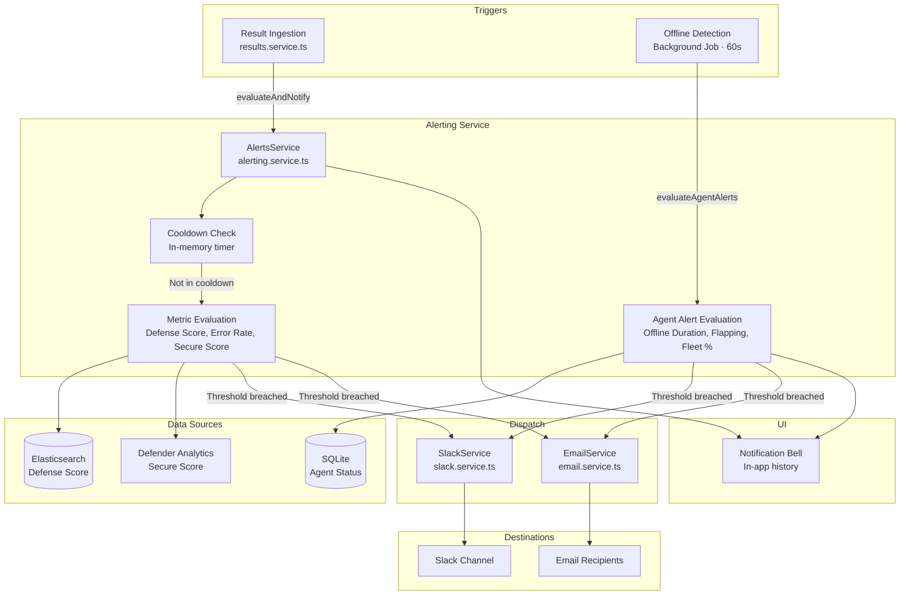
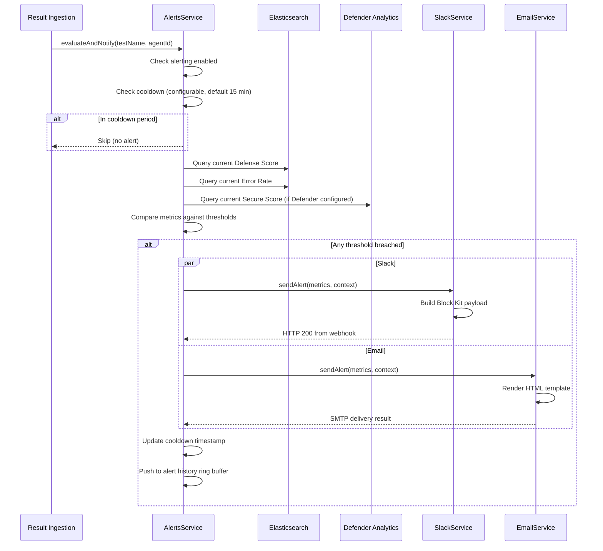

# Alerting (Slack & Email)

## Overview

The alerting service dispatches notifications when test results cross configured thresholds. Alerts are evaluated after each result ingestion.

## Channels

### Slack
Alerts are sent as Block Kit formatted messages via a Slack webhook URL.

1. Create an [Incoming Webhook](https://api.slack.com/messaging/webhooks) in your Slack workspace
2. Navigate to **Settings** → **Integrations** → **Alerting** → **Slack**
3. Paste the webhook URL
4. Send a test message to verify

### Email
Alerts are sent via SMTP using Nodemailer.

1. Navigate to **Settings** → **Integrations** → **Alerting** → **Email**
2. Configure SMTP settings (host, port, username, password)
3. Add recipient email addresses
4. Send a test email to verify

## Thresholds

Configure two types of thresholds:

| Threshold | Description |
|-----------|-------------|
| **Relative drop** | Alert when Defense Score drops by X% from the previous period |
| **Absolute floor** | Alert when Defense Score falls below X% |

## Notification Bell

Recent alerts also appear in the in-app notification bell in the top navigation bar.

## Architecture

The alerting service is hooked into the result ingestion pipeline — every time a test result is ingested into Elasticsearch, the service evaluates configured thresholds and dispatches notifications.



### Dispatch Pipeline

The full evaluation and dispatch flow proceeds as follows:



### Threshold Evaluation Logic

Three metrics are evaluated independently. Each can trigger an alert if its configured threshold is breached:

| Metric | Direction | Example | Evaluation |
|--------|-----------|---------|------------|
| **Defense Score** | Minimum (floor) | `defense_score_min: 80` | Alert if current score < 80% |
| **Error Rate** | Maximum (ceiling) | `error_rate_max: 5` | Alert if error rate > 5% |
| **Secure Score** | Minimum (floor) | `secure_score_min: 75` | Alert if Microsoft Secure Score < 75% |

:::info
The Secure Score threshold is only evaluated when the Microsoft Defender integration is configured. If Defender is not connected, this threshold is silently skipped.
:::

**Cooldown mechanism:** After an alert is dispatched, a configurable cooldown period (default: 15 minutes) prevents duplicate alerts from firing on subsequent result ingestions. The cooldown timer is stored in memory and resets after the period elapses.

**Alert history:** A fixed-size in-memory ring buffer stores recent alerts for display in the Notification Bell component. This history is not persisted — it resets on server restart.

## Agent Alerts

In addition to test result thresholds, the alerting service monitors **agent health** and dispatches notifications when fleet conditions degrade. Agent alerts are evaluated every 60 seconds alongside the offline detection background job.

| Threshold | Description | Example |
|-----------|-------------|---------|
| **Offline Duration** | Alert when any agent has been offline longer than X hours | `offline_hours_threshold: 24` — alert if any agent offline >24h |
| **Flapping** | Alert when an agent reconnects more than N times in 24 hours | `flapping_threshold: 5` — alert if agent reconnects >5x/day |
| **Fleet Online %** | Alert when the percentage of online agents drops below X% | `fleet_online_percent_min: 80` — alert if fewer than 80% of fleet is online |

Agent alerts use a **separate cooldown** from test result alerts (default: 30 minutes). This prevents the two alert types from suppressing each other.

Configure agent alerts in **Settings** → **Integrations** → **Alerting** → **Agent Alerts**.

### Slack Block Kit Format

Slack alerts use the [Block Kit](https://api.slack.com/block-kit) framework for rich, structured messages:

```
┌─────────────────────────────────────────┐
│ ⚠️  ProjectAchilles Alert               │  ← Header block
├─────────────────────────────────────────┤
│ One or more security metrics have       │  ← Section: summary text
│ crossed configured thresholds.          │
├─────────────────────────────────────────┤
│ ✗ Defense Score: 72% (threshold: > 80%) │  ← Section: breached metrics
│ ✓ Error Rate: 3% (threshold: < 5%)     │     (✓ = passing, ✗ = breached)
│ ✗ Secure Score: 68% (threshold: > 75%) │
├─────────────────────────────────────────┤
│ Triggered by: T1059.001 (WORKSTATION-3) │  ← Context: test + agent
├─────────────────────────────────────────┤
│ [ View Dashboard ]                      │  ← Actions: link button
└─────────────────────────────────────────┘
```

Both breached and passing metrics are included so the recipient sees the full picture at a glance. The dashboard button links directly to the Analytics page.

### Email Template

HTML email alerts follow the same information structure:

| Section | Content |
|---------|---------|
| **Red banner** | "ProjectAchilles Security Alert" with alert summary |
| **Metric table** | All three metrics with visual pass/fail indicators and current values vs. thresholds |
| **Context block** | Triggering test name, agent ID, and timestamp |
| **Dashboard button** | Direct link to the Analytics dashboard |
| **Footer** | Configuration instructions and unsubscribe note |

Emails are sent via Nodemailer with configurable SMTP settings (host, port, TLS, authentication).

### Settings Storage

Alert configuration is stored in `~/.projectachilles/integrations.json` (Docker) or Vercel Blob (serverless), encrypted with AES-256-GCM:

```json
{
  "alerts": {
    "thresholds": {
      "enabled": true,
      "defense_score_min": 80,
      "error_rate_max": 5,
      "secure_score_min": 75
    },
    "cooldown_minutes": 15,
    "slack": {
      "webhook_url": "enc:<iv>:<tag>:<ciphertext>",
      "configured": true,
      "enabled": true
    },
    "email": {
      "smtp_host": "smtp.gmail.com",
      "smtp_port": 587,
      "smtp_secure": false,
      "smtp_user": "enc:<iv>:<tag>:<ciphertext>",
      "smtp_pass": "enc:<iv>:<tag>:<ciphertext>",
      "from_address": "alerts@company.com",
      "recipients": ["admin@company.com"],
      "configured": true,
      "enabled": true
    },
    "agent_alerts": {
      "enabled": true,
      "offline_hours_threshold": 24,
      "flapping_threshold": 5,
      "fleet_online_percent_min": 80,
      "cooldown_minutes": 30
    }
  }
}
```

:::tip
Sensitive fields (webhook URLs, SMTP credentials) are prefixed with `enc:` and encrypted using AES-256-GCM. The encryption key is derived from the `ENCRYPTION_SECRET` environment variable.
:::

### Connection Testing

Before saving channel configuration, use the built-in test functions:

- **Slack**: Sends a test message to the webhook URL and verifies a 200 response
- **Email**: Opens a transient SMTP connection and verifies authentication succeeds

Both test endpoints are available in the Settings UI and return clear success/failure messages.
