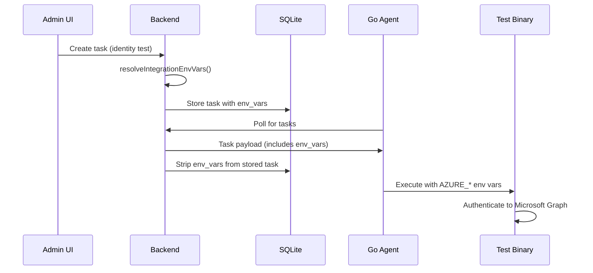

# Azure / Entra ID

## Overview

The Azure / Entra ID integration provides service principal credentials for security tests that target Azure Active Directory. Tests in the **identity-tenant** subcategory (e.g., MFA enrollment checks, conditional access policy validation, role assignment audits) require access to your Azure AD tenant via the Microsoft Graph API.

When configured, credentials are automatically injected into task payloads as environment variables — the test binary reads them at runtime to authenticate against your tenant.

## Prerequisites

- An Azure AD tenant (Microsoft Entra ID)
- An App Registration with the required API permissions (see below)
- Admin consent granted for all permissions

## Azure AD Setup

1. Go to [Azure Portal](https://portal.azure.com) → **App Registrations** → **New Registration**
2. Name: "ProjectAchilles Identity Assessments" (or similar)
3. Supported account types: **Accounts in this organizational directory only**
4. Click **Register**

### Required Permissions

Under **API Permissions**, add the following **Application** (not Delegated) permissions and grant admin consent:

| Permission | Type | Purpose |
|------------|------|---------|
| `Directory.Read.All` | Application | Read directory data (users, groups, roles) |
| `Policy.Read.All` | Application | Read conditional access and auth policies |
| `SecurityEvents.Read.All` | Application | Read security events and alerts |
| `UserAuthenticationMethod.Read.All` | Application | Read user MFA enrollment status |
| `RoleManagement.Read.Directory` | Application | Read role assignments and definitions |

:::warning Admin Consent Required
All five permissions require **admin consent**. After adding them, click **Grant admin consent for \<your org\>** on the API Permissions page. Without this, the service principal cannot access any data.
:::

### Create a Client Secret

1. Under **Certificates & Secrets** → **Client secrets** → **New client secret**
2. Set a description and expiration (recommended: 12-24 months)
3. Copy the **Value** immediately — it is shown only once

Note the following values from the App Registration overview page:
- **Application (client) ID**
- **Directory (tenant) ID**

## Configuration

### Via the Web UI

1. Navigate to **Settings** → **Integrations** → **Azure / Entra ID**
2. Enter:
   - **Tenant ID** — Azure AD Directory (tenant) ID
   - **Client ID** — Application (client) ID
   - **Client Secret** — The secret value you created
   - **Tenant Label** (optional) — A friendly name (e.g., "Contoso Production") displayed in analytics results
3. Click **Validate Credentials** to verify the service principal can authenticate
4. Click **Save Settings**

### Via Environment Variables

Alternatively, configure credentials via environment variables (useful for CI/CD or containerized deployments):

```bash
AZURE_TENANT_ID=xxxxxxxx-xxxx-xxxx-xxxx-xxxxxxxxxxxx
AZURE_CLIENT_ID=xxxxxxxx-xxxx-xxxx-xxxx-xxxxxxxxxxxx
AZURE_CLIENT_SECRET=your-client-secret-value
```

When env vars are set, the UI shows "Configured via environment variables" and the **Disconnect** button is disabled — remove the env vars to disconnect.

## How Credentials Are Used

When a task is created for a test that requires Azure integration, the backend injects credentials into the task payload:



**Key security details:**

- Credentials are injected server-side — the frontend never sees raw secrets
- `env_vars` are **stripped from the database** after being dispatched to the agent, so credentials exist in SQLite only transiently
- Credentials at rest are encrypted with AES-256-GCM in `integrations.json`

## Test Detection

Tests are identified as requiring Azure credentials by two mechanisms:

1. **`integrations` field** — Test metadata includes `integrations: ['azure']`
2. **`subcategory` field** — Tests with `subcategory: 'identity-tenant'` (backward compatibility)

The frontend validates that Azure is configured before allowing these tests to be submitted via the Task Creator or Execution Drawer. If not configured, a warning appears with a link to the Settings page.

## Tenant Label

The optional **Tenant Label** field provides a human-readable name for your Azure tenant (e.g., "Contoso Production", "Dev Tenant"). This label appears in:

- Bundle result documents in Elasticsearch (for identity-tenant test results)
- Analytics dashboard when viewing identity assessment results

If no label is set, results default to "Azure Tenant".

## Credential Storage

| Deployment Target | Storage |
|-------------------|---------|
| Docker / Railway / Render / Fly.io | `~/.projectachilles/integrations.json` (AES-256-GCM encrypted) |
| Vercel | Vercel Blob (encrypted) or env vars |

Credentials share the same encrypted settings file as Defender and Alerting configurations.

## API Reference

| Method | Endpoint | Description |
|--------|----------|-------------|
| `GET` | `/api/integrations/azure` | Returns masked settings (configured status, label, env-configured flag) |
| `POST` | `/api/integrations/azure` | Save or update credentials (partial updates supported) |
| `DELETE` | `/api/integrations/azure` | Remove credentials (blocked when env-configured) |
| `POST` | `/api/integrations/azure/test` | Validate credentials can authenticate to Azure AD |

## Troubleshooting

:::warning Common Issues
- **"Validate Credentials" fails**: Verify the Client Secret value has not expired. Azure AD client secrets have expiration dates — check **Certificates & Secrets** in the App Registration.
- **Identity tests fail with "Azure credentials not configured"**: Ensure credentials are saved in Settings → Integrations. The Task Creator shows a warning if Azure is not configured.
- **Tests run but return errors about permissions**: Verify all five permissions have **admin consent** granted. Individual user consent is not sufficient for Application-type permissions.
- **Cannot disconnect**: If credentials were set via environment variables (`AZURE_TENANT_ID`, etc.), the Disconnect button is disabled. Remove the env vars to disconnect.
:::
