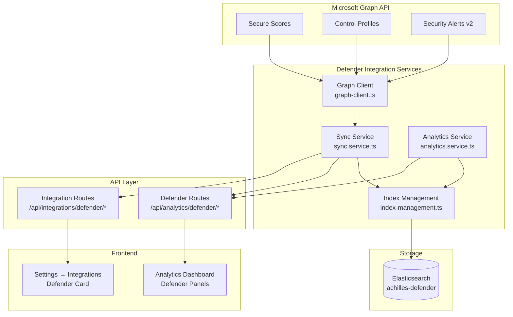
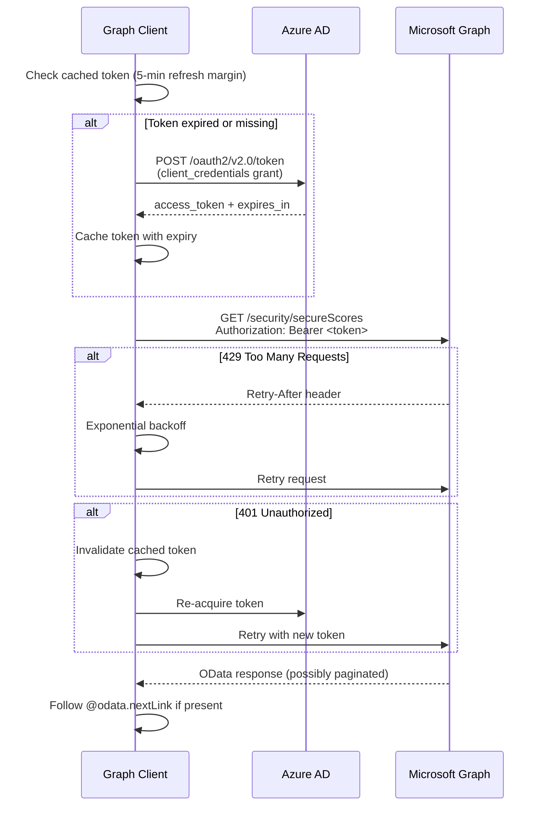
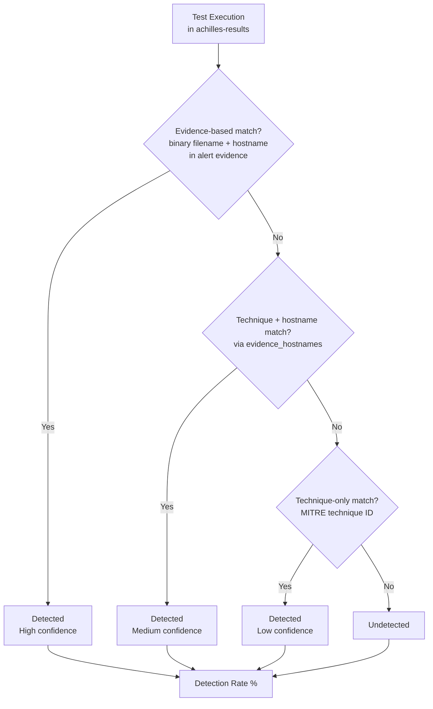

# Microsoft Defender

## Prerequisites

- Microsoft 365 with Defender enabled
- Azure AD App Registration with `SecurityEvents.Read.All` (Application type, admin consent)

## Azure AD Setup

1. Go to [Azure Portal](https://portal.azure.com) → App Registrations → New Registration
2. Name: "ProjectAchilles Defender Integration"
3. Under **API Permissions**, add:
   - `SecurityEvents.Read.All` (Application type)
   - Click **Grant admin consent**
4. Under **Certificates & Secrets**, create a client secret
5. Note the **Application (client) ID**, **Directory (tenant) ID**, and **Client Secret**

## Configuration

1. Navigate to **Settings** → **Integrations** → **Microsoft Defender**
2. Enter:
   - **Tenant ID** — Azure AD Directory (tenant) ID
   - **Client ID** — Application (client) ID
   - **Client Secret** — The secret you created
3. Click **Save** and then **Test Connection**

Credentials are encrypted at rest with AES-256-GCM.

## Sync Behavior

| Data | Sync Interval |
|------|--------------|
| Secure Score + Control Profiles | Every 6 hours |
| Alerts | Every 5 minutes |

In Docker deployments, sync runs via `setInterval`. On Vercel, sync runs via Cron at `/api/cron/defender-sync`.

## Architecture

The Defender integration is composed of four backend services that work together to pull data from Microsoft Graph, store it in Elasticsearch, and expose analytics to the frontend.



### Graph Client

The Graph client (`graph-client.ts`) is a lightweight, SDK-free HTTP client for Microsoft Graph API. It handles the full OAuth2 lifecycle internally.

**OAuth2 Client Credentials Flow:**



**Key behaviors:**
- **Token caching** with a 5-minute refresh margin before actual expiry
- **Automatic OData pagination** — follows `@odata.nextLink` until all pages are retrieved
- **429 retry** with exponential backoff using `Retry-After` header
- **401 recovery** — invalidates the cached token and re-authenticates on the next call

### Sync Service

The sync service (`sync.service.ts`) orchestrates data flow from Graph API to Elasticsearch using type-specific strategies:

| Data Type | Strategy | Frequency | Details |
|-----------|----------|-----------|---------|
| Secure Scores | Upsert by date | Every 6 hours | One document per day, keyed by date |
| Control Profiles | Full replacement | Every 6 hours | Relatively static; entire set is re-indexed |
| Alerts | Incremental | Every 5 minutes | Uses `lastUpdateDateTime` filter to fetch only new/updated alerts |

Each Graph API response is normalized into a consistent document structure with a `doc_type` discriminator field before indexing.

**Initial sync behavior:** The first alert sync uses a **90-day lookback** (`createdDateTime` filter) to fetch all relevant alerts without pulling the entire tenant history. Subsequent syncs resume incrementally from the last successful sync timestamp.

**Persisted sync timestamps:** `lastAlertSync` and `lastScoreSync` are persisted to `integrations.json` (Docker) or Vercel Blob (serverless). On server restart, the sync service loads persisted timestamps and resumes incremental syncs instead of re-fetching from scratch. Timestamps are only set on successful syncs — failed fetches do not advance the watermark.

**Evidence extraction:** During alert sync, the service extracts `evidence_hostnames` and `evidence_filenames` from the Graph API alert's evidence metadata (`deviceEvidence`, `processEvidence`, `fileEvidence`). These fields enable precise cross-correlation with test executions.

### Elasticsearch Storage Model

All Defender data is stored in a single index (`achilles-defender`) using a **sparse document** pattern with a `doc_type` discriminator:

| Field | Type | Used By | Description |
|-------|------|---------|-------------|
| `doc_type` | keyword | All | `secure_score`, `control_profile`, or `alert` |
| `timestamp` | date | All | Ingestion or event timestamp |
| `score_current` | float | secure_score | Current score value |
| `score_max` | float | secure_score | Maximum possible score |
| `score_percentage` | float | secure_score | `current / max * 100` |
| `control_name` | keyword | control_profile | Control display name |
| `control_category` | keyword | control_profile | Category grouping |
| `implementation_cost` | keyword | control_profile | `low`, `moderate`, `high` |
| `alert_id` | keyword | alert | Microsoft alert identifier |
| `severity` | keyword | alert | `low`, `medium`, `high`, `critical` |
| `status` | keyword | alert | `new`, `inProgress`, `resolved` |
| `mitre_techniques` | keyword[] | alert | MITRE ATT&CK technique IDs (e.g., `T1566.001`) |
| `evidence_hostnames` | keyword[] | alert | Hostnames extracted from alert evidence metadata |
| `evidence_filenames` | keyword[] | alert | Filenames extracted from alert evidence metadata |

:::info Index Design Rationale
A single sparse index is used instead of three separate indices because the total document volume is low (typically hundreds, not millions) and it simplifies cross-document queries and index lifecycle management.
:::

### Cross-Correlation Logic

The analytics service provides three types of cross-correlation between Achilles test results and Defender data:

**1. Detection Rate Analysis**

Correlates attack simulation executions with Defender security alerts using a **three-tier matching strategy** within a **-5 min to +30 min** window relative to test completion:



**Tier 1 — Evidence-based (most precise):** Matches `evidence_filenames` containing the test binary's UUID filename (e.g., `<uuid>.exe`) AND `evidence_hostnames` containing the test endpoint's hostname. This proves the specific test execution triggered the alert.

**Tier 2 — Technique + hostname:** Falls back to matching MITRE ATT&CK technique IDs with hostname scoping via `evidence_hostnames`. Used when Defender alerts lack file-level evidence.

**Tier 3 — Technique-only:** Falls back to matching on MITRE technique ID alone, without hostname scoping. Used for alerts that contain no evidence metadata at all.

The time window of **-5 min to +30 min** accounts for Defender's real-time telemetry generating alerts *during* test execution (before the test's `completed_at` timestamp) while excluding unrelated pre-test alerts.

- Excludes cyber-hygiene bundle controls (configuration checks, not attack simulations)
- Returns per-technique detection coverage with match confidence tier

**2. Technique Coverage Overlap**

Maps MITRE ATT&CK techniques present in both datasets to identify:
- Techniques tested by Achilles **and** detected by Defender (validated coverage)
- Techniques tested by Achilles but **not** detected (detection gaps)
- Techniques detected by Defender but **not** tested (untested detections)

**3. Defense Score vs. Secure Score Trending**

Compares the internal Defense Score (from test results) with Microsoft Secure Score over time using aligned date histograms, enabling teams to see whether improving their Secure Score configuration also improves real detection effectiveness.

### Conditional Frontend Display

All Defender dashboard elements are conditionally rendered based on the `useDefenderConfig` hook:

```
useDefenderConfig() → { configured: boolean, loading: boolean }
```

When `configured` is `false`, Defender panels, tabs, and cross-correlation widgets are hidden entirely — the dashboard shows only Achilles-native analytics. This prevents empty states and confusion for users who have not set up the integration.

## Deployment Variants

| Aspect | Docker / Fly.io / Railway | Vercel (Serverless) |
|--------|--------------------------|---------------------|
| Backend path | `backend/src/services/defender/` | `backend-serverless/src/services/defender/` |
| Settings access | Synchronous file read | Async Vercel Blob read |
| Sync trigger | `setInterval` at server startup | Vercel Cron (`/api/cron/defender-sync`) |
| Credentials | Encrypted file or env vars | Env vars or encrypted blob |

Both variants expose identical API endpoints and analytics capabilities.

## Troubleshooting

:::warning Common Issues
- **"Test Connection" fails with 401**: Verify that admin consent has been granted for the `SecurityEvents.Read.All` permission in Azure AD. Application permissions (not delegated) are required.
- **No data after saving credentials**: The first sync runs on the next interval (up to 6 hours for scores, 5 minutes for alerts). Click **Sync Now** in the integration settings to trigger an immediate sync.
- **Missing alerts**: Alerts require `SecurityEvents.Read.All`. The `SecurityActions.Read.All` and `SecurityReports.Read.All` permissions are needed for control profiles and scores respectively.
:::
