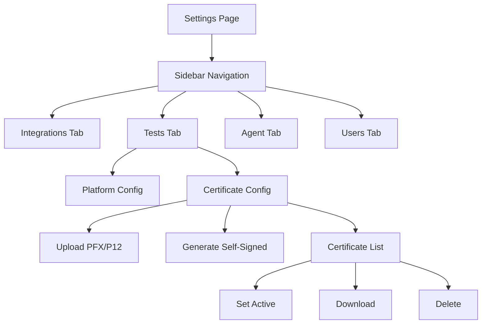

# Certificates & Signing

## Overview

ProjectAchilles supports up to **5 certificates** (uploaded + generated combined) for code signing Windows binaries.

## Uploading a Certificate

1. Navigate to **Settings** → **Certificates**
2. Click **Upload Certificate**
3. Select a PFX/P12 file
4. Enter the certificate password
5. Click **Upload**

## Generating a Self-Signed Certificate

1. Navigate to **Settings** → **Certificates**
2. Click **Generate Certificate**
3. Fill in the subject fields (Common Name, Organization, etc.)
4. Click **Generate**

:::info Platform Differences
- **Docker/Railway/Render/Fly.io**: Uses OpenSSL CLI for generation and `osslsigncode` for signing
- **Vercel**: Uses `node-forge` (pure JS) for generation; signing is not available (no osslsigncode)
:::

## Active Certificate

One certificate is marked as "active" at a time. The build service uses the active certificate for all Authenticode signing operations.

Click **Set Active** on any certificate to make it the current signing certificate.

## Storage

| Target | Storage Location |
|--------|-----------------|
| Docker/PaaS | `~/.projectachilles/certs/cert-<timestamp>/` |
| Vercel | Vercel Blob (`certs/` prefix) |

## Legacy Migration

If you have flat certificate files (from an older version), they are automatically migrated to the subdirectory structure on first access.

## Settings Page Layout

The Certificates section lives within the broader **Settings** page, which is organized into four tabs:

Navigate to **Settings** and select the **Tests** tab to access certificate management.

## Certificate Management Walkthrough

### Uploading a Certificate

1. In the **Tests** tab, scroll to the **Certificates** section
2. Click **Upload Certificate**
3. Select a PFX or P12 file from your file system
4. Enter the certificate password
5. Click **Upload**
6. The certificate appears in the certificate list with its subject details and expiration date

:::tip PFX Compatibility
Some PFX files use algorithms that the platform cannot parse for metadata extraction. In that case, the upload still succeeds, but the displayed subject and expiration fields may show "Unknown". The certificate itself remains fully functional for signing.
:::

### Generating a Self-Signed Certificate

1. Click **Generate Certificate**
2. Fill in the subject fields:
   - **Common Name** (required)
   - **Organization**
   - **Organizational Unit**
   - **Country**
   - **State/Province**
   - **Locality**
3. Click **Generate**
4. The new certificate appears in the list and is ready for use

### Setting the Active Certificate

Only one certificate can be active at a time. The active certificate is used for all Windows Authenticode signing operations during test and agent builds.

1. Find the certificate you want to use in the certificate list
2. Click **Set Active**
3. The active badge moves to the selected certificate
4. All subsequent builds use this certificate for signing

### Downloading and Deleting

- **Download** -- Retrieves the PFX file for backup or use in other tools
- **Delete** -- Permanently removes the certificate (requires the `settings:certificates:delete` permission)

:::warning 5-Certificate Limit
The platform enforces a maximum of 5 certificates (uploaded and generated combined). Delete unused certificates before adding new ones if you have reached the limit.
:::

## Other Settings Sections

The Settings page includes additional configuration areas relevant to the overall platform:

### Integrations Tab

Manages connections to external services through a card-based interface:

| Integration | Purpose |
|------------|---------|
| **Elasticsearch** | Connection to your Elasticsearch cluster for analytics data storage. Supports both Elastic Cloud (Cloud ID) and direct URL connections. Includes index management and connection testing. |
| **Azure / Entra ID** | Service principal credentials for tests that target Azure Active Directory. |
| **Microsoft Defender** | Tenant credentials for pulling Secure Score, alerts, and control profiles from Microsoft Graph. |
| **Alerting** | Threshold-based alerts dispatched to Slack (webhook) or email (SMTP) when scores drop below configured levels. |

Each integration card shows a status indicator: **Connected**, **Not Configured**, or **Error**.

### Agent Tab

Manages agent binary distribution:

- **Build from Source** -- Cross-compile agent binaries with automatic version incrementing and code signing
- **Upload Binary** -- Upload pre-compiled agent binaries with version metadata and release notes
- **Version Table** -- View all registered agent binaries with size, SHA-256 hash, signing status, and deletion controls

### Users Tab

User and role management (visible only to users with the `settings:users:manage` permission):

- **User list** with role assignment
- **Invitation system** for onboarding new team members via email
- **Permission reference** showing the full permission matrix for each role

### Platform Config

Located in the **Tests** tab alongside certificates:

- Select the default target **operating system** and **architecture** for builds
- Architecture options adjust based on OS compatibility (e.g., macOS does not support 386)
- Changes auto-save with visual confirmation

## Visual Themes

The platform supports three visual themes, selectable from the Settings page:

| Theme | Description |
|-------|-------------|
| **Default** | Clean light/dark mode with neutral tones |
| **Neobrutalism** | Hot pink accent color, bold borders, high contrast |
| **Hacker Terminal** | Phosphor green and amber text with CRT scanline effects |

The selected theme applies globally across all pages, including chart visualizations and code viewers.
