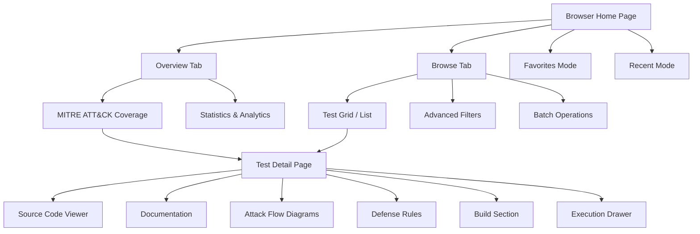

# Browsing & Filtering

The Test Browser is the primary interface for discovering and managing security tests.

## Overview Dashboard

The browser page opens with a 3-tab layout:

1. **Overview** — Category legend and summary statistics
2. **Overview** — MITRE ATT&CK coverage chart and summary statistics
3. **List** — Filterable test grid/list

## Views

Toggle between **Grid** and **List** views using the view selector in the top-right corner.

- **Grid view** — Card-based layout showing test name, category, severity, and platform badges
- **List view** — Compact table with sortable columns

## Filtering

The filter bar supports multiple simultaneous filters:

| Filter | Description |
|--------|-------------|
| **Search** | Free-text search across test names and descriptions |
| **Category** | Filter by test category (e.g., defense-evasion, persistence) |
| **Technique** | Filter by MITRE ATT&CK technique ID (e.g., T1059) |
| **Platform** | Filter by target platform (Windows, Linux, macOS) |
| **Severity** | Filter by severity level (Critical, High, Medium, Low) |

Filters are additive — combining multiple filters narrows the results.

## Favorites

Click the star icon on any test card to favorite it. Favorites are stored per-user in the browser's local storage. Use the **Favorites** filter to show only starred tests.

## Categories

Tests are organized into categories that map to MITRE ATT&CK tactics:
- Defense Evasion
- Persistence
- Privilege Escalation
- Credential Access
- Lateral Movement
- Discovery
- Collection
- Exfiltration
- And more...

Each category has a color-coded badge in the test cards.

## Browser Architecture

The test browser is organized around two main pages connected by navigation:

### Browse Modes

The browser home page has three top-level modes, selectable from the navigation:

- **Browse** (default) -- Full-featured browser with Overview and Browse sub-tabs
- **Favorites** -- Shows only tests you have starred
- **Recent** -- Displays tests you have recently viewed, in chronological order

## MITRE ATT&CK Coverage

The **Overview** tab features an interactive MITRE ATT&CK Enterprise coverage chart:

- **14 enterprise tactics** displayed in kill-chain order
- Each tactic column contains a **bar chart** where bar height represents the number of tests mapped to each technique
- Color intensity indicates test coverage density -- darker bars mean more tests
- Click any tactic column to open a **detail panel** listing all techniques and their test counts
- From the detail panel, click a technique to filter the Browse tab to tests covering that technique
- Use the **empty tactic toggle** to show or hide tactics that have no mapped tests

The chart adapts its color scheme to the active visual theme (Default, Neobrutalism, or Hacker Terminal).

:::tip Drill-Down Navigation
Click a technique in the coverage chart to jump directly to the Browse tab with that technique pre-filtered. This is the fastest way to find tests for a specific ATT&CK technique.
:::

## Advanced Filtering

The Browse tab provides multi-dimensional filtering with real-time results:

### Search

The search box matches across multiple fields simultaneously:

- Test names and descriptions
- UUIDs (partial matching supported)
- MITRE ATT&CK technique IDs (e.g., "T1059")

### Categorical Filters

| Filter | Options |
|--------|---------|
| **Category** | intel-driven, MITRE top 10, cyber hygiene, and more |
| **Severity** | Critical, High, Medium, Low, Informational |
| **Platform** | Windows, Linux, macOS, Cloud |
| **Threat Actor** | Specific threat actor groups |
| **Not Run Yet** | Tests that have never been executed (requires Elasticsearch connection) |

:::info "Not Run Yet" Filter
The "Not Run Yet" filter queries your Elasticsearch analytics data to identify tests that exist in the library but have no recorded executions. This is useful for expanding coverage to untested techniques.
:::

### Sorting

Sort the test list by any of these dimensions:

- **Name** -- Alphabetical
- **Severity** -- By criticality level
- **Score** -- By test quality rating
- **Created** / **Modified** -- By date
- Ascending or descending direction for each option

## Test Detail Page

Click any test to open its detail page, which uses a dual-pane layout:

### Left Sidebar

The sidebar organizes the test's files into collapsible sections:

| Section | Contents |
|---------|----------|
| **Documentation** | README, info cards, safety notes |
| **Build** | Binary compilation controls (see [Building & Signing](./building-signing)) |
| **Visualizations** | Attack Flow diagrams, Kill Chain diagrams |
| **Defense Guidance** | Hardening rules and recommended mitigations |
| **Source Code** | Go source files |
| **Detection Rules** | KQL, YARA, Sigma, and Elastic detection rules |
| **Configuration** | Test metadata and configuration files |

### Right Panel — Content Viewer

Selecting a file in the sidebar opens it in the content viewer, which adapts based on file type:

- **Markdown files** render with GitHub-style formatting, including tables and code blocks
- **Code files** display with syntax highlighting (Go, PowerShell, Bash, JSON, KQL, YARA, YAML)
- **Attack Flow diagrams** render as interactive SVG visualizations in a sandboxed frame
- **Kill Chain diagrams** render as interactive network graphs using Cytoscape.js

The page starts in full-header mode showing the test title, metadata badges, and description. When you select a file to view, it switches to compact mode to maximize content area.

## Batch Operations

From the Browse tab, select multiple tests using checkboxes, then:

- **Execute selected** -- Opens the execution drawer to run all selected tests on chosen agents
- **Batch operations** are useful for running an entire test category or severity level at once

## Favorites and Recent Tests

### Favorites

- Click the **star icon** on any test card to add it to your favorites
- Favorites are stored per-user in browser local storage
- Switch to **Favorites** mode to see only your starred tests

### Recent Tests

- The browser automatically tracks tests you have viewed
- Switch to **Recent** mode to see them in reverse chronological order
- Useful for quickly returning to tests you were analyzing

## Git Sync Status

The browser shows the sync status of the test library in the top bar:

- A **sync indicator** shows when the library was last updated from the Git repository
- Click **Sync Now** to trigger a manual sync if you have the `tests:sync:execute` permission
- After syncing, the test list refreshes automatically with any new or updated tests
