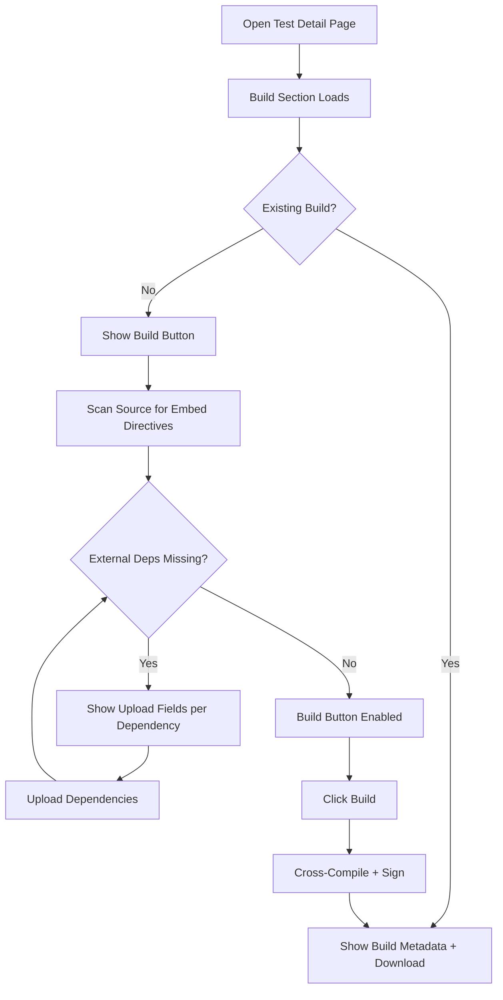

# Building & Signing Tests

ProjectAchilles can cross-compile test binaries directly from the web UI using the backend's Go toolchain.

## Build Process

1. Navigate to a test's detail page
2. Click the **Build** button
3. Select the **target platform** (Windows, Linux, macOS) and **architecture** (amd64, arm64)
4. If the test has `//go:embed` directives, upload the required dependency files
5. Click **Build** to trigger cross-compilation
6. Once complete, click **Download** to get the signed binary

## Platform & Architecture Support

| Platform | Architecture | Code Signing |
|----------|-------------|--------------|
| Windows | amd64 | Authenticode (osslsigncode) |
| Linux | amd64 | None |
| macOS | amd64, arm64 | Ad-hoc (rcodesign) |

## Code Signing

### Windows (Authenticode)
Windows binaries are signed with Authenticode using `osslsigncode` and a PFX certificate. Manage certificates in [Settings → Certificates](../settings/certificates).

### macOS (Ad-Hoc)
macOS binaries receive ad-hoc signatures via `rcodesign`. No certificate is required — the signature prevents Gatekeeper from quarantining the binary.

### Linux
Linux binaries are not signed.

:::info Signing Failures Are Non-Fatal
If signing fails (missing certificate, tool error), the build continues and produces an unsigned binary.
:::

## Embed Dependencies

Some tests use Go's `//go:embed` directive to embed files into the binary. The UI detects these directives and shows upload fields for each required file.

- **Source-built dependencies** (compiled from Go source by `build_all.sh`) show a wrench icon and "Auto-built" label — no upload needed
- **External dependencies** (pre-compiled binaries) show an upload button — the Build button is disabled until all external deps are uploaded

## Build Caching

Built binaries are cached by platform and architecture. Subsequent requests for the same build return the cached binary instantly. The cache is cleared when the test source changes.

## Availability by Deployment Target

| Target | Build from Source | Upload Binaries |
|--------|:-----------------:|:---------------:|
| Docker Compose | Yes | Yes |
| Railway | No | Yes |
| Render | Yes | Yes |
| Fly.io | Yes | Yes |
| Vercel | No | Yes |

## Build Section in the Test Detail Page

The **Build** section appears in the left sidebar of every test's detail page. It manages the full compile-sign-download workflow.

### Build Status Display

When a build already exists, the Build section shows:

- **Filename** of the compiled binary
- **Target platform** and architecture
- **Signature status** (signed or unsigned)
- **File size**
- **Download** button to retrieve the binary

When no build exists, a **Build** button is shown instead.

### Build Workflow

### Embed Dependency Handling

The UI scans Go source files for `//go:embed` directives and categorizes each dependency:

| Dependency Type | Icon | Action Required |
|----------------|------|----------------|
| **Source-built** (compiled from Go source by `build_all.sh`) | Wrench | None -- "Auto-built" label shown |
| **External** (pre-compiled binary) | Upload | Must upload before building |

The **Build** button remains disabled until all external dependencies are uploaded. Source-built dependencies are compiled automatically as part of the build process.

:::warning Upload Validation
When uploading a Windows executable dependency, the UI performs client-side validation by checking for the MZ header (the first two bytes of any PE executable). Invalid files are rejected before upload.
:::

### Multi-Binary Bundles

Some tests use a multi-binary architecture where each validator is a separate embedded binary. For these tests:

1. The `build_all.sh` script compiles all validators from source
2. The active signing certificate is passed to the build script for signing each validator
3. Validators are embedded into the final orchestrator binary
4. The entire process runs as a single build operation from the UI

## Execution Drawer

The **Execution Drawer** is a slide-out panel that appears when you click **Execute** on a test (or select multiple tests and choose batch execution). It orchestrates the full path from agent selection to task creation.

### Agent Selector

The drawer includes an agent selector with:

- **Search by hostname** -- Filter the agent list by typing
- **Filter by tags** -- Multi-select tag dropdown
- **Online-only toggle** -- Exclude agents that are not currently connected
- **Select All / Deselect All** -- Bulk selection for the currently filtered list
- Each agent row shows its status indicator (online/offline), hostname, OS/architecture, and tags

### Execution Configuration

Two tabs control how the test runs:

**Run Now tab:**
- **Timeout** -- Maximum execution time in seconds
- **Priority** -- Task priority level (1--3)
- **Target index** -- Elasticsearch index for result storage

**Schedule tab:**
- **Once** -- Date and time picker
- **Daily** -- Fixed time or randomized within business hours
- **Weekly** -- Day selection with time configuration
- **Monthly** -- Day of month with time options
- Timezone selection from common zones

### Pre-Execution Validation

Before submission, the drawer validates:

- At least one agent is selected
- All tests have valid builds (the drawer offers to build missing tests inline)
- Azure credentials are configured for tests that require Entra ID integration
- Schedule configuration is valid (future dates, selected days, etc.)

### Batch Execution

When multiple tests are selected:

- The drawer shows a summary of all selected tests with their build statuses
- A **Build All** button compiles any tests that lack builds
- Individual test build failures are non-fatal -- the remaining tests can still be submitted
- Tasks are created for each test-agent combination

:::info Build Before Execute
The execution drawer checks build status automatically. If a test has not been built yet, you can trigger the build directly from the drawer without going back to the test detail page.
:::
